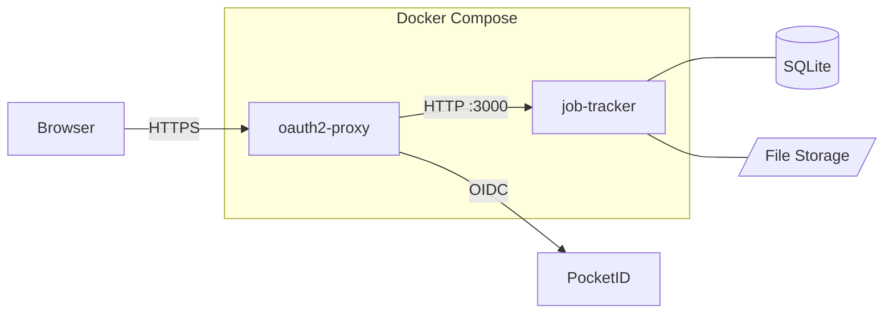
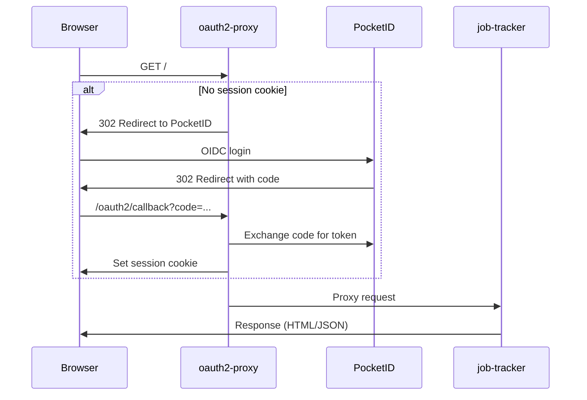
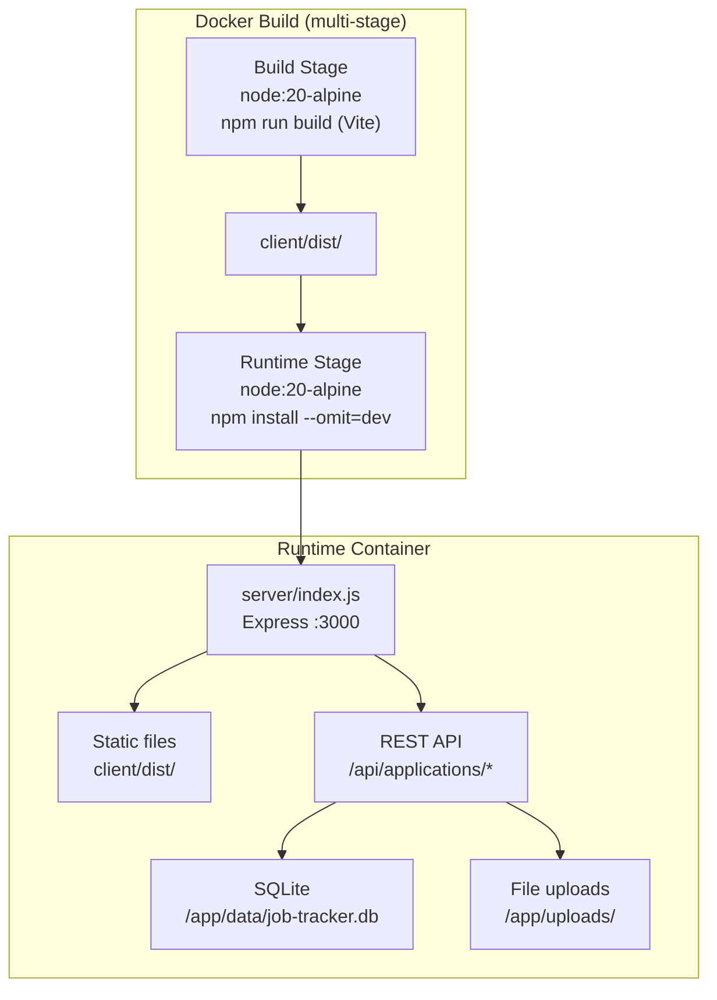
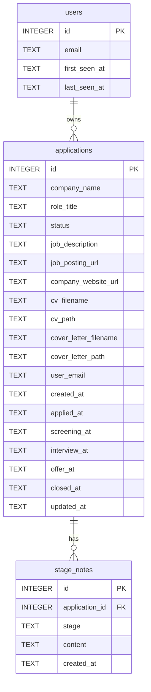
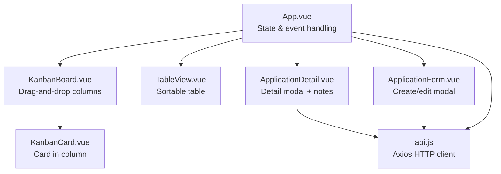
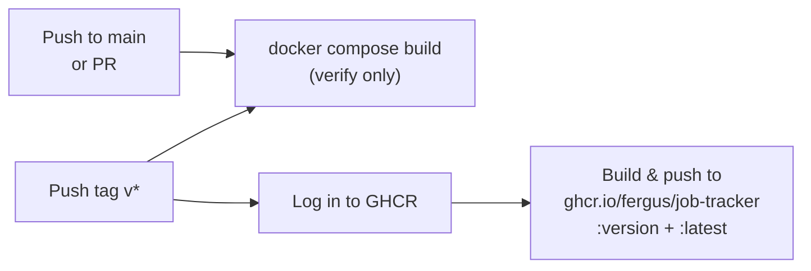

# Architecture

## Overview

Job Application Tracker is a multi-user single-page web application that runs as two Docker containers behind a reverse proxy. A Node.js server serves both the REST API and the pre-built Vue frontend as static files. Authentication is handled externally by oauth2-proxy before requests reach the application. All application data is scoped per-user via the `X-Forwarded-Email` header, with admin users able to view (but not modify) all users' data.

## Request Flow

All incoming requests pass through oauth2-proxy, which authenticates users via OIDC (PocketID) before proxying to the application.

## Container Architecture

A single multi-stage Docker build produces the runtime image. The build stage compiles the Vue frontend; the runtime stage bundles only the server, production dependencies, and the built static assets.

Two host-mounted volumes persist data across container restarts:

| Mount | Container Path | Contents |
|-------|---------------|----------|
| `./data/` | `/app/data/` | SQLite database |
| `./uploads/` | `/app/uploads/` | CV and cover letter files |

## Server

The Express server (`server/index.js`) has two responsibilities:

1. **REST API** at `/api/applications/*` — CRUD operations for applications, file uploads, status changes, and stage notes
2. **Static file server** — serves the pre-built Vue SPA from `client/dist/`, with a catch-all route for client-side routing

### Database Schema

SQLite with WAL mode and foreign keys enabled. Tables are auto-created on startup via `CREATE TABLE IF NOT EXISTS`. The `user_email` column on `applications` is added via `ALTER TABLE` migration if missing.

Stage notes cascade-delete when their parent application is deleted.

### API Endpoints

| Method | Path | Description |
|--------|------|-------------|
| `GET` | `/api/me` | Current user info (`email`, `isAdmin`) |
| `GET` | `/api/applications` | List user's apps (filter by `?status=`, admin: `?all=true`) |
| `GET` | `/api/applications/:id` | Get single application with notes |
| `POST` | `/api/applications` | Create application (multipart form) |
| `PUT` | `/api/applications/:id` | Update application fields |
| `PATCH` | `/api/applications/:id/status` | Change status (auto-sets date) |
| `POST` | `/api/applications/:id/cv` | Upload/replace CV |
| `GET` | `/api/applications/:id/cv` | Download CV |
| `POST` | `/api/applications/:id/cover-letter` | Upload/replace cover letter |
| `GET` | `/api/applications/:id/cover-letter` | Download cover letter |
| `POST` | `/api/applications/:id/notes` | Create a stage note |
| `DELETE` | `/api/applications/:id/notes/:noteId` | Delete a stage note |
| `DELETE` | `/api/applications/:id` | Delete application (cascades) |

### User Scoping & Authorization

All API requests pass through auth middleware (`server/middleware/auth.js`) which:

1. Reads `X-Forwarded-Email` header set by oauth2-proxy (falls back to `dev@localhost` in dev mode)
2. Upserts the user into the `users` table
3. Claims any legacy applications with `user_email IS NULL` (one-time migration on first login after upgrade)
4. Checks `ADMIN_EMAILS` env var to set `req.isAdmin`
5. Sets `req.userEmail` for downstream route handlers

All application queries are scoped to `user_email = ?` by default. Admin users can view all applications via `?all=true` but cannot edit or delete other users' data.

## Frontend

Vue 3 SPA built with Vite and styled with Tailwind CSS. All state lives in `App.vue` and is passed down as props.

### Pipeline Stages

Applications move through a fixed set of stages, each with a corresponding kanban column and color:

| Stage | Color | Date Field |
|-------|-------|------------|
| Interested | Gray | `created_at` |
| Applied | Blue | `applied_at` |
| Screening | Yellow | `screening_at` |
| Interview | Purple | `interview_at` |
| Offer | Green | `offer_at` |
| Accepted | Emerald | `closed_at` |
| Rejected | Red | `closed_at` |

## CI/CD

GitHub Actions workflow (`.github/workflows/build.yml`):

- Every push to `main` and every PR runs a build verification
- Pushing a version tag (e.g. `v0.1.0`) builds and publishes the Docker image to GitHub Container Registry
