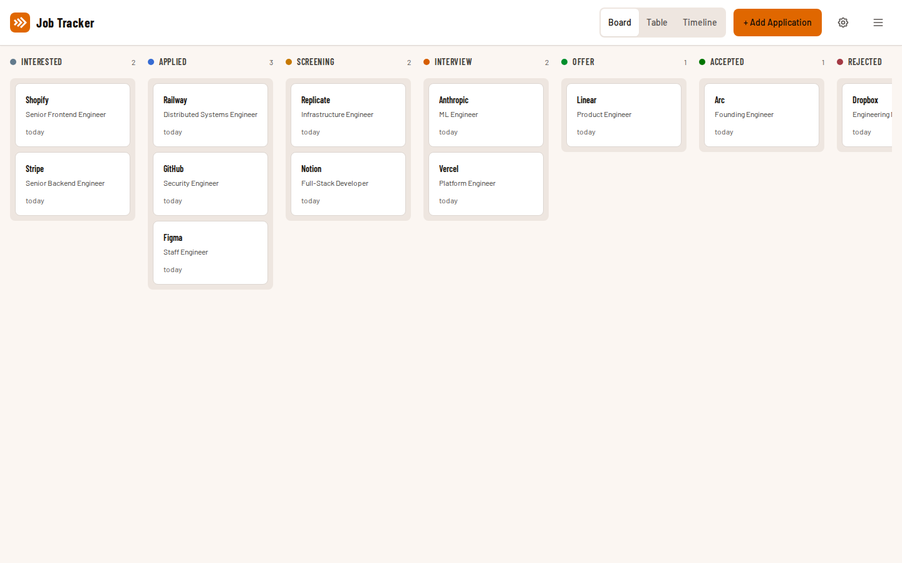

# Job Application Tracker

[](https://github.com/fergus/job-tracker/actions/workflows/build.yml)

A multi-user web app for tracking job applications through a pipeline — from initial interest through to offer and acceptance. Kanban board with drag-and-drop, table view, timeline view, file attachments, notes, salary tracking, and date tracking per stage. Each user sees only their own applications; admins can view all. Optionally exposes applications as an editable SMB network share.



## Quick Start

Requirements: [Docker](https://docs.docker.com/get-docker/) and Docker Compose, and a [PocketID](https://github.com/pocket-id/pocket-id) instance for authentication.

**1. Clone and configure:**

```bash
mkdir job-tracker && cd job-tracker
cp .env.example .env
```

Download the [`docker-compose.yml`](docker-compose.yml) and [`.env.example`](.env.example) files, or clone the repo.

**2. Set up PocketID:**

In your PocketID admin panel, create a new OIDC client:
- **Redirect URI:** `https://your-domain.com/oauth2/callback`
- Note the **Client ID** and **Client Secret**

**3. Edit `.env`** with your values:

```env
OIDC_ISSUER_URL=https://your-pocketid-instance.example.com
OIDC_CLIENT_ID=your-client-id
OIDC_CLIENT_SECRET=your-client-secret
PUBLIC_URL=https://your-domain.com
COOKIE_SECRET=   # generate with: openssl rand -base64 32 | tr -- '+/' '-_'
LISTEN_PORT=3000
```

**4. Update `docker-compose.yml`** to use the pre-built image:

```yaml
services:
  job-tracker:
    image: ghcr.io/fergus/job-tracker:latest
```

**5. Start:**

```bash
docker compose up -d
```

Open your `PUBLIC_URL` in a browser. You'll be redirected to PocketID to log in.

## Updating

Pull the latest image and restart:

```bash
docker compose pull
docker compose up -d
```

Your data is safe — updates only replace the container, not the volume-mounted data directories.

## Data Persistence

All data is stored in Docker volumes mapped to local directories:

- `./data/` — SQLite database
- `./uploads/` — uploaded attachment files
- `./smb-share/` — SMB sync directory (if SMB enabled)

These directories are created automatically. Your data survives container restarts, rebuilds, and updates.

To back up:

```bash
cp -r data/ data-backup/
cp -r uploads/ uploads-backup/
```

## Features

- **Kanban board** — drag cards between columns: Interested → Applied → Screening → Interview → Offer → Accepted/Rejected
- **Table view** — sortable columns, click any row for details
- **Timeline view** — visual history of status changes per application
- **Hamburger menu** — slide-in sidebar houses the view switcher, admin toggle, and account info; an "Always use menu" toggle (persisted per browser) controls whether those controls also appear inline in the header
- **File attachments** — upload any file type (PDF, DOC, DOCX, etc. up to 10MB) as generic attachments
- **Salary tracking** — min/max salary range and job location per application
- **Date tracking** — timestamps auto-set when you move applications between stages; all dates are editable
- **Stage notes** — per-stage timestamped notes with markdown rendering and colored stage badges
- **Links** — store job posting and company website URLs
- **Multi-user** — each user sees only their own applications, identified via PocketID `X-Forwarded-Email` header. Admins (configured via `ADMIN_EMAILS`) can view all users' applications but cannot edit or delete others' data
- **SMB file access** — optionally expose applications as an editable directory tree over SMB (see below)

## Configuration

The server runs on port 3000 by default. To change the exposed port, set `LISTEN_PORT` in your `.env`:

```env
LISTEN_PORT=8080
```

To run without HTTPS (e.g. local dev), set:

```env
COOKIE_SECURE=false
```

To grant admin access (view all users' applications), set a comma-separated list of email addresses:

```env
ADMIN_EMAILS=admin@example.com,boss@example.com
```

## SMB File Access

Optional feature that exposes applications as an editable directory tree over SMB. Edit application details in VS Code, nano, file explorer, or with LLMs like Claude Code.

### Setup

Add to your `.env`:

```env
ENABLE_SMB=true
SMB_USER=youruser
SMB_PASS=yourpassword
SMB_USER_EMAIL=you@example.com
```

Or use a credentials file (format: `username:password:email`):

```env
ENABLE_SMB=true
SMB_CREDENTIALS_FILE=/run/secrets/smb-credentials
```

Connect from Windows: `\\your-server\jobs`

### Directory Structure

```
\\server\jobs
├── interested/
│   └── google--senior-swe/
│       ├── details.md          # YAML frontmatter + description
│       ├── job-description.md
│       ├── interview-notes.md
│       ├── prep-work.md
│       ├── notes.md            # stage notes with markdown headers
│       └── files/              # attachments
│           └── resume.pdf
├── applied/
├── screening/
├── interview/
├── offer/
├── accepted/
└── rejected/
```

The sync engine maintains bidirectional sync between the filesystem and the API:
- **API to files:** Full sync on startup, polls every 30s for web UI changes
- **Files to API:** chokidar watches for edits, new directories (`mkdir`), and attachment changes
- **New applications:** Create a directory in any status folder (e.g., `mkdir interested/acme--engineer`)

**Important:** Do not expose port 445 to the public internet. Use a VPN (WireGuard, Tailscale) for remote access.

## Architecture

```
┌───────────────────────────────────────────────────────┐
│  Docker Container                                     │
│                                                       │
│  oauth2-proxy (:4180) ──── Express API (:3000)        │
│                                  │                    │
│                              SQLite (WAL)             │
│                                  │                    │
│  [optional, ENABLE_SMB=true]     │                    │
│  Samba (:3445) ── Sync Engine ── HTTP ──┘             │
│       │                                               │
│  /app/smb-share/                                      │
└───────────────────────────────────────────────────────┘
```

- **Frontend** (`client/`): Vue 3 SPA, Vite, Tailwind CSS 4. State in `App.vue`, API calls in `client/src/api.js`
- **Backend** (`server/`): Express 5, better-sqlite3. Routes in `server/routes/applications.js`
- **Auth** (`server/middleware/auth.js`): oauth2-proxy headers + internal auth token for sync engine
- **Database** (`server/db.js`): 4 tables (`users`, `applications`, `stage_notes`, `attachments`) + `_migrations` tracking
- **Sync Engine** (`server/lib/sync-engine.mjs`): Two-way sync with content-hash feedback loop prevention

## Tech Stack

- Vue 3 + Vite + Tailwind CSS (frontend)
- Node.js + Express (backend)
- SQLite via better-sqlite3 (database)
- Samba + chokidar + gray-matter (SMB sync, optional)
- Single Docker container (multi-stage build)
