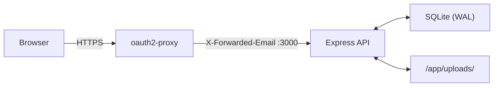

# Job Application Tracker

[](https://github.com/fergus/job-tracker/actions/workflows/build.yml)

A multi-user web app for tracking job applications through a pipeline — from initial interest through to offer and acceptance. Kanban board with drag-and-drop, table view, timeline view, file attachments, notes, salary tracking, and date tracking per stage. Each user sees only their own applications; admins can view all.


## Quick Start

Requirements: [Docker](https://docs.docker.com/get-docker/) and Docker Compose, and a [PocketID](https://github.com/pocket-id/pocket-id) instance for authentication.

**1. Clone and configure:**

```bash
mkdir job-tracker && cd job-tracker
cp .env.example .env
```

Download the [`docker-compose.yml`](docker-compose.yml) and [`.env.example`](.env.example) files, or clone the repo.

**2. Set up PocketID:**

In your PocketID admin panel, create a new OIDC client:
- **Redirect URI:** `https://your-domain.com/oauth2/callback`
- Note the **Client ID** and **Client Secret**

**3. Edit `.env`** with your values:

```env
OIDC_ISSUER_URL=https://your-pocketid-instance.example.com
OIDC_CLIENT_ID=your-client-id
OIDC_CLIENT_SECRET=your-client-secret
PUBLIC_URL=https://your-domain.com
COOKIE_SECRET=   # generate with: openssl rand -base64 32 | tr -- '+/' '-_'
LISTEN_PORT=3000
```

**4. Update `docker-compose.yml`** to use the pre-built image:

```yaml
services:
  job-tracker:
    image: ghcr.io/fergus/job-tracker:latest
```

**5. Start:**

```bash
docker compose up -d
```

Open your `PUBLIC_URL` in a browser. You'll be redirected to PocketID to log in.

## Updating

Pull the latest image and restart:

```bash
docker compose pull
docker compose up -d
```

Your data is safe — updates only replace the container, not the volume-mounted data directories.

## Data Persistence

All data is stored in Docker volumes mapped to local directories:

- `./data/` — SQLite database
- `./uploads/` — uploaded attachment files

These directories are created automatically. Your data survives container restarts, rebuilds, and updates.

To back up:

```bash
cp -r data/ data-backup/
cp -r uploads/ uploads-backup/
```

## Features

- **Kanban board** — drag cards between columns: Interested → Applied → Screening → Interview → Offer → Accepted/Rejected
- **Table view** — sortable columns, click any row for details
- **Timeline view** — visual history of status changes per application
- **Hamburger menu** — slide-in sidebar with the view switcher and account info; an "Always use menu" toggle (persisted per browser) controls whether the view switcher also appears inline in the header
- **Settings panel** — manage API keys; admins can toggle between personal and all-users view
- **API keys** — generate personal API keys for programmatic access without the browser OAuth flow; scoped to your account, shown once at creation
- **File attachments** — upload PDF, DOC, DOCX, MD, or TXT files (up to 10MB each) as attachments; CV and cover letter can also be attached directly to an application
- **Salary tracking** — min/max salary range and job location per application
- **Date tracking** — timestamps auto-set when you move applications between stages; all dates are editable
- **Stage notes** — per-stage timestamped notes with markdown rendering and colored stage badges
- **Links** — store job posting and company website URLs
- **Multi-user** — each user sees only their own applications, identified via PocketID `X-Forwarded-Email` header. Admins (configured via `ADMIN_EMAILS`) can view all users' applications but cannot edit or delete others' data

## MCP Server (AI Integration)

A Model Context Protocol (MCP) server is included for AI clients to interact with your job applications programmatically. It exposes tools for listing, creating, updating, and adding notes to applications.

**Endpoint:** `https://your-domain.com/mcp`

**Authentication:** Bearer API key (generate one in the Settings panel)

**Tools exposed:**
- `create_application` — create a new job application
- `add_note` — append a stage note to an application
- `list_applications` — list all applications (optionally filter by status)
- `get_application` — get full details including notes and attachments
- `update_application` — update fields on an existing application
- `update_status` — change status (auto-sets the corresponding date)
- `list_attachments` — list file attachments for an application
- `upload_attachment` — upload a small file (<~30KB) via base64-encoded content
- `get_upload_url` — get a pre-signed upload URL for larger files (any size)

### Connecting from Claude Code

Add this to your `~/.mcp.json`:

```json
{
  "job-tracker": {
    "type": "http",
    "url": "https://your-domain.com/mcp",
    "headers": {
      "Authorization": "Bearer YOUR_API_KEY"
    }
  }
}
```

Generate `YOUR_API_KEY` from the app's Settings panel → API Keys.

### Connecting from other MCP clients

Any MCP client that supports the Streamable HTTP transport can connect using the same URL and Bearer token.

## Configuration

The server runs on port 3000 by default. To change the exposed port, set `LISTEN_PORT` in your `.env`:

```env
LISTEN_PORT=8080
```

To run without HTTPS (e.g. local dev), set:

```env
COOKIE_SECURE=false
```

To grant admin access (view all users' applications), set a comma-separated list of email addresses:

```env
ADMIN_EMAILS=admin@example.com,boss@example.com
```

## Architecture



- **Frontend** (`client/`): Vue 3 SPA, Vite, Tailwind CSS 4. State in `App.vue`, API calls in `client/src/api.js`
- **Backend** (`server/`): Express 5, better-sqlite3. Routes in `server/routes/`
- **Auth** (`server/middleware/auth.js`): oauth2-proxy headers (browser) or Bearer API key (programmatic)
- **Database** (`server/db.js`): 5 tables (`users`, `applications`, `stage_notes`, `attachments`, `api_keys`) + `_migrations` tracking

## Tech Stack

- Vue 3 + Vite + Tailwind CSS (frontend)
- Node.js + Express (backend)
- SQLite via better-sqlite3 (database)
- Single Docker container (multi-stage build)
