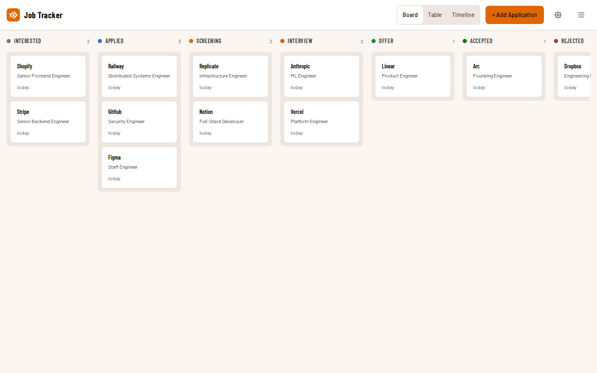
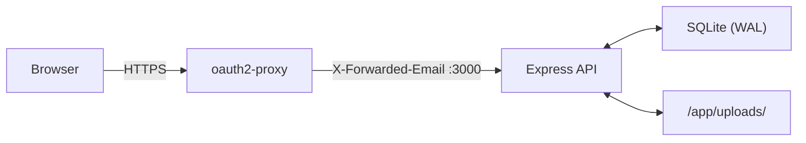

# Job Application Tracker

[](https://github.com/fergus/job-tracker/actions/workflows/build.yml)

A multi-user web app for tracking job applications through a pipeline — from initial interest through to offer and acceptance. Kanban board with drag-and-drop, table view, timeline view, file attachments, notes, salary tracking, and date tracking per stage. Each user sees only their own applications; admins can view all.



## Quick Start

Requirements: [Docker](https://docs.docker.com/get-docker/) and Docker Compose, and a [PocketID](https://github.com/pocket-id/pocket-id) instance for authentication.

**1. Clone and configure:**

```bash
mkdir job-tracker && cd job-tracker
cp .env.example .env
```

Download the [`docker-compose.yml`](docker-compose.yml), [`docker-compose.prod.yml`](docker-compose.prod.yml) and [`.env.example`](.env.example) files, or clone the repo.

**2. Set up PocketID:**

In your PocketID admin panel, create a new OIDC client:
- **Redirect URI:** `https://your-domain.com/oauth2/callback`
- Note the **Client ID** and **Client Secret**

**3. Edit `.env`** with your values:

```env
OIDC_ISSUER_URL=https://your-pocketid-instance.example.com
OIDC_CLIENT_ID=your-client-id
OIDC_CLIENT_SECRET=your-client-secret
PUBLIC_URL=https://your-domain.com
COOKIE_SECRET=   # generate with: openssl rand -base64 32 | tr -- '+/' '-_'
LISTEN_PORT=3000
```

**4. Start**, adding the production overlay so the stack runs the pre-built
image instead of building from source:

```bash
docker compose -f docker-compose.yml -f docker-compose.prod.yml up -d
```

`docker-compose.prod.yml` is committed and carries the restart policy and the
published image. Do not edit `docker-compose.yml` to achieve this — keeping the
tracked file clean is what makes `git pull` safe later.

Open your `PUBLIC_URL` in a browser. You'll be redirected to PocketID to log in.

## Updating

Pull the latest image and restart:

```bash
git pull
docker compose pull
docker compose -f docker-compose.yml -f docker-compose.prod.yml up -d
```

Your data is safe — updates only replace the container, not the volume-mounted data directories.

## Data Persistence

All data is stored in Docker volumes mapped to local directories:

- `./data/` — SQLite database
- `./uploads/` — uploaded attachment files

These directories are created automatically. Your data survives container restarts, rebuilds, and updates.

To back up:

```bash
cp -r data/ data-backup/
cp -r uploads/ uploads-backup/
```

## Features

- **Today** — the home screen: everything you owe in the next seven days across roles, leads and people, grouped Overdue / Today / This week (see [Today and follow-ups](#today-and-follow-ups))
- **Kanban board** — drag cards between columns: Interested → Applied → Screening → Interview → Offer → Accepted/Rejected
- **Table view** — sortable columns, click any row for details
- **Timeline view** — visual history of status changes per application
- **Hamburger menu** — slide-in sidebar with the view switcher and account info; an "Always use menu" toggle (persisted per browser) controls whether the view switcher also appears inline in the header
- **Settings panel** — manage API keys, choose whether closing a record clears its next step (Follow-ups), and, for admins, toggle between personal and all-users view
- **API keys** — generate personal API keys for programmatic access without the browser OAuth flow; scoped to your account, shown once at creation
- **File attachments** — upload PDF, DOC, DOCX, MD, or TXT files (up to 10MB each) as attachments; CV and cover letter can also be attached directly to an application
- **Salary tracking** — min/max salary range and job location per application
- **Date tracking** — timestamps auto-set when you move applications between stages; all dates are editable
- **Stage notes** — per-stage timestamped notes with markdown rendering and colored stage badges
- **Links** — store job posting and company website URLs
- **Multi-user** — each user sees only their own applications, identified via PocketID `X-Forwarded-Email` header. Admins (configured via `ADMIN_EMAILS`) can view all users' applications but cannot edit or delete others' data

## Today and follow-ups

The app opens on **Today**, a single list of what you owe this week. **Pipeline** (the board and Timeline) and **People** are one click away in the header.

**What appears on Today.** Every open role or lead, and every person, whose follow-up date falls on or before seven days from today. Rows are grouped **Overdue**, **Today** and **This week**, oldest first, with roles and people mixed together. Each row says what kind it is (Role, Lead or Person) and what to do, for example "Overdue by 2 days: Chase the panel date". A row with a date but no wording reads "Follow up". Anything further out than seven days, or with no date, lives only in Pipeline or People. When nothing is due, Today says so.

**Setting a follow-up on a role.** Open the application, expand **Dates**, and set **Follow up** (the date) and **Next step** (what to do). Each half can be changed or cleared on its own. People have the same pair in their contact drawer.

**Working the list.**
- Click a row to open the role or the person.
- Use **+1d**, **+1w** or the calendar icon to snooze. Snoozing only moves the date: it is not logged as contact and does not count as activity on the record.
- Anything that records what actually happened (a note, a call) goes through the role's panel or the person's drawer.

**Closing a role.** By default, closing a role or lead (from the board, the panel, the API or an agent) clears its next step, and reopening it does not bring the step back. To keep steps instead, turn off **Settings → Follow-ups → Clear the next step when a record closes**. With it off, the step stays on the closed record and returns if you reopen it. Either way, closed records never appear on Today.

A date you add to a role *after* closing it (for example, "re-check this company in six months") is always kept, but Today still lists open records only, so it will not show there.

## MCP Server (AI Integration)

A Model Context Protocol (MCP) server is included for AI clients to interact with your job applications programmatically. It exposes tools for listing, creating, updating, and adding notes to applications.

**Endpoint:** `https://your-domain.com/mcp`

**Authentication:** Bearer API key (generate one in the Settings panel)

**Tools exposed:**
- `create_application` — create a new job application
- `add_note` — append a stage note to an application, optionally re-dating the follow-up (`next_action_at`) and its wording (`next_action`) in the same call
- `list_applications` — list all applications (optionally filter by status)
- `get_application` — get full details including notes and attachments
- `update_application` — update fields on an existing application, including the follow-up date and next-step wording
- `update_status` — change status (auto-sets the corresponding date)
- `list_attachments` — list file attachments for an application
- `upload_attachment` — upload a small file (<~30KB) via base64-encoded content
- `get_upload_url` — get a pre-signed upload URL for larger files (any size)

### Connecting from Claude Code

Add this to your `~/.mcp.json`:

```json
{
  "job-tracker": {
    "type": "http",
    "url": "https://your-domain.com/mcp",
    "headers": {
      "Authorization": "Bearer YOUR_API_KEY"
    }
  }
}
```

Generate `YOUR_API_KEY` from the app's Settings panel → API Keys.

### Connecting from other MCP clients

Any MCP client that supports the Streamable HTTP transport can connect using the same URL and Bearer token.

## Configuration

The server runs on port 3000 by default. To change the exposed port, set `LISTEN_PORT` in your `.env`:

```env
LISTEN_PORT=8080
```

To run without HTTPS (e.g. local dev), set:

```env
COOKIE_SECURE=false
```

To grant admin access (view all users' applications), set a comma-separated list of email addresses:

```env
ADMIN_EMAILS=admin@example.com,boss@example.com
```

## Architecture


```mermaid
graph LR
  Browser -->|HTTPS| Proxy["oauth2-proxy"]
  Proxy -->|"X-Forwarded-Email :3000"| API["Express API"]
  API <--> DB["SQLite (WAL)"]
  API <--> FS["/app/uploads/"]
```

- **Frontend** (`client/`): Vue 3 SPA, Vite, Tailwind CSS 4. State in `App.vue`, API calls in `client/src/api.js`
- **Backend** (`server/`): Express 5, better-sqlite3. Routes in `server/routes/`
- **Auth** (`server/middleware/auth.js`): oauth2-proxy headers (browser) or Bearer API key (programmatic)
- **Database** (`server/db.js`): 5 tables (`users`, `applications`, `stage_notes`, `attachments`, `api_keys`) + `_migrations` tracking

## Tech Stack

- Vue 3 + Vite + Tailwind CSS (frontend)
- Node.js + Express (backend)
- SQLite via better-sqlite3 (database)
- Single Docker container (multi-stage build)
