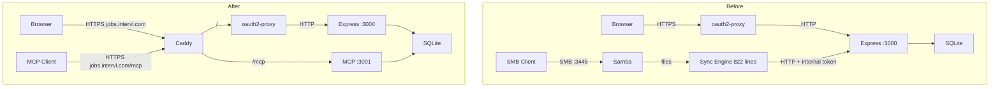

# MCP Server + SMB Removal

## Problem Frame

The job tracker needs AI agent integration for reviewing applications, tailoring documents, and managing the application lifecycle. The current approach to external tool access — an 822-line bidirectional SMB sync engine with Samba — is fragile, complex, and optimized for text editors rather than AI agents.

MCP (Model Context Protocol) is the standard for agent-to-service communication. While the existing REST API provides full CRUD, MCP adds specific value for agent workflows: clients auto-discover available tools via the protocol (no manual endpoint documentation), MCP-native clients like Claude Desktop integrate without custom HTTP configuration, and the protocol handles session management and streaming natively. This makes agent integration zero-configuration rather than requiring each agent to learn the REST API's conventions.

The net effect: ~1,050 lines deleted, Samba removed from Docker, reduced attack surface, smaller image, and a modern agent integration layer added in its place.

## Architecture

Note: Caddy reverse-proxies `jobs.intervl.com` — web traffic routes through oauth2-proxy to Express, MCP traffic routes directly to the MCP port (API key auth, no OAuth). The MCP endpoint runs in the same Node.js process but uses the MCP SDK's own HTTP server (Hono-based), not Express. Both servers share the process and can import the same database module directly.

## Delivery Phases

This work ships in two phases to de-risk MCP transport assumptions.

**Phase 1: API key auth + SMB removal**
Add API key authentication to the existing REST API and remove all SMB infrastructure. This is independently valuable — agents can use the REST API with API keys immediately.

**Phase 2: MCP server**
Add the MCP SSE endpoint wrapping the REST API's business logic. Gated on a spike validating that MCP clients (Claude Desktop, Claude Code) can connect via SSE/Streamable HTTP to a remote server.

## Requirements

### Phase 1: API Keys + SMB Removal

**Authentication**
- R1. Users can generate and revoke personal API keys from the web UI. Each key is scoped to the generating user's `user_email`.
- R2. API keys authenticate programmatic access to the REST API via `Authorization: Bearer <key>` header. All operations are scoped to the key owner's data, using the same per-user scoping the web UI enforces. Requests without a valid key on the API-key-authenticated path are rejected with HTTP 401.
- R3. API keys are generated using `crypto.randomBytes(32)` and stored as `HMAC-SHA256(SERVER_API_KEY_SECRET, raw_key)` in the database (never plaintext). `SERVER_API_KEY_SECRET` is an env var. The raw key is shown to the user exactly once at generation time.
- R4. The API key endpoint applies rate limiting (configurable via `RATE_LIMIT_MCP` env var, defaulting to the same value as `RATE_LIMIT_API`).

**SMB Removal**
- R5. The SMB sync engine (`server/lib/sync-engine.mjs`, `server/smb-sync.mjs`), Samba configuration (`smb.conf`), and all SMB-related Docker infrastructure (Samba packages, SMB entrypoint branches, `smb-share` volume, SMB env vars, SMB port mapping) are removed. SMB is not currently enabled in production (`ENABLE_SMB` defaults to false).
- R6. The `X-Internal-Auth-Token` code path in the auth middleware is removed (its only consumer was the sync engine).
- R7. Linux capabilities are reduced to the verified minimum. The entrypoint's `chown -R` for volume ownership requires `CHOWN`; `SETUID` and `SETGID` may be needed for `su-exec`. `DAC_OVERRIDE` can likely be dropped. Final set determined during planning.

**Web UI**
- R8. A gear icon in the header opens a settings slide-over (matching the existing ApplicationPanel pattern). The settings panel allows users to: generate new API keys (with an optional label), view existing keys (label, creation date, last used as relative time or "Never used"), and revoke keys (with inline confirmation).
- R9. On key creation, a modal displays the raw key with a copy-to-clipboard button. The user must click "I've saved this key" before the modal can be dismissed. The key cannot be retrieved again after dismissal.

### Phase 2: MCP Server (gated on SSE spike)

**MCP Server**
- R10. The MCP SDK's SSE/Streamable HTTP server runs in the same Node.js process as Express, on a separate port (not published in docker-compose.yml). Caddy reverse-proxies `jobs.intervl.com/mcp` to the MCP port over the Docker network, providing TLS termination. MCP clients connect to `https://jobs.intervl.com/mcp`.
- R11. MCP tools cover core application CRUD: list applications (with filtering), get a single application (with stage notes, attachment metadata, and job description in one response), create an application, update application fields, change application status, and add stage notes.
- R12. MCP tools cover attachment access: list attachments for an application, and retrieve attachment content via download URL (not inlined — binary PDFs up to 10MB are impractical to base64-encode in MCP JSON responses).
- R13. MCP tool handlers call a shared service layer (extracted from Express route handlers during planning) that accepts `userEmail` as an explicit parameter. Both REST routes and MCP tools use this service layer. This avoids threading fake `req` objects through Express middleware.
- R14. MCP clients authenticate using the same API key system from Phase 1 (R2-R3). The MCP SDK's auth hook validates the key and resolves the `userEmail` before any tool handler executes.
- R15. Attachment retrieval verifies the parent application is owned by the API key's `userEmail` before returning data.

## Success Criteria

**Phase 1:**
- An agent or script can authenticate with an API key and call the REST API to list applications, create/update applications, change statuses, and add notes.
- The Docker image no longer contains Samba, the sync engine, or any SMB-related code or configuration.
- The container runs with `cap_drop: ALL` and a verified minimal `cap_add` set.
- API key auth works: valid key scopes to correct user; invalid/missing key returns 401.

**Phase 2:**
- An MCP client (e.g., Claude Desktop) can connect to the job tracker via SSE, discover available tools, and perform all CRUD operations — with no filesystem layer in between.
- MCP operations use the same per-user scoping as the web UI and REST API.

## Scope Boundaries

- **Not in scope:** AI document generation (cover letters, resume tailoring). Ideation item #6.
- **Not in scope:** Document text extraction from attachments. Ideation item #2.
- **Not in scope:** User profile / master resume store. Ideation item #4.
- **Not in scope:** Stdio MCP transport. SSE/HTTP only.
- **Not in scope:** Attachment uploads via MCP. Read-only attachment access for the initial tool set.
- **Not in scope:** Key expiry or rotation. Keys are long-lived; revocation is the recovery mechanism. Schema should include a nullable `expires_at` column for future use.

## Key Decisions

- **MCP over REST-only**: MCP adds auto-discovery, native Claude Desktop integration, and session management. The REST API with API keys (Phase 1) is the immediate fallback and independently useful.
- **SSE/Streamable HTTP transport**: Remote agent access. Chosen over stdio because the Docker deployment is remote.
- **Same process, separate HTTP server**: The MCP SDK uses Hono (not Express) for its HTTP layer. Both run in the same Node.js process, sharing the database module. MCP tools call a shared service layer, not Express route handlers directly.
- **Per-user API keys**: Proper user scoping for both REST and MCP access. Chosen over shared secrets (no per-user scoping) and OIDC M2M flows (too complex).
- **Caddy-proxied MCP path**: MCP traffic reaches the container via `https://jobs.intervl.com/mcp` — Caddy terminates TLS and routes `/mcp` directly to the MCP port (bypassing oauth2-proxy). The MCP port is not published in docker-compose.yml; only Caddy can reach it over the Docker network. API key auth handles access control.
- **Phased delivery**: Phase 1 (API keys + SMB removal) ships first with immediate value. Phase 2 (MCP) is gated on a spike validating SSE transport. This decouples the deletion (pure simplification, zero risk) from the addition (new protocol, unvalidated assumptions).
- **Service layer extraction**: Business logic extracted from Express `(req, res)` route handlers into service functions with explicit `userEmail` parameters. Both REST routes and MCP tools call these functions. This is prerequisite work for Phase 2.

## Dependencies / Assumptions

- The `@modelcontextprotocol/sdk` npm package provides SSE/Streamable HTTP server support via its Hono-based transport layer. (Validated: SDK v1.29.0 depends on `@hono/node-server`.)
- MCP clients (Claude Desktop, Claude Code) support SSE/Streamable HTTP transport for remote connections. **This must be validated via spike before Phase 2 begins.**
- A `SERVER_API_KEY_SECRET` env var is available for HMAC-SHA256 key hashing.

## Outstanding Questions

### Resolve Before Phase 2
- [Affects R10][Spike required] Validate that Claude Desktop and Claude Code can connect to a remote MCP SSE server via `https://jobs.intervl.com/mcp` (through Caddy). Build a minimal MCP server with one tool, deploy behind Caddy, and test client connectivity. Caddy must be configured to support SSE (disable response buffering on the `/mcp` route). If this fails, Phase 2 needs rethinking.

### Deferred to Planning
- [Affects R10][Needs research] Which MCP SDK package version to use and how to run its Hono HTTP server alongside Express in one process.
- [Affects R10][Technical] Port number for the MCP endpoint. Internal only (Docker network, not published). Caddy config for the `/mcp` route — must support SSE (no response buffering, no short timeouts).
- [Affects R7][Technical] Whether the simplified entrypoint needs `CHOWN` only, or also `SETUID`/`SETGID` for `su-exec`.
- [Affects R1][Technical] Schema for the `api_keys` table: `(id, user_email, label, key_hash, created_at, last_used_at, expires_at nullable)`.
- [Affects R13][Technical] Which route handler functions to extract into the service layer and their signatures.

## Related Documents

- **Ideation:** `docs/ideation/2026-04-06-smb-to-mcp-agent-integration-ideation.md`
- **Original SMB brainstorm:** `docs/brainstorms/2026-03-09-smb-filesystem-access-brainstorm.md`
- **SMB lessons learned:** `docs/solutions/integration-issues/smb-filesystem-sync-implementation.md`

## Next Steps

`-> /ce:plan` for Phase 1 implementation planning (API keys + SMB removal)
