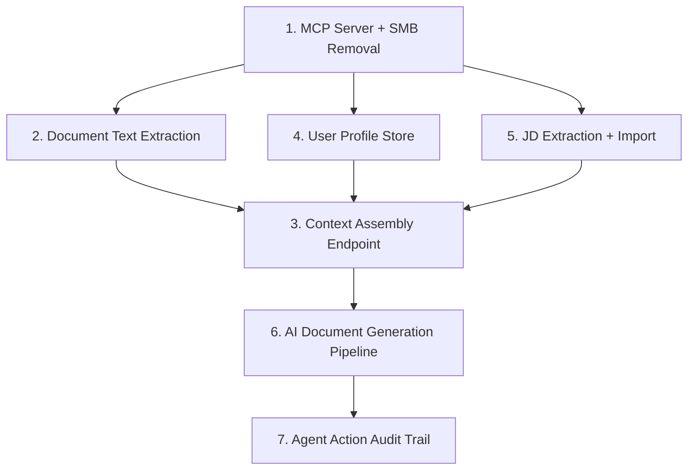

# Ideation: SMB to MCP — AI Agent Integration

## Codebase Context

Full-stack job tracker: Vue 3 + Express 5 + SQLite, deployed via Docker Compose.

**Current SMB sync (to be replaced):** 822-line bidirectional sync engine (`server/lib/sync-engine.mjs`) + 86-line startup wrapper (`server/smb-sync.mjs`) + Samba config/packages in Docker. Uses chokidar file watching, 30s API polling, content-hash feedback loop prevention (SHA-256), three-layer self-echo suppression, special umask handling. Docker image includes samba packages; entrypoint configures SMB users/credentials. 5 dedicated env vars, 4 Linux capabilities added solely for SMB.

**Existing foundations:** Generic `attachments` table with multer uploads (10MB limit, PDF/DOCX/DOC allowed). Auth via oauth2-proxy with internal token pattern for service-to-service calls. Status pipeline (interested->applied->screening->interview->offer->accepted->rejected) with auto-dated transitions. Stage notes (markdown). Per-user data scoping via `user_email`.

**Past learnings:** Internal auth token pattern is reusable for new services. Multer cleanup on error paths is critical. The sync engine already proved the REST API is sufficient for full CRUD from an external consumer.

**No prior art:** No MCP, AI/LLM integration, cover letter generation, or resume tailoring exists in the codebase.

## Ranked Ideas

### 1. MCP Server + SMB Removal
**Description:** Replace the 822-line SMB sync engine with an MCP server that wraps the existing REST API as structured tools (`list_applications`, `get_application`, `update_status`, `add_note`, `upload_attachment`). Remove sync-engine.mjs, smb-sync.mjs, smb.conf, Samba from Docker, the 5 SMB env vars, the internal-auth-token code path, and the 4 Linux capabilities that only SMB needed. ~1,050 lines deleted, smaller Docker image, reduced attack surface.
**Rationale:** This is the architectural pivot — everything else depends on it. The MCP server is a thin translation layer; the existing API already handles CRUD, auth, validation, and rate limiting. The sync engine already proved the API is sufficient for full external CRUD.
**Downsides:** MCP is still maturing; transport choice (stdio vs SSE) has tradeoffs. Loses the "edit files in any text editor" affordance SMB provided.
**Confidence:** 90%
**Complexity:** Medium
**Status:** Explored (brainstorm 2026-04-06)

### 2. Document Text Extraction Layer
**Description:** Add server-side text extraction for uploaded PDF/DOCX attachments (via `pdf-parse` or `mammoth`). Store extracted text in an `extracted_text` column on the `attachments` table, populated on upload. Nothing downstream (tailoring, matching, generation) works without this.
**Rationale:** The system currently stores files as opaque blobs. Every AI feature requires reading document content. This is the foundational prerequisite.
**Downsides:** Adds two dependencies. Extraction quality varies by document complexity. Need to handle extraction failures gracefully.
**Confidence:** 85%
**Complexity:** Low-Medium
**Status:** Unexplored

### 3. Application Context Assembly Endpoint
**Description:** `GET /api/applications/:id/context` returns a single rich payload: application record, all stage notes, extracted text from all labelled attachments, parsed JD, and user profile. One call gives an agent everything it needs.
**Rationale:** Agents are token-constrained and round-trip-sensitive. The existing API requires 3-4 calls to assemble working context. A single endpoint dramatically reduces agent integration complexity.
**Downsides:** Potentially large response payload. Need to decide what to include vs. omit.
**Confidence:** 85%
**Complexity:** Low
**Status:** Unexplored

### 4. User Profile / Master Resume Store
**Description:** Add a `user_profiles` table storing the user's canonical resume text, skills inventory, career summary, and preferred tone/style. Exposed via `GET/PUT /api/me/profile`. This is the "candidate side" that agents need alongside the "job side" to do any tailoring.
**Rationale:** Currently the only user data is an email. An agent can't write a cover letter without knowing who the candidate is. A user-level store avoids the problem of "my resume is attached to application #7 but I need it for application #42."
**Downsides:** Users must populate it (onboarding friction). Keeping it current requires discipline.
**Confidence:** 80%
**Complexity:** Low
**Status:** Unexplored

### 5. Structured JD Extraction + URL Auto-Import
**Description:** Parse the `job_description` text field into structured data (required skills, experience, responsibilities, salary signals) stored as JSON. Optionally auto-import by fetching and extracting from `job_posting_url`. The structured data powers skill-gap analysis and targeted tailoring.
**Rationale:** Every useful agent task starts with understanding the JD. Structured extraction done once makes every downstream task higher quality. URL auto-import reduces friction at the capture point.
**Downsides:** Extraction accuracy depends on JD format diversity. URL fetching adds complexity (rate limits, anti-scraping, varied HTML). Could be an LLM call itself.
**Confidence:** 75%
**Complexity:** Medium
**Status:** Unexplored

### 6. AI Document Generation Pipeline
**Description:** `POST /api/applications/:id/generate` accepts a task type (cover_letter, resume_tailor, interview_prep) and orchestrates: read context (#3), fetch user profile (#4), generate a tailored document, store it as an attachment with a `generated_by: "agent"` flag. Users review in the UI before use.
**Rationale:** This is the killer use case — the reason to do any of this. It turns the tracker from a record-keeping tool into an active job search assistant.
**Downsides:** Requires an LLM API key and cost. Generation quality is hard to guarantee. Needs all of #2-#5 as prerequisites.
**Confidence:** 80%
**Complexity:** Medium-High
**Status:** Unexplored

### 7. Agent Action Audit Trail
**Description:** An `agent_actions` table logging every agent mutation: who (agent identity), what (action, target), when, before/after diff, and a human-readable rationale. Surfaced in the Vue UI as a timeline per application.
**Rationale:** If agents modify data, humans need trust-but-verify. This is the minimum viable governance layer.
**Downsides:** Adds storage overhead. UI work to surface the timeline. May feel like overkill early on.
**Confidence:** 70%
**Complexity:** Low-Medium
**Status:** Unexplored

## Dependency Chain

## Rejection Summary

| # | Idea | Reason Rejected |
|---|------|-----------------|
| 1 | Scoped Agent API Tokens | Too expensive relative to value; internal token sufficient initially |
| 2 | Webhook/Event System | Premature; agents can be invoked directly, no reactive workflows yet |
| 3 | Multi-Agent Orchestration Metadata | Solving multi-agent before single agent works |
| 4 | Lifecycle State Machine with Hooks | Too complex; current linear pipeline works; brainstorm variant |
| 5 | Preserve markdown rendering for context | Structured JSON is better for agents than markdown |
| 6 | AI-Generated Document Versioning | Premature; build generation first, add versioning when needed |
| 7 | Human Review/Approval Queue | UI naturally shows drafts; formal workflow unnecessary |
| 8 | Tailoring Diff/Match Score | Downstream of generation; build core pipeline first |
| 9 | Attachment Labels/Type Tags | Merged into context assembly endpoint |
| 10 | Automated Follow-Up Tracker | Too far from core SMB-to-MCP goal |
| 11 | Batch Operations Endpoint | Premature; single operations first |
| 12 | Application Strategy Scoring | Interesting but too far from core migration |
| 13 | Calendar Integration | Unrelated to core goal |
| 14 | Interview Prep Context Bundles | Downstream of context assembly |
| 15 | Pipeline Digest/Weekly Report | Interesting but downstream |
| 16 | Offer Comparison Workspace | Too narrow, too far from core goal |
| 17 | MCP as sidecar vs in-process | Deployment detail, merged into MCP server idea |

## Session Log
- 2026-04-06: Initial ideation — 38 raw candidates from 4 frames (agent-first architecture, removal/simplification, document intelligence, lifecycle automation), deduped to 25, 7 survivors
- 2026-04-06: Brainstorming idea #1 (MCP Server + SMB Removal)
