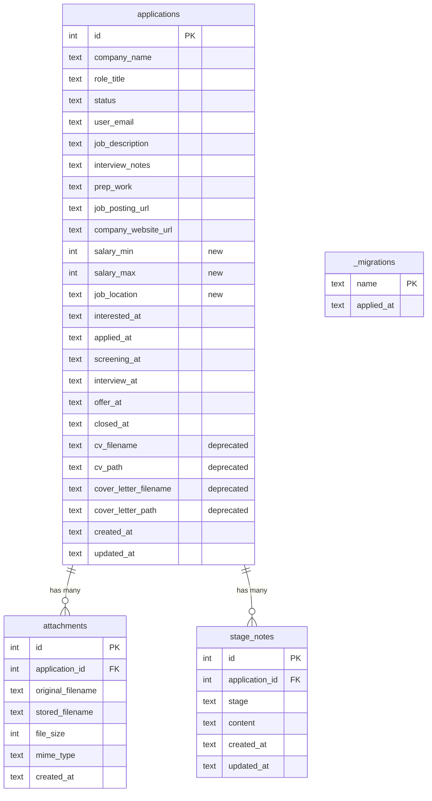

# feat: SMB Filesystem Access for Job Applications

## v1 Scope Decisions (from technical review)

**Reviewed:** 2026-03-09 — 8 review agents, 19 findings triaged

### Adopted Scope Reductions

- **Option B: Single-user mode** — `SMB_USER`/`SMB_PASS`/`SMB_USER_EMAIL` instead of multi-user provisioning
- **Option C: Flat notes** — Single `notes.md` per application instead of `notes/{stage}/{id}.md` hierarchy
- **Option D: Drop `mv` for status changes** — No rename detection. Status changes via web UI only. Defer with delete support.

### Key Design Decisions from Review

1. **Content-hash feedback loop prevention** — deterministic SHA-256 comparison, not time-based
2. **Security controls are mandatory** — internal auth token, path canonicalization, YAML JSON_SCHEMA, O_NOFOLLOW, `wide links = no`
3. **`_migrations` table** for idempotent data migration tracking
4. **WAL checkpoint before backup** — `PRAGMA wal_checkpoint(TRUNCATE)` before copying `.db` file
5. **Date fields writable** in frontmatter (except `id`, `created_at`, `updated_at`)
6. **Deletes ignored for v1** — `rm -rf` has no effect; directories recreated on next poll. Defer with `mv` support.
7. **Express is PID 1** via `exec` — sync engine backgrounded before it
8. **Samba on high port (3445)** — mapped to 445 externally, allows non-root smbd
9. **`SMB_USERS_FILE`** as primary credential mechanism (file, not env var)

## Overview

Add an opt-in Samba (SMB) network share to the job-tracker Docker container, exposing job applications as a browsable, editable directory tree. Windows hosts map it as a network drive to view and manage applications using VS Code, nano, file explorer, or LLMs like Claude Code.

A Node.js sync process maintains a real directory tree mirroring the database. Samba serves those files over SMB. File changes are detected with chokidar and synced back to the Express API. API changes are polled periodically and reflected on disk.

## Problem Statement / Motivation

Currently, job application data is only accessible through the web UI. Users who want to:
- Edit notes and details in their preferred editor (VS Code, nano)
- Have an LLM (Claude Code) review and assist with their application workflow
- Bulk-manage applications using standard file tools

...cannot do so. An SMB share provides a universal filesystem interface that any tool can work with.

## Proposed Solution

Three implementation phases:
1. **Generic attachments API** — Replace CV/cover-letter-specific upload slots with a unified attachments system
2. **Sync engine** — Node.js process that maintains a bidirectional sync between the API and a directory tree
3. **Samba integration** — Samba server in the Docker container serving the sync directory over SMB

(See brainstorm: `docs/brainstorms/2026-03-09-smb-filesystem-access-brainstorm.md` for all design decisions)

## Technical Approach

### Architecture

```
Windows Host                    Docker Container
                               ┌──────────────────────────────────┐
 \\server\jobs ──SMB (445)───>│  smbd (Samba daemon, port 3445)   │
                               │    ↕ serves real files            │
                               │  /app/smb-share/                  │
                               │    ↕ chokidar watches             │
                               │  smb-sync.mjs (Node.js process)  │
                               │    ↕ HTTP + X-Internal-Auth-Token │
                               │  Express API (:3000)              │
                               │    ↕                              │
                               │  SQLite (data/job-tracker.db)     │
                               └──────────────────────────────────┘
```

### Directory Structure

Single-user directory organized by pipeline status. Each application is a directory named `{company}--{role}` (double-dash separator preserves hyphens in names).

```
/app/smb-share/
├── _README.md                      # read-only, auto-generated agent guide
├── interested/
│   └── google--senior-swe/
│       ├── details.md              # YAML frontmatter + free-form body
│       ├── job-description.md      # maps to job_description field
│       ├── interview-notes.md      # maps to interview_notes field
│       ├── prep-work.md            # maps to prep_work field
│       ├── notes.md                # all stage notes, markdown headers per stage
│       └── files/
│           ├── resume.pdf          # generic attachment
│           └── cover-letter.pdf    # generic attachment
├── applied/
├── screening/
├── interview/
├── offer/
├── accepted/
└── rejected/
```

### File Formats

**`details.md`** — YAML frontmatter with structured fields:
```yaml
---
id: 42
company_name: "Google"
role_title: "Senior SWE"
job_posting_url: "https://careers.google.com/123"
company_website_url: "https://google.com"
salary_min: 150000
salary_max: 200000
job_location: "Remote"
interested_at: "2026-03-01"
applied_at: "2026-03-05"
created_at: "2026-03-01T00:00:00.000Z"
updated_at: "2026-03-09T12:00:00.000Z"
---

Free-form description or notes here.
```

`id`, `created_at`, and `updated_at` are **read-only** — the sync process ignores changes to them. All other fields are editable, including date fields (`interested_at`, `applied_at`, `screening_at`, `interview_at`, `offer_at`, `closed_at`) which sync to `PATCH /api/applications/:id/dates`.

**Note:** Frontmatter field names match database column names exactly (`company_name` not `company`, `role_title` not `role`, `job_location` not `location`) to avoid translation bugs in the sync engine.

**`job-description.md`, `interview-notes.md`, `prep-work.md`** — Plain markdown. Entire file content maps to the corresponding database text field. Filename uses hyphens but maps to underscore column names (`interview-notes.md` → `interview_notes`).

**`notes.md`** — All stage notes in a single file with markdown headers per stage:

```markdown
## Interested
First note content here...

## Interview
Interview went well...
```

The sync engine parses headers matching valid status names and syncs each section's content. New sections create notes; removed sections delete notes. Simpler than per-file notes and more natural for editor workflows.

### Implementation Phases

#### Phase 1: Generic Attachments API

Replace the CV/cover-letter-specific upload system with a unified attachments model. (See brainstorm decision #11)

**New database table** in `server/db.js`:

```sql
CREATE TABLE IF NOT EXISTS attachments (
  id INTEGER PRIMARY KEY AUTOINCREMENT,
  application_id INTEGER NOT NULL,
  original_filename TEXT NOT NULL,
  stored_filename TEXT NOT NULL,
  file_size INTEGER NOT NULL,
  mime_type TEXT,
  created_at TEXT DEFAULT (datetime('now')),
  FOREIGN KEY (application_id) REFERENCES applications(id) ON DELETE CASCADE
);
```

**New API endpoints** in `server/routes/applications.js`:

| Method | Path | Description |
|--------|------|-------------|
| `GET` | `/:id/attachments` | List attachments for an application |
| `POST` | `/:id/attachments` | Upload one or more files (multer) |
| `GET` | `/:id/attachments/:attachmentId` | Download a specific attachment |
| `DELETE` | `/:id/attachments/:attachmentId` | Delete an attachment |

**Migration path for existing CV/cover-letter data:**
- Add the `attachments` table alongside existing columns
- **Back up the database** before migration with WAL checkpoint:

```js
// Flush WAL to main database file before backup
db.pragma('wal_checkpoint(TRUNCATE)');
fs.copyFileSync(dbPath, dbPath + '.pre-attachments.bak');
```

- **Track migrations with a `_migrations` table** (not row counts, which break after legitimate deletions):

```js
db.exec(`CREATE TABLE IF NOT EXISTS _migrations (name TEXT PRIMARY KEY, applied_at TEXT)`);
db.exec(`CREATE TABLE IF NOT EXISTS attachments (...)`);

const alreadyRun = db.prepare("SELECT 1 FROM _migrations WHERE name = ?").get('cv_to_attachments');
const hasCvData = db.prepare("SELECT COUNT(*) as count FROM applications WHERE cv_path IS NOT NULL").get();

if (!alreadyRun && hasCvData.count > 0) {
  const migrate = db.transaction(() => {
    const apps = db.prepare("SELECT id, cv_filename, cv_path, cover_letter_filename, cover_letter_path FROM applications WHERE cv_path IS NOT NULL OR cover_letter_path IS NOT NULL").all();
    for (const app of apps) {
      if (app.cv_path && fs.existsSync(path.join(uploadsDir, app.cv_path))) {
        const size = fs.statSync(path.join(uploadsDir, app.cv_path)).size;
        const ext = path.extname(app.cv_path).toLowerCase();
        const mime = MIME_MAP[ext] || null;
        db.prepare("INSERT INTO attachments (application_id, original_filename, stored_filename, file_size, mime_type) VALUES (?, ?, ?, ?, ?)").run(app.id, app.cv_filename, app.cv_path, size, mime);
      }
      // Same for cover_letter...
    }
    db.prepare("INSERT INTO _migrations (name, applied_at) VALUES (?, datetime('now'))").run('cv_to_attachments');
  });
  migrate();
}
```

- Keep old columns and endpoints functional for backward compatibility during transition
- **Old CV/cover-letter endpoints should also insert into `attachments`** during transition (dual-write, wrapped in `db.transaction()`) to prevent data drift
- The web UI continues to work unchanged; update it to use the new attachments API in a later iteration
- Add index: `CREATE INDEX IF NOT EXISTS idx_attachments_application_id ON attachments(application_id)`

**New columns on `applications` table** (inline migration in `db.js`):
- `salary_min` INTEGER — Minimum salary
- `salary_max` INTEGER — Maximum salary
- `job_location` TEXT — Job location

These fields are also added to the `PUT /:id` update endpoint and `POST /` create endpoint.

**Files to modify:**
- `server/db.js` — Add `attachments` table, migration for existing uploads, add `salary_min`/`salary_max`/`job_location` columns
- `server/routes/applications.js` — Add attachment CRUD endpoints (reuse existing `uploadsDir`, `storage`, `safePath` helpers), add salary/job_location to PUT/POST
- `client/src/api.js` — Add attachment API functions (for future web UI update)

**Acceptance criteria:**
- [x] `attachments` table created on startup
- [x] Existing CV/cover-letter files migrated to attachments table
- [x] `POST /:id/attachments` uploads files with multer (same 10MB limit, same allowed extensions)
- [x] `GET /:id/attachments` returns list with `id`, `original_filename`, `file_size`, `mime_type`, `created_at`
- [x] `GET /:id/attachments/:id` downloads the file with original filename
- [x] `DELETE /:id/attachments/:id` removes file from disk and database
- [x] All endpoints scoped to owner (reuse `getOwnApp` pattern)
- [x] Old CV/cover-letter endpoints remain functional

#### Phase 2: Sync Engine

The core two-way sync process that bridges the filesystem and the API. **Single-user only** for v1.

**New file: `server/smb-sync.mjs`**

A standalone Node.js script (ESM, `.mjs` extension for chokidar v4 compatibility) that:
1. On startup, performs a full sync (API → files): fetches all applications, builds the directory tree
2. Watches the directory with chokidar for file changes (files → API)
3. Periodically polls the API (every 30s) for changes (API → files)

**Dependencies to add to `server/package.json`:**
- `chokidar` — File watching (v4, ESM)
- `gray-matter` — YAML frontmatter parsing/stringifying

**Key module: `server/lib/sync-engine.mjs`**

```
SyncEngine
├── constructor(apiBase, userEmail, syncDir, authToken)
├── start()                    # Full sync + start watching + start polling
├── stop()                     # Clean shutdown
├── fullSync()                 # API → files: rebuild entire directory tree
├── pollForChanges()           # API → files: full-fetch update
├── handleFileChange(event, path)  # files → API: process a filesystem event
├── buildDirectoryTree(apps)   # Create/update directory structure from API data
├── parseApplicationDir(dirPath) # Extract app data from directory contents
└── Internal state:
    ├── appIdByDir: Map<dirPath, appId>    # directory → application ID mapping
    ├── lastWrittenHashes: Map<filePath, hash>  # content-hash feedback loop prevention
    └── pendingChanges: Map<filePath, timer> # debounce writes
```

**Sync operations mapping (v1 — no mv, no delete, flat notes):**

| Filesystem Event | API Call | Notes |
|-----------------|----------|-------|
| Edit `details.md` | `PUT /api/applications/:id` | Parse YAML frontmatter, send only changed editable fields |
| Edit `details.md` date fields | `PATCH /api/applications/:id/dates` | Detect changes to date fields, validate ISO format |
| Edit `job-description.md` | `PUT /api/applications/:id` | Send `{ job_description: content }` |
| Edit `interview-notes.md` | `PUT /api/applications/:id` | Send `{ interview_notes: content }` |
| Edit `prep-work.md` | `PUT /api/applications/:id` | Send `{ prep_work: content }` |
| Edit `notes.md` | Note sync | Parse markdown headers per stage, sync each section |
| `mkdir` in status folder | `POST /api/applications` | Parse `company--role` from dirname |
| Add file to `files/` | `POST /api/applications/:id/attachments` | Upload via multipart |
| Delete file from `files/` | `DELETE /api/applications/:id/attachments/:id` | Match by filename |
| `mv` dir / `rm -rf` dir | **Ignored in v1** | Directories recreated on next poll. Deferred to v2. |

**Security controls (mandatory, not optional):**

All security items are required for Phase 2, not deferred hardening:

1. **Internal auth token**: Generated at startup with `crypto.randomBytes(32)`. Shared via `INTERNAL_AUTH_TOKEN` env var (set by entrypoint). Auth middleware updated to reject `X-Forwarded-Email` without valid `X-Internal-Auth-Token` unless request came through oauth2-proxy.
2. **Path canonicalization**: Every chokidar event path is validated as a descendant of the sync directory using `fs.realpathSync()` before processing.
3. **YAML safety**: gray-matter configured with `yaml.JSON_SCHEMA` to prevent prototype pollution. Only whitelisted frontmatter fields are sent to the API.
4. **O_NOFOLLOW**: Files opened with `fs.constants.O_RDONLY | fs.constants.O_NOFOLLOW` to prevent symlink TOCTOU attacks.

```js
// Auth token generation (in smb-sync.mjs)
const INTERNAL_TOKEN = process.env.INTERNAL_AUTH_TOKEN;

// All API calls include the token
const headers = {
  'X-Forwarded-Email': userEmail,
  'X-Internal-Auth-Token': INTERNAL_TOKEN,
  'Content-Type': 'application/json'
};

// gray-matter with safe YAML schema
const { data, content } = matter(fileContent, {
  engines: {
    yaml: { parse: (str) => yaml.load(str, { schema: yaml.JSON_SCHEMA }) }
  }
});

// Path validation on every chokidar event
function validatePath(filePath, syncRoot) {
  const real = fs.realpathSync(filePath);
  if (!real.startsWith(fs.realpathSync(syncRoot) + path.sep)) {
    throw new Error(`Path traversal detected: ${filePath}`);
  }
  return real;
}
```

**Feedback loop prevention (content-hash comparison):**

When the sync engine writes files from API data, it must not re-sync those writes back to the API. Use deterministic content-hash comparison:

```js
const lastWrittenHashes = new Map(); // filePath -> sha256 hash

function writeFromApi(filePath, content) {
  const hash = crypto.createHash('sha256').update(content).digest('hex');
  lastWrittenHashes.set(filePath, hash);
  atomicWrite(filePath, content);
}

// In chokidar handler:
function shouldSync(filePath) {
  const content = fs.readFileSync(filePath, 'utf-8');
  const hash = crypto.createHash('sha256').update(content).digest('hex');
  if (lastWrittenHashes.get(filePath) === hash) return false; // our own write
  return true;
}
```

Additionally, **pause chokidar during `fullSync()`** to avoid a thundering herd of events on startup. Resume with `ignoreInitial: true` after all files are written.

**chokidar configuration:**

```js
const watcher = chokidar.watch(syncDir, {
  persistent: true,
  ignoreInitial: true,
  depth: 4,                    // deepest path: status/company--role/files/file.pdf
  followSymlinks: false,       // prevent symlink attacks
  ignored: [
    /(^|[\/\\])\./,            // dotfiles (.DS_Store, etc.)
    /~$/,                      // editor backup files (file~)
    /\.tmp$/,                  // temp files
    /~\$.*/,                   // Word/Excel lock files (~$document.docx)
    /Thumbs\.db$/,             // Windows thumbnail cache
    /desktop\.ini$/,           // Windows folder config
    /\.swp$/,                  // Vim swap files
    /\.~lock\..*/,             // LibreOffice lock files
    /_README\.md$/,            // our auto-generated readme
  ],
  awaitWriteFinish: {
    stabilityThreshold: 2000,  // wait 2s after last write before firing event
    pollInterval: 300          // 300ms, not 100ms (reduces syscall overhead)
  }
});
```

**Startup reconciliation:**

On startup, `fullSync()` rebuilds the directory tree from the API. The algorithm:
1. Fetch all applications from API
2. For each application, compute expected directory path (`{status}/{company}--{role}/`)
3. Create/update files that differ from API state
4. **Only remove directories that have a `details.md` with an `id` not found in the API response** — directories without `details.md` or without an `id` are left alone for the watcher to process as new applications
5. Build the `appIdByDir` mapping
6. Generate `_README.md` in sync root

**Changed field detection:**

The sync engine tracks the last-known state of each `details.md` file. On change, it diffs parsed frontmatter against the last-known state and only sends fields that actually differ to the API. This prevents stale filesystem values from overwriting concurrent web UI changes.

**Files to create (2 files):**
- `server/smb-sync.mjs` — Entry point. Reads `SMB_USER_EMAIL`, waits for Express API readiness, instantiates single SyncEngine. Uses `.mjs` extension to resolve CJS/ESM conflict with chokidar v4 without modifying the existing server's CommonJS configuration.
- `server/lib/sync-engine.mjs` — All sync logic: API client (inline `fetch` calls), file building (gray-matter stringify), file parsing (gray-matter parse), chokidar watcher, polling loop. No premature decomposition — extract modules only if this file exceeds 500 lines.

**Startup ordering:** The sync engine waits for Express to be ready before calling the API. `smb-sync.mjs` polls `http://localhost:3000/api/me` with retries (1s interval, 30s timeout) before starting.

**Acceptance criteria:**
- [x] Full sync on startup rebuilds directory tree from API
- [x] Editing `details.md` frontmatter updates application via API (only changed fields sent)
- [x] Editing date fields in `details.md` calls `PATCH /api/applications/:id/dates`
- [x] Editing text field files updates corresponding API field
- [x] Editing `notes.md` syncs note sections bidirectionally
- [x] `mkdir` creates new application via API
- [x] Adding files to `files/` uploads attachments via API
- [x] Deleting files from `files/` removes attachments via API
- [x] `rm -rf` and `mv` are ignored (directories recreated on next poll)
- [x] Periodic polling (30s) catches web UI changes
- [x] No feedback loops (API writes don't trigger re-sync to API)
- [x] Debounced file events (500ms) prevent partial-save syncs
- [x] Internal auth token required on all sync engine API calls
- [x] Path canonicalization validates all chokidar paths
- [x] YAML parsed with JSON_SCHEMA, only whitelisted fields sent to API
- [x] Files opened with O_NOFOLLOW

#### Phase 3: Samba Integration

Add Samba to the Docker container, conditionally started via `ENABLE_SMB` environment variable. **Single-user only** for v1.

**Dockerfile additions:**

```dockerfile
# In runtime stage, after existing setup:
RUN apk add --no-cache samba samba-common-tools && \
    mkdir -p /var/log/samba /run/samba /var/lib/samba/private

COPY smb.conf /etc/samba/smb.conf

EXPOSE 3000 3445
```

**New file: `smb.conf`** (project root):

```ini
[global]
   workgroup = WORKGROUP
   server string = Job Tracker
   security = user
   map to guest = Never
   server min protocol = SMB2
   server max protocol = SMB3
   disable netbios = yes
   smb ports = 3445
   load printers = no
   printing = bsd
   printcap name = /dev/null
   disable spoolss = yes
   log file = /var/log/samba/log.%m
   max log size = 50
   wide links = no
   unix extensions = no
   restrict anonymous = 2
   # Restrict to private networks only
   hosts allow = 127.0.0.1 10.0.0.0/8 172.16.0.0/12 192.168.0.0/16
   hosts deny = 0.0.0.0/0

[jobs]
   comment = Job Tracker Applications
   path = /app/smb-share
   browseable = yes
   read only = no
   writable = yes
   valid users = %U
   create mask = 0664
   directory mask = 0775
   force group = nodejs
```

**Note:** Uses a single `[jobs]` share pointing to `/app/smb-share` (single user, no per-user directories needed). The `valid users = %U` ensures only the configured Samba user can access. Uses high port 3445 (mapped to 445 externally) so smbd doesn't need root for port binding. `wide links = no` prevents symlink escapes at the SMB level.

**Updated `docker-entrypoint.sh`:**

```bash
#!/bin/sh
set -e

# Fix volume ownership
chown -R nodejs:nodejs /app/data /app/uploads

# Conditionally start SMB
if [ "$ENABLE_SMB" = "true" ]; then
  # Create smb-share directory
  mkdir -p /app/smb-share
  chown -R nodejs:nodejs /app/smb-share

  # Read credentials from file (Docker secrets) or fall back to env var
  if [ -f "$SMB_CREDENTIALS_FILE" ]; then
    SMB_USER=$(head -1 "$SMB_CREDENTIALS_FILE" | cut -d: -f1)
    SMB_PASS=$(head -1 "$SMB_CREDENTIALS_FILE" | cut -d: -f2)
    SMB_USER_EMAIL=$(head -1 "$SMB_CREDENTIALS_FILE" | cut -d: -f3)
  fi

  # Create single Samba user
  adduser -D -H -s /sbin/nologin -G nodejs "$SMB_USER" 2>/dev/null || true
  echo -e "$SMB_PASS\n$SMB_PASS" | smbpasswd -a -s "$SMB_USER"
  smbpasswd -e "$SMB_USER"
  echo "SMB: User '$SMB_USER' configured"

  # Clear credentials from environment
  unset SMB_PASS

  # Generate internal auth token for sync engine → API communication
  INTERNAL_AUTH_TOKEN=$(head -c 32 /dev/urandom | od -A n -t x1 | tr -d ' \n')
  export INTERNAL_AUTH_TOKEN

  # Start Samba daemon (high port, no root needed for binding)
  smbd --daemon --no-process-group --configfile=/etc/samba/smb.conf
  echo "SMB: Samba started on port 3445"

  # Start sync process in background (waits for Express readiness internally)
  export SMB_USER_EMAIL
  su-exec nodejs node /app/server/smb-sync.mjs &
  echo "SMB: Sync process started"
fi

# Start Express as main process (PID 1 via exec)
exec su-exec nodejs node server/index.js
```

**Updated `docker-compose.yml`:**

```yaml
job-tracker:
  build: .
  expose:
    - "3000"
  ports:
    - "127.0.0.1:445:3445"     # SMB - high port internally, 445 externally, localhost only
  environment:
    - NODE_ENV=production
    - ADMIN_EMAILS=${ADMIN_EMAILS:-}
    - ENABLE_SMB=${ENABLE_SMB:-false}
    - SMB_USER=${SMB_USER:-}
    - SMB_USER_EMAIL=${SMB_USER_EMAIL:-}
  volumes:
    - ./data:/app/data
    - ./uploads:/app/uploads
    - ./smb-share:/app/smb-share    # persistent sync directory
    - ./smb-credentials:/run/secrets/smb-credentials:ro  # optional: Docker secrets
  sysctls:
    - fs.inotify.max_user_watches=524288
  security_opt:
    - no-new-privileges
  cap_drop:
    - ALL
  cap_add:
    - CHOWN
    - SETUID
    - SETGID
    - DAC_OVERRIDE
```

**Updated `.env.example`:**

```bash
# ... existing vars ...

# SMB File Access (optional)
ENABLE_SMB=false
SMB_USER=ferg
# SMB_PASS is intentionally not in .env — use SMB_CREDENTIALS_FILE instead
SMB_USER_EMAIL=ferg@example.com
# Credentials file format: username:password:email (one line)
SMB_CREDENTIALS_FILE=/run/secrets/smb-credentials
```

**Single-user sync entry point in `smb-sync.mjs`:**

```js
// smb-sync.mjs entry point (single user)
const userEmail = process.env.SMB_USER_EMAIL;
const authToken = process.env.INTERNAL_AUTH_TOKEN;
const syncDir = '/app/smb-share';

const engine = new SyncEngine({
  apiBase: 'http://localhost:3000/api',
  userEmail,
  syncDir,
  authToken
});

// Wait for Express readiness, then start
await waitForApi('http://localhost:3000/api/me', { authToken, userEmail });
engine.start();
```

**Files to create/modify:**
- `smb.conf` (new) — Samba configuration (high port 3445, single share)
- `Dockerfile` — Add samba packages, copy smb.conf, expose ports 3000 and 3445
- `docker-entrypoint.sh` — Conditional SMB startup, single-user provisioning, auth token generation
- `docker-compose.yml` — Add SMB env vars, port mapping (445→3445), smb-share volume, sysctl, cap_drop/cap_add
- `.env.example` — Add SMB configuration variables
- `server/middleware/auth.js` — Accept `X-Internal-Auth-Token` as alternative to oauth2-proxy for `X-Forwarded-Email` trust

**Acceptance criteria:**
- [x] `ENABLE_SMB=false` (default): container starts normally, no Samba, no sync process
- [x] `ENABLE_SMB=true`: Samba starts on port 3445, sync process starts
- [x] Single Samba user created from `SMB_USER`/`SMB_CREDENTIALS_FILE`
- [ ] Windows can map `\\docker-host\jobs` as a network drive (requires deploy to test)
- [x] SMBv1 disabled (minimum SMB2)
- [x] `wide links = no` set in smb.conf
- [x] Files created via SMB are readable by the Node.js process (correct permissions)
- [x] Express is PID 1 via `exec` (container restarts if Express crashes)
- [x] Internal auth token generated and required for sync engine API calls
- [x] Credentials cleared from environment after Samba user creation
- [x] `cap_drop: ALL` with selective `cap_add` in docker-compose

## System-Wide Impact

### Interaction Graph

- SMB file write → chokidar event → sync engine → `PUT/PATCH/POST /api/applications/*` → SQLite write → web UI sees updated data on next load
- Web UI save → `PUT/PATCH /api/applications/*` → SQLite write → sync engine polls (30s) → file updated on disk → SMB client sees updated file

### Error Propagation

- Sync engine API call failure: log error, retry on next poll cycle. Do not delete/modify files on API errors.
- Samba crash: Express continues running unaffected (it's PID 1). SMB access is lost until container restart.
- Malformed `details.md` frontmatter: log warning, skip file. Do not overwrite with API data until user fixes the parse error.
- File permission errors: log and skip. The `force group = nodejs` + `create mask` settings should prevent these.

### State Lifecycle Risks

- **Partial sync on crash**: If the sync process crashes mid-sync, some files may be stale. The startup `fullSync()` resolves this.
- **Orphaned files**: If an application is deleted via web UI between poll cycles, the directory persists until the next poll. `fullSync()` on poll cleans these up.
- **Sync directory corruption**: If the `smb-share/` volume is corrupted, deleting it and restarting triggers a clean `fullSync()` rebuild.

### API Surface Parity

The new attachments endpoints follow the same patterns as existing CV/cover-letter endpoints:
- Same multer configuration (storage, limits, extensions)
- Same `getOwnApp()` ownership check
- Same `safePath()` for downloads
- Auth middleware already covers all `/api/*` routes

## Technical Considerations

### Directory-to-Database ID Mapping

Each application directory must be reliably mapped to a database record. The `company--role` directory name is not unique (a user could apply to the same company/role twice) and is mutable. Solution:

- The `details.md` frontmatter includes an `id` field (read-only, set by the sync engine)
- The sync engine maintains an in-memory `appIdByDir` map rebuilt on startup from `details.md` files
- For new directories (`mkdir`), the sync engine creates the application via API, gets the ID, then writes `details.md` with the ID
- **Duplicate directory names**: If `company--role` already exists, append a numeric suffix: `company--role-2`

### Filesystem Name Sanitization

Company and role names can contain characters invalid in filesystem paths (`/`, `\`, `:`, `*`, `?`, `"`, `<`, `>`, `|`). The sync engine must:

- **API → disk**: Replace invalid characters with `-` when generating directory names. Store the original names in `details.md` frontmatter (which is the source of truth for the API).
- **Disk → API**: When `mkdir` creates a new application, the directory name is a hint. The sync engine writes a `details.md` with the parsed company/role, which the user can then edit to set the real names.
- Round-trip preservation: `details.md` frontmatter always holds the canonical company/role names; the directory name is a lossy filesystem-safe representation.

### Windows Temp File Filtering

Windows and editors create various temporary files that must be ignored by chokidar:

```js
ignored: [
  /(^|[\/\\])\./,           // dotfiles (.DS_Store, .sync-meta, etc.)
  /~$/,                      // editor backup files
  /\.tmp$/,                  // temp files
  /~\$.*/,                   // Word/Excel lock files (~$document.docx)
  /Thumbs\.db$/,             // Windows thumbnail cache
  /desktop\.ini$/,           // Windows folder config
  /\.swp$/,                  // Vim swap files
  /\.~lock\..*/,             // LibreOffice lock files
]
```

### Error Reporting

When sync operations fail (bad YAML, API error, file too large), errors are logged to `console.error()` (visible via `docker logs`). For v1, this is sufficient — the user will know something is wrong when edits don't appear in the web UI.

### Editor Atomic Saves

Many editors use write-to-temp-then-rename for atomic saves, producing rapid sequences of `unlink`, `create`, `rename` events. The `awaitWriteFinish` option (2000ms stability threshold) combined with per-file debouncing (500ms) handles this. The sync engine never reads a file immediately on an event — it always waits for the debounce window to close.

### File Attachment Restrictions

Attachments uploaded via the `files/` directory follow relaxed rules compared to the existing CV/cover-letter system:
- **File types**: Any file type allowed (not just PDF/DOC/DOCX) — users may want to attach screenshots, spreadsheets, etc.
- **Size limit**: 10MB per file (enforced by the sync engine before uploading to the API)
- **Oversized files**: Left on disk but not synced. An error is logged to `.sync-errors.log`.

### Deleting Individual Files

- Deleting structural files (`details.md`, `notes.md`, text field `.md` files) does **not** clear the corresponding API field. These files are recreated on the next poll sync (30s).
- Deleting files in `files/` removes the attachment from the API.
- Deleting application directories is **ignored in v1** — directories are recreated on the next poll sync. Deferred to v2 alongside `mv` support.

### Salary and Location Fields

The database currently has no salary columns. Phase 1 should add `salary_min` (INTEGER), `salary_max` (INTEGER), and `job_location` (TEXT) columns to the `applications` table via the inline migration pattern in `db.js`. These fields should also be added to the `PUT /:id` endpoint.

**Application-level validation** (not CHECK constraints, which can't be added via ALTER TABLE in SQLite): validate `salary_min`/`salary_max` as non-negative integers and `salary_min <= salary_max` in the route handler. Add `job_location` to the `LIMITS` map (500 characters max).

### Security: Path Traversal and Symlinks

- The sync engine validates all paths stay within the user's sync directory (reuse the `safePath()` pattern from the existing upload system)
- Symlinks are not followed — chokidar's `followSymlinks: false` option
- SMB port 445 must NOT be exposed to the public internet — document that a VPN (WireGuard, Tailscale) is required for remote access
- `smb.conf` enforces `server min protocol = SMB2` to disable insecure SMBv1

### Race Condition: mkdir Before API Response

When a user creates a directory and immediately starts writing files, the sync engine may not yet have an application ID. Solution:
- Queue file events for a directory (bounded to 50 max) until the `mkdir` → `POST /api/applications` call completes
- Process queued events after the application ID is available
- If `details.md` has no ID yet, skip events until the next poll cycle populates it

## Dependencies & Risks

**Dependencies:**
- `samba` Alpine package (OS-level)
- `chokidar` npm package (v4, ESM)
- `gray-matter` npm package

**Risks:**

| Risk | Likelihood | Impact | Mitigation |
|------|-----------|--------|------------|
| inotify watch limit exceeded | Low | SMB changes not detected | Set `fs.inotify.max_user_watches=524288` via sysctl |
| Port 445 conflict on host | Medium | SMB inaccessible | Document in README, allow configurable host port |
| Samba adds image bloat | Low | Larger Docker image | ~20MB on Alpine, acceptable |
| Editor temp files trigger sync | Medium | Unnecessary API calls | Ignore `.tmp`, `.swp`, `~` files in chokidar |
| ESM/CJS compatibility | Medium | Import errors | Sync engine uses `.mjs` extension |
| Web UI + SMB concurrent edits | Low | Last-write-wins data loss | Only changed fields sent; 30s poll window documented |

## ERD: Schema Changes



## Research Insights (Reference)

### YAML Frontmatter Gotchas

gray-matter uses js-yaml which has surprising type coercion:
- `status: on` → parsed as boolean `true` (use quotes: `status: "on"`)
- `date: 2026-03-08` → parsed as JavaScript Date object (normalize to ISO string after parsing)
- `matter.stringify()` reorders keys alphabetically → define explicit field ordering to prevent diff churn

**Mandatory:** gray-matter configured with `yaml.JSON_SCHEMA` (see Phase 2 security controls).

### v2 Reference: Incremental Polling

When application count grows, add `?updated_since=` query parameter. Use composite index `(user_email, updated_at)`. Append to existing conditions array (don't create separate query branch). Ensure note/attachment CRUD bumps parent `updated_at`.

### v2 Reference: Sync State Manifest

`_sync-state.json` per user enables three-way conflict detection ("both changed" vs "one changed"). Deferred — content-hash + last-write-wins is sufficient for single-user v1.

### v2 Reference: `mv` and Delete Support

ID-based rename detection: read `details.md` from new directory to match application by `id` field. For deletes, suppress child file events when parent `unlinkDir` is detected to prevent attachment loss.

## v1 Scope Decisions

### Adopted for v1

- **Option A: Keep Phase 1** — Generic attachments API is included (enables arbitrary file uploads via SMB)
- **Option B: Single-user mode** ✅ — `SMB_USER`/`SMB_USER_EMAIL`/`SMB_CREDENTIALS_FILE`. One sync directory, one SyncEngine.
- **Option C: Flat notes** ✅ — Single `notes.md` per application with markdown headers per stage.
- **Option D: Drop `mv` and delete** ✅ — No rename detection, no delete handling. Status changes via web UI only.

### Deferred to v2

- Multi-user Samba provisioning (`SMB_USERS=user:pass:email;...`)
- `mv` between status directories for status changes (with ID-based rename detection)
- `rm -rf` for application deletion (with child event suppression)
- `_sync-state.json` manifest for three-way conflict detection
- Incremental polling (`?updated_since=`)
- `.sync-errors.log` visible over SMB
- Per-note granularity (`notes/{stage}/{id}.md` hierarchy)

## Sources & References

### Origin

- **Brainstorm document:** [docs/brainstorms/2026-03-09-smb-filesystem-access-brainstorm.md](../brainstorms/2026-03-09-smb-filesystem-access-brainstorm.md) — Key decisions carried forward: SMB via Samba with synced directory (not FUSE), status-based directory layout with `mv` for status changes, generic file attachments replacing CV/cover-letter slots, opt-in via `ENABLE_SMB` env var.
- **Lessons learned:** [docs/solutions/integration-issues/smb-filesystem-sync-implementation.md](../solutions/integration-issues/smb-filesystem-sync-implementation.md) — Implementation gotchas: feedback loop prevention, umask for SMB permissions, orphaned multer files, empty string coercion, internal auth token.

### Internal References

- Database schema: `server/db.js`
- Application routes: `server/routes/applications.js`
- Auth middleware: `server/middleware/auth.js`
- Dockerfile: `Dockerfile`
- Docker entrypoint: `docker-entrypoint.sh`
- Docker compose: `docker-compose.yml`

### External References

- Samba documentation: https://www.samba.org/samba/docs/
- chokidar v4: https://github.com/paulmillr/chokidar
- gray-matter: https://github.com/jonschlinkert/gray-matter
