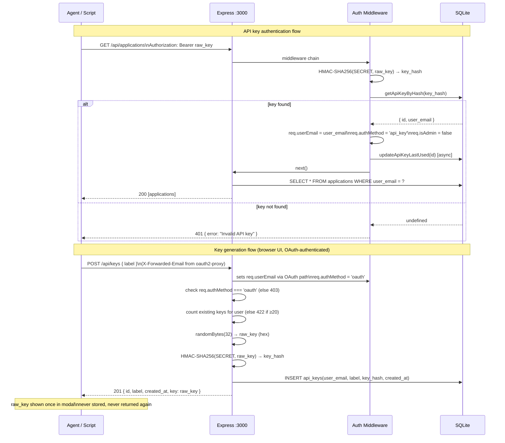

# feat: Add API Key Authentication and Remove SMB Infrastructure

## Overview

Phase 1 of the MCP Server + SMB Removal project. Adds personal API key authentication to the REST API so agents and scripts can access the API without the OAuth browser flow, and removes the 1,050-line Samba + sync engine infrastructure that was the previous external-access mechanism.

## Problem Frame

The job tracker currently has no programmatic access path: all API requests must go through oauth2-proxy, which requires an interactive browser login. The only workaround was the SMB sync engine — 822 lines of bidirectional filesystem sync that was fragile, complex, and optimised for text editors rather than AI agents.

Phase 1 clears the debt (delete SMB) and adds the right foundation (API keys). Phase 2 (MCP server) is explicitly out of scope here.

(see origin: `docs/brainstorms/2026-04-06-mcp-server-smb-removal-requirements.md`)

## Requirements Trace

- R1. Users generate and revoke personal API keys from the web UI. Each key scopes to the generating user's `user_email`.
- R2. API keys authenticate programmatic REST access via `Authorization: Bearer <key>`. Operations are scoped to the key owner's data using the same per-user scoping as the web UI. Invalid/missing key → HTTP 401.
- R3. Keys generated with `crypto.randomBytes(32)`, stored as `HMAC-SHA256(SERVER_API_KEY_SECRET, raw_key)`. Raw key shown once at generation. `SERVER_API_KEY_SECRET` is an env var.
- R4. Key management endpoints rate-limited (reuse existing `RATE_LIMIT_API` limiter; `RATE_LIMIT_MCP` is deferred to Phase 2).
- R5. Sync engine (`server/lib/sync-engine.mjs`, `server/smb-sync.mjs`), Samba config (`smb.conf`), and all SMB Docker infrastructure removed.
- R6. `X-Internal-Auth-Token` code path in auth middleware removed (its only consumer was the sync engine).
- R7. Linux capabilities reduced to verified minimum after SMB removal.
- R8. Gear icon in header opens settings slide-over. Users can generate (with optional label), list, and revoke API keys.
- R9. Key creation shows a one-time modal with copy-to-clipboard. User must click "I've saved this key" to dismiss. Key cannot be retrieved again.

## Scope Boundaries

- Phase 2 MCP server (SSE/Streamable HTTP endpoint)
- Service layer extraction (Phase 2 prerequisite — separate PR before MCP work begins)
- Key expiry / rotation (schema includes nullable `expires_at` for future use; enforcement not implemented)
- Attachment uploads via API key (read-only attachment access deferred to Phase 2)
- Admin privilege via API keys (API keys are never admin-privileged)
- `RATE_LIMIT_MCP` env var (Phase 2 only — MCP server's own port)
- Stdio MCP transport

### Deferred to Separate Tasks

- Service layer extraction (prerequisite for Phase 2): separate PR before MCP work begins

## Context & Research

### Relevant Code and Patterns

- `server/middleware/auth.js` (60 lines) — existing timing-safe comparison with `crypto.timingSafeEqual`. Current auth paths: (1) `X-Forwarded-User` marker + `X-Forwarded-Email` identity → OAuth; (2) `X-Internal-Auth-Token` → SMB (to be deleted); (3) dev fallback. New API key path (`Authorization: Bearer`) is inserted before (1).
- `server/db.js` (169 lines) — auto-run migrations at startup using `PRAGMA table_info()` checks; prepared statements exported at module level (`upsertUser`, etc.). API key statements follow same pattern.
- `server/routes/applications.js` (609 lines) — `getOwnApp(id, userEmail)` ownership check pattern; error responses as `res.status(N).json({ error: '...' })`; all routes use `req.userEmail` set by auth middleware.
- `server/app.js` (73 lines) — rate limiters applied to `/api` before auth middleware; routes mounted last. Key management route mounts the same way.
- `client/src/components/ApplicationPanel.vue` — slide-over pattern: fixed overlay + right-side drawer (`translate-x-full → translate-x-0`), bottom sheet on mobile via responsive breakpoints. SettingsPanel mirrors this exactly.
- `client/src/api.js` (101 lines) — thin Axios wrappers, no error handling, callers handle errors.
- `server/test/api.test.js` (397 lines) — `node:test` + supertest; `DB_PATH=:memory:` set before require; auth identity set via `.set('X-Forwarded-Email', ...)`.

### Institutional Learnings

- Timing-safe comparison required for secret token validation — already used in auth middleware (`timingSafeEqual`). Apply same pattern to HMAC comparison. (`docs/solutions/integration-issues/smb-filesystem-sync-implementation.md`)
- Type coercion trap: `Number('') === 0`. Multipart form data sends empty fields as `''`. Guard label field before any numeric coercion (not applicable here, but a known footgun in this codebase).

### External References

None required — design decisions fully resolved in origin document and local patterns cover implementation.

## Key Technical Decisions

- **HMAC-SHA256 over bcrypt for key storage:** The raw key is 256 bits of entropy from `randomBytes`, making it brute-force-resistant without a slow hash. HMAC is deterministic, which allows direct lookup by hash without enumerating rows. Bcrypt would require fetching all keys and comparing each — unnecessary here.
- **API key auth as an additional middleware branch, not a replacement:** Browser users (OAuth) and programmatic users (API key) hit the same REST endpoints. The auth middleware gains a third path; all existing route logic is unchanged.
- **Key management routes at `/api/keys`:** Mounted in `app.js` alongside `/api/applications`. Covered by existing `RATE_LIMIT_API` limiter automatically. `RATE_LIMIT_MCP` deferred to Phase 2.
- **Web-UI-only key management:** `POST /api/keys`, `GET /api/keys`, `DELETE /api/keys/:id` must only be callable by OAuth-authenticated sessions (not by API key holders). Enforced via `req.authMethod` flag (`'oauth'` | `'api_key'`) set by auth middleware. Prevents agents from generating unlimited keys on behalf of users.
- **Middleware branching order:** The Bearer check must be inserted *before* the existing production guard that returns 401 when `X-Forwarded-Email` is absent — not nested inside it. Agents will arrive with a Bearer token and *no* `X-Forwarded-Email` header (they bypass oauth2-proxy); the current guard would reject them before the Bearer branch is ever reached. The actual auth.js checks `X-Forwarded-User` as the proxy marker (proof the request passed through oauth2-proxy) and reads identity from `X-Forwarded-Email`. Correct order: (1) `Authorization: Bearer` present? → API key auth; (2) `X-Forwarded-User` present? → OAuth path (read email from `X-Forwarded-Email`); (3) dev mode? → dev fallback; (4) else → 401.
- **`SERVER_API_KEY_SECRET` hard-fails at startup if missing in production:** Silent fallback would produce keys with no real secret. App must refuse to start; dev mode warns and uses a static fallback string.
- **Key count cap of 20 per user:** Prevents unbounded key accumulation. Returns 422 if user already has 20 keys.
- **`last_used_at` is a fire-and-forget async update:** One synchronous SQLite write per authenticated request would be acceptable at this scale, but async avoids any blocking. Acceptable staleness: a request that crashes after auth but before the update leaves `last_used_at` slightly stale — acceptable.
- **After SMB removal: keep `CHOWN`, `SETUID`, `SETGID`; drop `DAC_OVERRIDE`:** `su-exec` needs `SETUID`/`SETGID` to switch user context. `chown -R nodejs:nodejs` in the entrypoint needs `CHOWN`. `DAC_OVERRIDE` was only needed for Samba file permission overrides.

## Open Questions

### Resolved During Planning

- **Where do key management routes live?** → `server/routes/keys.js`, mounted at `/api/keys` in `app.js`.
- **Rate limiting for key endpoints?** → Covered by existing `RATE_LIMIT_API` limiter already applied to `/api`. `RATE_LIMIT_MCP` deferred to Phase 2.
- **Which Docker capabilities remain?** → `CHOWN` + `SETUID` + `SETGID`; `DAC_OVERRIDE` dropped.
- **What if `SERVER_API_KEY_SECRET` is absent?** → Hard fail at startup in production; console warning + static dev fallback in development.
- **Should invalid Bearer token leak key existence?** → No. Always `401 { "error": "Invalid API key" }` — no distinction between "not found" and "wrong key".
- **Can API key holders call key management endpoints?** → No. `req.authMethod` flag restricts these routes to `'oauth'` only.
- **Key label uniqueness?** → Not enforced (duplicates allowed). Max 100 chars.
- **Key count limit?** → 20 per user.

### Deferred to Implementation

- Whether to index `api_keys(key_hash)` in addition to `api_keys(user_email)` — both are likely useful; implementation should add both.
- Exact async mechanism for `last_used_at` update (setImmediate vs. Promise.resolve().then vs. leaving synchronous for simplicity at this scale).
- Whether `smb-share/` directory in the repo root should be deleted or `.gitignore`d — check git status before removing.

## High-Level Technical Design

> *This illustrates the intended approach and is directional guidance for review, not implementation specification. The implementing agent should treat it as context, not code to reproduce.*



## Implementation Units

- [ ] **Unit 1: `api_keys` database schema**

**Goal:** Add `api_keys` table to SQLite and export prepared statements for key CRUD.

**Requirements:** R1, R3

**Dependencies:** None

**Files:**
- Modify: `server/db.js`

**Approach:**
- Add `CREATE TABLE IF NOT EXISTS api_keys` with columns: `id INTEGER PRIMARY KEY AUTOINCREMENT`, `user_email TEXT NOT NULL REFERENCES users(email)`, `label TEXT`, `key_hash TEXT NOT NULL UNIQUE`, `created_at TEXT NOT NULL DEFAULT (datetime('now'))`, `last_used_at TEXT`, `expires_at TEXT`
- Add `CREATE INDEX IF NOT EXISTS` on `api_keys(user_email)` and on `api_keys(key_hash)`
- Export prepared statements: `insertApiKey`, `getApiKeyByHash`, `listApiKeysByUser`, `deleteApiKey`, `updateApiKeyLastUsed`, `countApiKeysByUser`
- Follow the existing pattern: statements defined at module level, exported from `db.js`

**Patterns to follow:** Existing `CREATE TABLE IF NOT EXISTS` blocks; `upsertUser.run()` prepared statement pattern

**Test scenarios:**
- Happy path: table exists after `db.js` is loaded (in-memory DB); `insertApiKey.run(...)` succeeds and `getApiKeyByHash.get(hash)` returns the row
- Happy path: `listApiKeysByUser.all(email)` returns only keys for that user; second user's keys are not included
- Happy path: `deleteApiKey.run(id, userEmail)` (scoped delete) removes the row; subsequent lookup returns undefined
- Edge case: two different raw keys produce different hashes; same key always produces the same hash

**Verification:** `db.js` exports all six statements without error; SQLite schema contains `api_keys` table with correct columns and indexes on app start

---

- [ ] **Unit 2: API key auth middleware**

**Goal:** Extend `server/middleware/auth.js` to validate `Authorization: Bearer` tokens and set `req.authMethod`.

**Requirements:** R2, R3, R6

**Dependencies:** Unit 1

**Files:**
- Modify: `server/middleware/auth.js`

**Approach:**
- Add `SERVER_API_KEY_SECRET` env var validation at module load: if `NODE_ENV === 'production'` and the var is absent, throw immediately; in dev, `console.warn` and use a static fallback string.
- Rework branching order (see Key Technical Decisions): Bearer check first, then X-Forwarded-User (OAuth), then dev fallback, then 401.
- Bearer path: compute `createHmac('sha256', secret).update(rawToken).digest('hex')` → `keyHash`, then query `getApiKeyByHash.get(keyHash)`. The HMAC computation happens unconditionally before the lookup, so the timing of the lookup reveals nothing about the raw token — the security comes from the HMAC itself, not a secondary comparison. No `timingSafeEqual` step is needed after the lookup (the row either exists or it doesn't). If found: set `req.userEmail`, `req.isAdmin = false`, `req.authMethod = 'api_key'`; schedule `updateApiKeyLastUsed` async; call `next()`. If not found: return `res.status(401).json({ error: 'Invalid API key' })`.
- OAuth path: same logic as today; set `req.authMethod = 'oauth'`.
- Dev fallback: set `req.authMethod = 'oauth'` (dev sessions behave like OAuth for key management purposes).
- **Remove** the `X-Internal-Auth-Token` block entirely (R6): lines that read `internalAuthToken`, `internalAuthEmail`, and the `timingSafeEqual` check for those variables. Remove associated env var declarations.
- The existing per-request `upsertUser.run()` call continues for both OAuth and API key paths (keeps `last_seen_at` current for all users).

**Patterns to follow:** Existing `timingSafeEqual` import (keep for any future use, or remove if no longer used); `req.isAdmin` computation from `ADMIN_EMAILS`

**Test scenarios:**
- Happy path: valid Bearer key sets `req.userEmail` to key owner's email and `req.authMethod = 'api_key'`; `/api/me` returns correct email
- Error: invalid Bearer token → 401 `{ error: 'Invalid API key' }`
- Error: Authorization header with malformed/empty token → 401
- **Critical edge case: Bearer token present, no `X-Forwarded-Email` header** — the normal agent path. Must return 200 (not 401 from the production OAuth guard). This is the primary agent flow and must be explicitly tested.
- Integration: Bearer key for user A cannot retrieve user B's applications (per-user scoping enforced in route handlers unchanged)
- Integration: revoked key (deleted from DB) → 401 on next request
- Edge case: `Authorization: Bearer` header present alongside `X-Forwarded-Email` — Bearer path takes precedence (agents should not also have oauth2-proxy headers, but must not break if they do)
- Regression: existing X-Forwarded-Email OAuth path still works after refactor; dev fallback still works when neither header is present in dev mode

**Verification:** All existing `api.test.js` tests continue to pass; new API key tests pass; `curl -H "Authorization: Bearer <valid>"` returns 200; `curl -H "Authorization: Bearer bad"` returns 401

---

- [ ] **Unit 3: API key management endpoints**

**Goal:** REST endpoints for generating, listing, and revoking API keys; restricted to OAuth-authenticated sessions.

**Requirements:** R1, R4

**Dependencies:** Unit 1, Unit 2

**Files:**
- Create: `server/routes/keys.js`
- Modify: `server/app.js`

**Approach:**
- Create `server/routes/keys.js` with three routes, all prefixed at `/api/keys` in `app.js`:
  - `POST /` — generate key: validate `req.authMethod === 'oauth'` (else 403); count existing keys (else 422 if ≥ 20); validate optional label (strip whitespace, max 100 chars); `randomBytes(32).toString('hex')` → raw key; HMAC-SHA256 → hash; insert row; respond `201 { id, label, created_at, key: rawKey }`. This is the **only** response that includes the raw key.
  - `GET /` — list keys for `req.userEmail`: validate OAuth-only (403); `listApiKeysByUser.all(req.userEmail)`; respond `200 [{ id, label, created_at, last_used_at }]` — never include `key_hash` or `expires_at`.
  - `DELETE /:id` — revoke: validate OAuth-only (403); `deleteApiKey.run(id, req.userEmail)` (scoped by user_email to prevent cross-user deletion); if no rows affected → 404; else 204.
- Mount in `app.js` under `/api/keys`. Because the route is under `/api`, the existing `RATE_LIMIT_API` limiter and auth middleware already apply.

**Patterns to follow:** `routes/applications.js` error pattern; `getOwnApp(id, userEmail)` → `deleteApiKey.run(id, userEmail)` ownership-scoped delete pattern; req.isAdmin check pattern (here: req.authMethod check instead)

**Test scenarios:**
- Happy path: `POST /api/keys` with label returns 201 with raw key; `GET /api/keys` returns the new key entry (without key_hash)
- Happy path: `POST /api/keys` without label → label is null; entry shows in list
- Happy path: `DELETE /api/keys/:id` removes key; subsequent `GET` no longer includes it
- Error: `POST /api/keys` via API key auth (`req.authMethod === 'api_key'`) → 403
- Error: `GET /api/keys` via API key auth → 403
- Error: `DELETE /api/keys/:id` via API key auth → 403
- Error: `DELETE /api/keys/:id` with another user's key id → 404 (not 403 — avoids id enumeration)
- Error: `POST /api/keys` with label > 100 chars → 400
- Edge case: `POST /api/keys` when user already has 20 keys → 422
- Integration: after `DELETE`, using the deleted key for `GET /api/applications` → 401

**Verification:** Endpoints return correct status codes and body shapes; raw key never appears in GET or DELETE responses; cross-user deletion returns 404

---

- [ ] **Unit 4: SMB infrastructure removal**

**Goal:** Delete sync engine code and all SMB-specific Docker, entrypoint, and dependency configuration.

**Requirements:** R5, R6, R7

**Dependencies:** None (fully independent; can land in any order relative to other units)

**Files:**
- Delete: `server/lib/sync-engine.mjs`
- Delete: `server/smb-sync.mjs`
- Delete: `smb.conf`
- Delete or gitignore: `smb-share/` directory (check `git status` — if tracked, delete; if untracked with local data, add to `.gitignore` and note for operator)
- Modify: `Dockerfile`
- Modify: `docker-compose.yml`
- Modify: `docker-entrypoint.sh`
- Modify: `server/package.json` (run `npm remove chokidar gray-matter` in `server/`)
- Modify: `server/package-lock.json`

**Approach:**

`Dockerfile`:
- Remove `samba samba-common-tools` from the `apk add` line (keep `su-exec`)
- Remove `mkdir -p /var/log/samba /run/samba /var/lib/samba/private`
- Remove `COPY smb.conf /etc/samba/smb.conf`
- Remove `/app/smb-share` from the `mkdir -p` line and `chown` line
- Remove `EXPOSE 3445` (keep `EXPOSE 3000`)

`docker-compose.yml`:
- Remove port mapping `"127.0.0.1:445:3445"`
- Remove env vars: `ENABLE_SMB`, `SMB_USER`, `SMB_PASS`, `SMB_USER_EMAIL`, `SMB_CREDENTIALS_FILE`
- Add `SERVER_API_KEY_SECRET: ""` placeholder (with comment: "Required in production — generate with: openssl rand -hex 32")
- Remove volume `./smb-share:/app/smb-share`
- Update `cap_add`: remove `DAC_OVERRIDE`; keep `[CHOWN, SETUID, SETGID]`

`docker-entrypoint.sh`:
- Remove the entire `if [ "$ENABLE_SMB" = "true" ]` block (everything from the comment through the closing `fi`)
- Result is ~5 lines: `set -e`, `chown -R nodejs:nodejs /app/data /app/uploads`, `exec su-exec nodejs node server/index.js`

`server/` npm packages:
- `npm remove chokidar gray-matter` in `server/` directory
- These packages are exclusively used by the deleted sync engine

**Test scenarios:**
- Test expectation: none for file deletion itself
- Integration: `docker compose build` succeeds after changes
- Integration: `docker compose up` starts; `GET /api/me` returns 200 (app starts without SMB code present)
- Integration: `docker inspect <container>` shows no samba process; port 3445 not bound

**Verification:** No references to `sync-engine`, `smb-sync`, `gray-matter`, or `chokidar` in remaining server-side source; `smb-share/` directory absent or gitignored; `docker compose build` succeeds; container runs and responds to API requests

---

- [ ] **Unit 5: Frontend API client for key management**

**Goal:** Add three key management functions to `client/src/api.js`.

**Requirements:** R8, R9

**Dependencies:** Unit 3

**Files:**
- Modify: `client/src/api.js`

**Approach:**
- `generateApiKey(label)` — POST `/api/keys` with body `{ label: label || null }`; response body contains `key` (raw key string)
- `listApiKeys()` — GET `/api/keys`; returns array of `{ id, label, created_at, last_used_at }`
- `revokeApiKey(id)` — DELETE `/api/keys/:id`; no response body (204)
- Follow existing Axios pattern: no try/catch in api.js; callers handle errors

**Patterns to follow:** `fetchMe()`, `deleteApplication(id)`, `createNote()` signatures in `api.js`

**Test scenarios:**
- Test expectation: none — thin wrappers; behavior tested via UI and integration tests in Unit 6

**Verification:** Functions exported from `api.js`; signatures match endpoint contracts

---

- [ ] **Unit 6: Settings slide-over UI**

**Goal:** Gear icon in header opens a settings panel where users can generate, view, and revoke API keys.

**Requirements:** R8, R9

**Dependencies:** Unit 5

**Files:**
- Create: `client/src/components/SettingsPanel.vue`
- Modify: `client/src/App.vue`

**Approach:**

`SettingsPanel.vue`:
- Reuse ApplicationPanel's CSS structure: fixed overlay backdrop + right-side drawer with `translate-x-full → translate-x-0` transition; bottom sheet on mobile via responsive classes
- Props: `show: Boolean`; emits: `close`
- Reactive state: `keys` (loaded on panel open), `newKey: null` (raw key string, cleared on modal dismiss), `isGenerating`, `isRevoking: {}`, `generateLabel`, `confirmRevokeId`
- Load keys via `listApiKeys()` when `show` changes to true (watch prop)
- **Generate section:** label input (optional, max 100 chars client-side), "Generate API Key" button. On success: set `newKey = response.key`, refresh key list.
- **Key list section:** rendered as a table/list of `{ id, label, created_at, last_used_at }`. Label displays "Unnamed" if null. Relative timestamps for `last_used_at` ("Never used" if null). Inline revoke: show confirmation inline when revoke clicked (`confirmRevokeId = id`); "Cancel" / "Yes, revoke" buttons. On confirmed revoke: `revokeApiKey(id)` — treat both 204 and 404 as success (handle already-revoked gracefully). Refresh key list after revoke.
- **Empty state:** "No API keys yet." shown when key list is empty.
- **Key creation modal** (inline in component):
  - Rendered as an overlay within the panel when `newKey` is set
  - Displays raw key in a `<code>` block with a copy-to-clipboard button (uses `navigator.clipboard.writeText`)
  - Single dismiss button: "I've saved this key" — sets `newKey = null`; clicking outside the modal does **not** dismiss it
  - No close (×) button on modal — user must confirm

`App.vue`:
- Add gear icon button to header (SVG cog icon, consistent with existing nav icon style)
- Add `showSettings` ref; gear click sets `showSettings = true`
- Render `<SettingsPanel :show="showSettings" @close="showSettings = false" />`
- Close settings panel when `showSettings = false`

**Patterns to follow:** `ApplicationPanel.vue` slide-over CSS structure; existing header icon buttons; inline confirmation pattern (search codebase for existing delete confirmation pattern to mirror)

**Technical design (directional):**

```
// SettingsPanel state sketch
const keys = ref([])
const newKey = ref(null)      // raw key after generation; cleared on modal dismiss
const confirmRevokeId = ref(null)

// On panel open
watch(() => props.show, async (val) => {
  if (val) keys.value = await api.listApiKeys()
})

// Generate
async function generate() {
  const res = await api.generateApiKey(generateLabel.value.trim() || null)
  newKey.value = res.key      // triggers modal render
  keys.value = await api.listApiKeys()  // refresh list
}

// Revoke
async function confirmRevoke(id) {
  try { await api.revokeApiKey(id) } catch(e) { /* 404 = already gone */ }
  keys.value = await api.listApiKeys()
  confirmRevokeId.value = null
}
```

**Test scenarios:**
- Happy path: opening settings panel calls `listApiKeys()` and renders returned keys
- Happy path: generating a key shows the key creation modal with the raw key; modal cannot be dismissed by clicking outside; "I've saved this key" clears modal and raw key is gone from state
- Happy path: revoking a key with inline confirmation removes it from the list; 404 on revoke treated as success (already-revoked race)
- Edge case: empty key list shows "No API keys yet." empty state
- Edge case: `last_used_at` null shows "Never used"; non-null shows relative time
- Edge case: label null shows "Unnamed" in key list
- Error path: key generation fails (network error or 422 key limit) → show inline error message; modal does not appear

**Verification:** Settings panel opens and closes correctly; key modal appears after generation and is non-dismissible until confirmed; raw key is not accessible after modal dismissal; key list reflects current server state after generate and revoke

## System-Wide Impact

- **Interaction graph:** Auth middleware gains a third path (API key). All existing route handlers are unchanged — they use `req.userEmail` regardless of how it was set. Key management routes add an `authMethod` check.
- **Error propagation:** API key auth failure returns 401 before any route handler executes. The key management `authMethod` guard returns 403 before any DB operation.
- **State lifecycle risks:** `last_used_at` update is async fire-and-forget — a crash between auth check and update leaves `last_used_at` slightly stale. Acceptable for an informational field.
- **API surface parity:** Browser (OAuth) and programmatic (API key) users hit the same REST endpoints. Both are scoped by `user_email`. Admin access (`?all=true`) is not available via API keys.
- **Integration coverage:** The full generate → use → revoke → 401 cycle must be tested end-to-end, not mocked.
- **Unchanged invariants:** Per-user data scoping (`user_email = ?`) in all application queries is unchanged. OAuth browser path is additive-only (new `req.authMethod` field added, no existing fields changed).
- **Docker networking:** After SMB removal, the container no longer listens on port 3445. Any firewall rules, Caddy configs, or monitoring that reference port 3445 should be checked.

## Risks & Dependencies

| Risk | Mitigation |
|------|------------|
| `SERVER_API_KEY_SECRET` missing in production | Hard fail at startup; add placeholder with generation comment to `docker-compose.yml` |
| OAuth browser path broken by auth middleware refactor | Existing `api.test.js` covers OAuth path; branching is additive — existing tests catch regressions |
| su-exec still requires `SETUID`/`SETGID` after SMB removal | Keep both in `cap_add`; add inline comment in `docker-compose.yml` explaining why |
| `smb-share/` directory has untracked local data | Check `git status` before deleting; directory was only used when `ENABLE_SMB=true` (disabled in production) |
| Response-time oracle: valid key auth takes longer than invalid (DB hit + async update + route handler vs. immediate 401) | Accepted low-risk gap at this deployment scale — self-hosted, rate-limited, not publicly exposed. Statistical timing attack requires many requests to be useful; rate limiting makes this impractical. |
| Raw key returned in API response captured by request logging | Ensure no response body logging middleware is added in future; note in key generation handler comment |
| Key count cap (20) too restrictive for power users | 20 is generous; can be raised via env var in a future PR if needed |

## Documentation / Operational Notes

- `SERVER_API_KEY_SECRET` must be set in production `docker-compose.yml` before deploying. Generate with `openssl rand -hex 32`. A missing secret causes a hard startup failure.
- After deploy: verify port 3445 is no longer exposed; verify Docker image size is smaller (Samba packages removed).
- `docker-compose.yml` comment on retained capabilities: `# CHOWN: entrypoint chown /app/data and /app/uploads; SETUID/SETGID: su-exec user switch`

## Sources & References

- **Origin document:** [`docs/brainstorms/2026-04-06-mcp-server-smb-removal-requirements.md`](docs/brainstorms/2026-04-06-mcp-server-smb-removal-requirements.md)
- **Institutional learnings:** `docs/solutions/integration-issues/smb-filesystem-sync-implementation.md`
- Auth middleware to modify: `server/middleware/auth.js`
- DB layer to extend: `server/db.js`
- Route pattern to follow: `server/routes/applications.js`
- UI pattern to follow: `client/src/components/ApplicationPanel.vue`
- API client to extend: `client/src/api.js`
- Test file to extend: `server/test/api.test.js`
