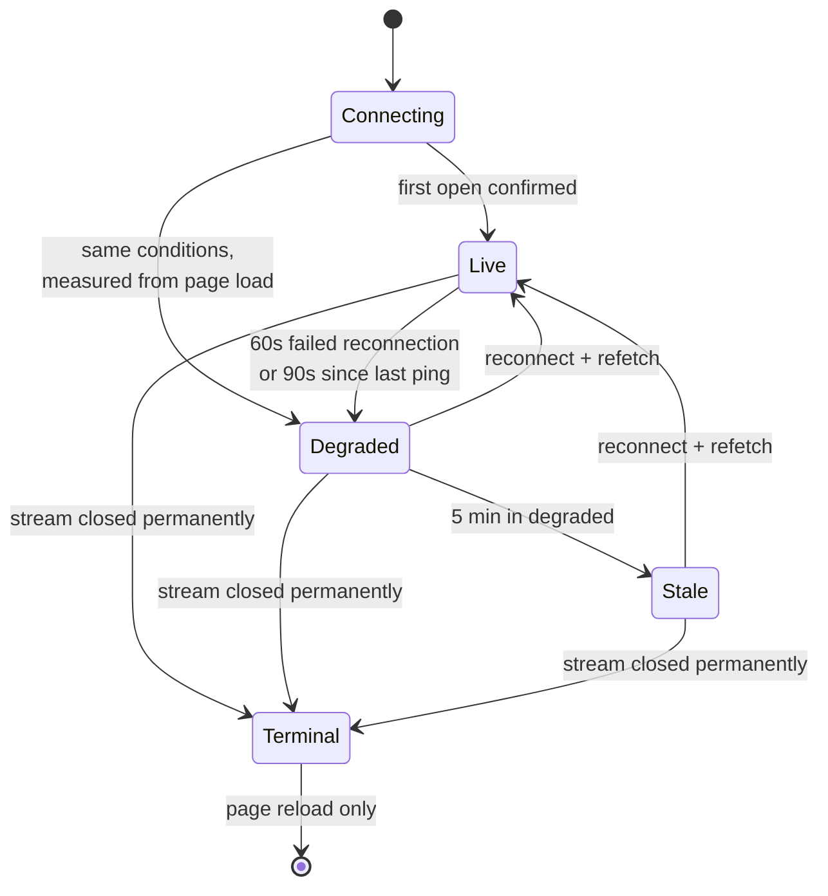
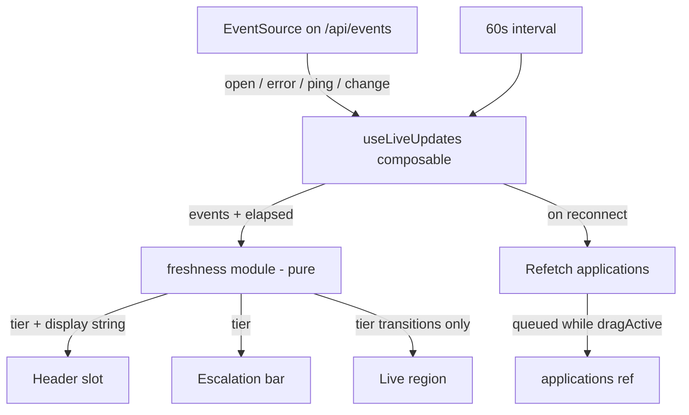

# Live-Refresh Connection Feedback - Plan

## Goal Capsule

- **Objective:** Tell the user when the board can no longer be trusted, and give them a way back. Covers the freshness signal and its test coverage; event replay for missed changes is not active scope.
- **Product authority:** This document. Product behaviour, thresholds, and scope boundaries are settled here; how to build it is planning's decision.
- **Open blockers:** None.
- **Product Contract preservation:** Changed — R4a, R4b, R7a, R13a, R14a added and R17 reworded, all following document review and confirmed with the product owner. Review found the original set left four tiers with only two defined display states, no escalation path for a board that never connected, no recovery for a connection that is open but dead, and no retry or announcement semantics. No original requirement was removed or renumbered.

---

## Product Contract

### Summary

Add a freshness signal to the board's live-refresh stream: a header slot reading `LIVE` while updates are confirmed flowing, degrading through duration-earned tiers to an inline bar with a real remedy once the board may be wrong. The server's keepalive becomes an observable event so `LIVE` is a claim the client can substantiate, and the tier logic is covered by server and unit tests.

### Problem Frame

The board updates itself over Server-Sent Events. Changes made through the REST API, a second browser tab, or an MCP agent arrive without a reload.

There is no connection-state feedback of any kind. `client/src/composables/useLiveUpdates.js` has no `onerror` handler, so when the stream dies the board keeps rendering its last known state and looks identical to a healthy one. The user has no way to tell a current board from a stale one.

Three properties make silent failure the default rather than an edge case. No event IDs are emitted and `Last-Event-ID` is not handled, so any change occurring while a tab is disconnected is lost permanently. The 30-second keepalive is written as an SSE comment, which the parser ignores without firing a JavaScript event, leaving a connection that is wedged open but dead undetectable from the client. And when the oauth2-proxy session expires, the reconnect receives something other than an event stream, which closes the `EventSource` permanently — the failure that looks most healthy is also the one that never recovers on its own.

The cost lands on a user who leaves the board open for hours and acts on what it shows. A missed follow-up has real consequences in an active job hunt, and a board that is confidently wrong is worse than one that admits it does not know.

### Key Decisions

- KD1. **Freshness, not connectivity, is the unit.** Without replay, an open socket does not mean the board is current, so the signal answers "can I trust this?" rather than "is it connected?" (session-settled: user-approved — chosen over a connection-state indicator: connectivity cannot answer the user's actual question.) Governs R1, R2, R5.
- KD2. **Tiers are earned by duration, not by kind.** A sustained-degraded board is the failure this feature exists to catch, so it escalates to the same bar as terminal, just later. (session-settled: user-approved — chosen over degraded-stays-text-only: severity should track how long the board may have been wrong.) Governs R5, R6, R7, R8.
- KD3. **`LIVE` stays visible while healthy.** An empty slot recreates the silent-until-broken shape and denies the user the chance to learn where sync truth lives. (session-settled: user-approved — chosen over showing the slot only on failure: the quiet 99% is what makes the 1% legible.) Governs R1, R4.
- KD4. **Relative time, quantised to minutes.** The user's question is a duration, so state the duration rather than requiring subtraction against a clock. (session-settled: user-approved — chosen over an absolute timestamp: seconds imply precision the system does not have.) Governs R2, R3.
- KD5. **The observable ping is a prerequisite, not an add-on.** Without it `LIVE` means only "no error has fired", which is false in exactly the wedged-open case. (session-settled: user-approved — chosen over relying on `readyState` alone: an ambient claim the client cannot substantiate is worse than no claim.) Governs R12, R13.
- KD6. **Mobile drops the ambient layer.** The argument for a persistent slot rests on hours-long desktop sessions; a bounded mobile session is served by the bar alone. (session-settled: user-approved — chosen over shrinking the slot into the compact header: the header is the only real estate genuinely under pressure.) Governs R17.
- KD7. **No iconography.** A status dot encodes connectivity, cannot degrade into a timestamp, and would spend colour meaning that belongs to the stage system. (session-settled: user-approved — chosen over a status dot: the typographic system already carries the signal.) Governs R18.
- KD8. **Tests sit at the server and client-unit level.** Thresholds and transitions are pure logic and cheapest to cover there. (session-settled: user-directed — chosen over adding an E2E smoke: driving SSE through a real browser is slow and fiddly for logic that needs no browser.) Governs R19, R20, R21.
- KD9. **Reconnect refetches instead of replaying.** A full list refetch on reconnect recovers missed changes without event IDs or `Last-Event-ID`. (session-settled: user-directed — chosen over implementing replay: most of the coverage at a fraction of the cost.) Governs R9.

### Tier model

### Requirements

**Freshness signal**

- R1. The header carries a freshness slot beside the version link, reading `LIVE` while the stream is confirmed healthy.
- R2. In the degraded tier the slot states elapsed time since last confirmed sync, quantised to whole minutes and updated on minute boundaries.
- R3. Beyond one hour, or across a day boundary, the slot falls back to an absolute time; the absolute time is available on hover in every tier.
- R4. The slot stays empty until the first connection is confirmed, and never displays `LIVE` before then.
- R4a. A page that has never connected escalates on the same conditions as any other tier, measuring from page load, and its bar states that the board has not connected rather than that it has gone stale.
- R4b. Once the stream has been confirmed, the slot never returns to empty and never reverts to `LIVE` while degraded, stale, or terminal; the elapsed duration keeps counting in every tier after live.

**Escalation**

- R5. The signal has four tiers. Live holds while the stream is confirmed healthy; degraded is entered on either condition in R13; stale is entered after five minutes in degraded; terminal is entered immediately on permanent closure, with no debounce.
- R6. The degraded tier changes the slot text only, with no colour change and no motion.
- R7. The stale tier adds an inline bar above the board stating that updates are not being received, with the last sync time and a control that reattempts the connection without a page reload.
- R7a. The retry control has three states: idle; in-flight, where it is disabled and its label changes without a spinner; and failed, where it returns to idle and the bar states the attempt did not succeed. A failed retry leaves the tier unchanged.
- R8. The terminal tier replaces the bar's message with one stating that live updates have stopped, and its control performs a full page reload; `--danger` is used in this tier and no other.

**Recovery**

- R9. Every successful reconnection triggers a full refetch of the application list.
- R10. A refetch that would land while a drag is in progress is queued until the drag completes.
- R11. When a post-degraded refetch changes visible content, the slot holds a just-now state briefly so the content shift has a stated cause.

**Server protocol**

- R12. The stream's keepalive is emitted as a named event carrying a server-generated timestamp, replacing the comment-based heartbeat.
- R13. Degradation is detected by two independent conditions — continuous failed reconnection for 60 seconds, or 90 seconds elapsed since the last keepalive.
- R13a. Detecting the silence condition closes the stream and opens a fresh one, so a connection that is open but dead either recovers or surfaces a real error.

**Accessibility and motion**

- R14. Tier changes are announced through a live region carrying a summary string that changes only on transition; the ticking elapsed value is excluded from it.
- R14a. Degraded and stale transitions announce politely. The terminal transition announces assertively, since it is the only tier the user must act on.
- R15. No tier is distinguished by colour or position alone.
- R16. Any motion introduced by this feature resolves to a static state under `prefers-reduced-motion: reduce`.

**Mobile**

- R17. At mobile viewport widths the header slot is absent and the degraded tier escalates directly to the bar as soon as either condition in R13 is met. The condition is screen width, not the persisted compact-header preference.

**Visual vocabulary**

- R18. The feature introduces no status dot or icon; the bar's controls are the only graphical affordance it adds.

**Test coverage**

- R19. Server tests cover the event stream endpoint: per-user scoping, the admin all-users case, and the keepalive event's shape.
- R20. Client unit tests drive the tier machine against simulated time, covering every threshold, every transition, and both detection conditions in R13.
- R21. Client unit tests cover refetch-on-reconnect and the drag-queued refetch.

### Key Flows

- F1. Transient blip
  - **Trigger:** The stream drops and reconnects within the degradation threshold.
  - **Steps:** Connection fails; retry succeeds; list refetches.
  - **Outcome:** No tier change and no visible signal. The user never learns it happened.
  - **Covered by:** R5, R9, R13

- F2. Sustained degradation
  - **Trigger:** Reconnection fails continuously, or keepalives stop arriving on an open connection.
  - **Steps:** Threshold in R13 elapses; slot degrades to elapsed time; five minutes later the bar appears.
  - **Outcome:** The user can see how stale the board is, and after five minutes is offered a retry.
  - **Covered by:** R2, R5, R6, R7, R13

- F3. Session expiry
  - **Trigger:** The auth proxy session expires and the stream closes permanently.
  - **Steps:** Closure is detected; terminal tier is entered with no delay.
  - **Outcome:** The user is told live updates have stopped and offered a reload, the only recovery.
  - **Covered by:** R5, R8

- F4. Recovery
  - **Trigger:** A connection succeeds after any degraded or stale period.
  - **Steps:** List refetches, queued behind a drag if one is active; slot returns to `LIVE`; a just-now state holds if content changed.
  - **Outcome:** The board is current and any visible jump has a stated cause.
  - **Covered by:** R9, R10, R11

### Acceptance Examples

- AE1. **Covers R5, R13.** Given a healthy stream, when the connection drops and recovers after nine seconds, then no tier change occurs and nothing appears in the header.
- AE2. **Covers R2, R13.** Given reconnection has failed continuously for 60 seconds, when the threshold elapses, then the slot states one minute since last sync — never a sub-minute value.
- AE3. **Covers R12, R13.** Given a connection that remains open but stops delivering keepalives, when 90 seconds pass, then the degraded tier is entered even though no error was raised.
- AE4. **Covers R7, R8.** Given the degraded tier persists, when five minutes elapse, then the bar appears with a retry that reattempts the connection; given instead the stream closed permanently, then the bar offers a reload and uses `--danger`.
- AE5. **Covers R10.** Given a card is being dragged, when a reconnect refetch resolves, then the board does not re-render until the drag ends.
- AE6. **Covers R14.** Given the degraded tier persists for several minutes, when the elapsed value ticks, then the live region announces nothing; it announces only when a tier boundary is crossed.
- AE7. **Covers R4.** Given a cold page load, when the stream has not yet connected, then the slot is empty rather than showing `LIVE`.
- AE8. **Covers R17.** Given a mobile viewport width, when either degradation condition is met, then the bar appears with no header slot at any point.
- AE9. **Covers R4a.** Given a page loaded while the stream is unavailable, when the degradation conditions elapse from page load, then the bar appears stating the board has not connected — not that it has gone stale.
- AE10. **Covers R4b.** Given the tier has left live, when the display updates, then it states an elapsed duration in stale and terminal alike and never reads `LIVE` again until a connection is confirmed.
- AE11. **Covers R13a.** Given an open connection that has stopped delivering keepalives, when the silence condition fires, then the stream is closed and reopened rather than left in place.
- AE12. **Covers R7a.** Given the stale bar, when retry is pressed, then the control disables until the attempt resolves; a failed attempt returns it to idle, states the failure, and leaves the tier unchanged.
- AE13. **Covers R14a.** Given a transition into terminal, when it is announced, then the announcement is assertive; degraded and stale transitions announce politely.

### Scope Boundaries

- Event IDs and `Last-Event-ID` replay. Reconnect-refetch (R9) recovers missed changes without them.
- Multi-instance delivery. The event bus is process-local, which holds while the app runs as a single container.
- Rate-limit tuning for reconnection traffic. Reconnect attempts consume the shared API budget; not addressed here.
- Batching the per-event refetch. A bulk agent update still triggers one request per changed application.
- End-to-end browser coverage, per KD8.
- Automated deployment. The gap that produced the stale board this week is a separate concern from the stream.

### Dependencies / Assumptions

- R12 is load-bearing. If the server keepalive change is cut, `LIVE` becomes an unsubstantiated claim and KD3 must be revisited — an empty slot would then be more honest than a persistent one.
- The keepalive interval stays at 30 seconds. R13's 90-second condition is three missed keepalives; changing the interval shifts that threshold.
- The failure this prevents has not been observed. The stale board that prompted this work was caused by a container running an image predating the stream, not by the stream failing. This is preventive work, and no evidence yet establishes how often the stream degrades in practice.
- The app continues to run as a single process, keeping the process-local bus sufficient.

### Outstanding Questions

All four items deferred to planning are now resolved: the silence clock's time base by KTD2, the just-now hold duration by KTD5, and copy and type treatment by KTD6. None changed product scope.

### Sources / Research

- `server/routes/events.js` — the stream endpoint; writes `event: change` with no `id:` field, and a comment-based keepalive.
- `server/lib/events.js` — process-local event bus shared by the REST routes and MCP tools.
- `client/src/composables/useLiveUpdates.js` — the `EventSource` subscription; no error handling.
- `client/src/App.vue` — owns the applications ref; subscribes on mount and refetches per change event.
- `server/app.js` — the API rate limiter covers the stream endpoint.
- `docs/solutions/ui-bugs/showclosed-toggle-drag-guard-and-panel-close-sync-2026-04-30.md` — prior bug in this repo caused by re-rendering the board mid-drag; the precedent behind R10.
- WHATWG HTML specification, server-sent events: lines beginning with a colon are comments and dispatch no event, which is why the current keepalive is invisible to the client.
- `docs/solutions/ui-bugs/timelineview-today-boundary-stale-overnight-2026-04-30.md` — the same class of bug (a time-derived UI value going stale in a long-lived tab) and the repo's established remedy; the precedent behind KTD3.
- `client/src/utils/timeline.test.js` — the shape client unit tests take in this repo: pure module, colocated test, `node:test` plus `node:assert`.

---

## Planning Contract

### Key Technical Decisions

- KTD1. **The tier machine is a pure module under `client/src/utils/`.** The client's only unit-test runner is `node --test src/utils/*.test.js`, so logic living in a composable or an SFC cannot be covered by it; extracting the machine is what makes R20 and R21 achievable at all. (session-settled: user-directed — chosen over an E2E browser smoke: thresholds and transitions are pure logic and need no browser.) Governs R20, R21.
- KTD2. **All elapsed measurements use client receipt time, not the server timestamp.** Both the silence condition and the displayed duration are elapsed measures from the reader's perspective, so deriving them locally removes clock skew from the calculation entirely; the server timestamp rides along in the ping payload for diagnostics and the absolute fallback only. Governs R2, R3, R13.
- KTD3. **One 60-second interval drives the displayed duration, comparing the quantised value before assigning.** This is the pattern the repo already settled on for wall-clock staleness, including the `onUnmounted` teardown that prevents a dangling interval. Governs R2.
- KTD4. **The drag queue reuses the existing `dragActive` ref.** `client/src/App.vue` already tracks drag state and receives a `drag-active` emit from the board, so R10 needs a guard rather than new plumbing. Governs R10.
- KTD5. **The just-now state holds for 10 seconds.** Long enough to be read as the cause of a content shift, short enough not to linger as a claim about freshness. Governs R11.
- KTD6. **Copy and type treatment follow the existing muted-metadata slot.** The slot inherits the version link's type scale and `--ink-3`, separated by a middot; no new type scale is introduced. Governs R1, R18.
- KTD7. **The bar renders in `client/src/App.vue` above `<main>`, not inside a view component.** Staleness is a property of the data, not of the kanban or timeline view, so it must not disappear when the view changes. Governs R7, R8.
- KTD8. **The live region is a separate visually-hidden element carrying only a tier summary.** Keeping it distinct from the visible slot is what prevents the minute-by-minute tick from being announced. Governs R14.
- KTD9. **The client test script widens to `node --test "src/**/*.test.js"`.** The existing `src/utils/*.test.js` glob cannot reach the composable or the drag queue, so R20 and R21 are unsatisfiable without this; widening the glob keeps plain `node --test` and adds no framework. Governs R20, R21.
- KTD10. **The stream's keepalive interval becomes env-overridable.** A test asserting the ping's shape would otherwise have to wait a real 30 seconds; an env override matches the existing `RATE_LIMIT_API` pattern the server tests already use, and the production default stays 30s. Governs R19.

### High-Level Technical Design

The freshness machine is a pure reducer: connection events plus elapsed time in, tier plus display state out. The composable owns the `EventSource` and feeds it; the components only read.

The module holds no timers and reads no clock of its own — elapsed time is passed in. That is what makes every threshold in R13 testable by advancing a number rather than waiting.

### Assumptions

- The keepalive interval stays at 30 seconds; R13's 90-second condition is three missed pings.
- The app continues to run as a single process, so the process-local event bus remains sufficient.
- No client unit-test framework is introduced. Tests stay plain `node --test` modules colocated with the code they cover, which the widened glob in KTD9 collects.

---

## Implementation Units

### U1. Observable ping event on the stream

- **Goal:** Replace the invisible comment keepalive with a named event the client can observe.
- **Requirements:** R12; supports R13.
- **Dependencies:** None.
- **Files:** `server/routes/events.js`, `server/test/routes/events.test.js` (new).
- **Approach:** Emit the keepalive as a named `ping` event carrying a server timestamp in its data payload, per R12. Make the interval env-overridable per KTD10 so the shape test does not wait a real 30 seconds; the production default is unchanged. Leave the existing `close` teardown as is.
- **Patterns to follow:** `server/test/routes/_helpers.test.js` for route-test placement; the server test glob covers `test/*/*.test.js`.
- **Test scenarios:**
  - A subscriber receives `change` events only for its own user.
  - An admin subscriber with the all-users flag receives another user's `change` event.
  - A non-admin subscriber does not receive another user's `change` event.
  - The keepalive arrives as a named `ping` event with a parseable timestamp, not a comment line.
  - Closing the request clears the interval and removes the bus listener.
- **Verification:** `cd server && npm test` passes, including the new route tests.

### U2. Freshness tier machine

- **Goal:** A pure module that maps connection events and elapsed time onto a tier and a display string.
- **Requirements:** R2, R3, R4, R4a, R4b, R5, R13, R20.
- **Dependencies:** None.
- **Files:** `client/src/utils/freshness.js` (new), `client/src/utils/freshness.test.js` (new).
- **Approach:** Per KTD1 the module is pure — it takes the last-confirmed-sync time, the current time, and connection status, and returns the tier plus the string to render. Per KTD2 both elapsed measures derive from client receipt time. Encode the two detection conditions in R13 separately so either can trigger degraded independently. Format per R2 and R3.
- **Execution note:** Write this unit test-first. The thresholds are the whole substance, and they are cheapest to pin before the wiring exists.
- **Test scenarios:**
  - Covers AE1. A drop and recovery inside the threshold produces no tier change.
  - Covers AE2. Sixty seconds of continuous failed reconnection yields degraded with a whole-minute value, never a sub-minute one.
  - Covers AE3. Ninety seconds without a ping on an otherwise open connection yields degraded.
  - Covers AE7. Before any confirmed connection the display is empty, not live.
  - Covers AE9. A page that never connects reaches degraded on the same conditions, measured from page load.
  - Covers AE10. After the first confirmed connection the display never returns to empty and never reverts to live while degraded, stale, or terminal.
  - Five minutes in degraded yields stale.
  - Permanent closure yields terminal with no elapsed-time precondition.
  - The displayed duration quantises to whole minutes and changes only on minute boundaries.
  - Covers R3. Beyond one hour, and across a day boundary, the display falls back to absolute form.
- **Verification:** `cd client && npm run test:unit` passes.

### U3. Wire the composable to the machine

- **Goal:** Give `useLiveUpdates` error, open, and ping handling, and expose the tier to consumers.
- **Requirements:** R9, R13, R13a; supports R1.
- **Dependencies:** U1, U2.
- **Files:** `client/package.json`, `client/src/composables/useLiveUpdates.js`, `client/src/composables/useLiveUpdates.test.js` (new).
- **Approach:** First widen the client test script to `node --test "src/**/*.test.js"` so tests can live beside the code they cover; this stays on plain `node --test` and adds no framework, per KTD9. Then add `onopen`, `onerror`, and a `ping` listener, feeding the machine from U2. Drive the display refresh with a single 60-second interval per KTD3, and clear it on teardown alongside the existing `source.close()`. Expose tier, display string, and a `reconnect()` that tears down and reopens the stream for U5's retry; keep the existing change-event callback contract intact so `App.vue` continues to work unchanged. Node exposes no global `EventSource`, so the test injects a fake constructor rather than relying on the runtime.
- **Patterns to follow:** the interval-plus-teardown shape in `docs/solutions/ui-bugs/timelineview-today-boundary-stale-overnight-2026-04-30.md`.
- **Test scenarios:**
  - A successful reconnection triggers the refetch callback exactly once.
  - The first open confirms the connection but does not refetch, since the caller already loads on mount.
  - Teardown clears the interval and closes the stream, leaving no timer running.
  - A `ping` event advances last-confirmed-sync without being treated as an application change.
  - `reconnect()` closes the existing stream and opens exactly one new one.
  - Covers AE11. The silence condition closes and reopens the stream rather than leaving it in place.
- **Verification:** `cd client && npm run test:unit` passes; the board still live-updates against a locally running server.

### U4. Header freshness slot

- **Goal:** Render the tier in the header, and omit it in compact mode.
- **Requirements:** R1, R2, R3, R4, R4b, R15, R17, R18.
- **Dependencies:** U3.
- **Files:** `client/src/App.vue`, `client/src/components/FreshnessSlot.vue` (new).
- **Approach:** Place the slot beside the version link, separated by a middot per KTD6, inheriting the existing muted type treatment. Hide it at mobile widths per R17, matching the `hidden sm:flex` treatment already on the closed-count button — not the persisted compact-header preference, which is a different condition. No icon and no status dot per R18. The absolute time is carried on the element's accessible name as well as its title, so it is not pointer-only.
- **Test scenarios:** Test expectation: none — presentation only; the tier logic it renders is covered by U2.
- **Verification:** The slot reads `LIVE` on a healthy stream, states a whole-minute duration when the server is stopped, and is absent at mobile widths.

### U5. Escalation bar and live region

- **Goal:** Surface stale and terminal states as an actionable bar, and announce tier changes once each.
- **Requirements:** R4a, R6, R7, R7a, R8, R14, R14a, R15, R16, R17.
- **Dependencies:** U3.
- **Files:** `client/src/App.vue`, `client/src/components/FreshnessBar.vue` (new).
- **Approach:** Render above `<main>` per KTD7 so it survives view switches. Stale offers a retry that calls the `reconnect()` exposed by U3, cycling through the three states in R7a; terminal offers a reload, and is the only tier using `--danger`, per R8. A never-connected board gets its own copy per R4a rather than the stale wording. The live region is a separate visually-hidden element carrying a tier summary per KTD8, polite for degraded and stale and assertive for terminal per R14a. Degraded adds no bar and no colour per R6. Any entrance transition resolves to a static state under `prefers-reduced-motion: reduce` per R16. At mobile widths the bar is the only surface, appearing at the degraded threshold per R17.
- **Test scenarios:** Test expectation: none — presentation only; tier derivation is covered by U2 and the announcement rule is a static binding.
- **Verification:** Stopping the server surfaces the bar after the stale threshold; retry restores `LIVE` without a page reload; a screen reader announces once per transition rather than once per minute.

### U6. Reconnect refetch, drag queue, and just-now hold

- **Goal:** Recover missed changes on reconnect without re-rendering the board under an active drag.
- **Requirements:** R9, R10, R11, R21.
- **Dependencies:** U3.
- **Files:** `client/src/App.vue`, `client/src/utils/refetchQueue.js` (new), `client/src/utils/refetchQueue.test.js` (new), `client/src/utils/freshness.js`, `client/src/utils/freshness.test.js`.
- **Approach:** On the reconnect callback from U3, refetch the full list. Keep the queue decision in a pure module — request marks pending, clearing drag state flushes at most once — so it is testable; `App.vue` only forwards the existing `dragActive` ref per KTD4 and performs the flush. The just-now hold is tier vocabulary and stays in the freshness module, held for 10 seconds per KTD5.
- **Patterns to follow:** the drag-guard discipline in `docs/solutions/ui-bugs/showclosed-toggle-drag-guard-and-panel-close-sync-2026-04-30.md` — never mutate layout-critical state mid-drag.
- **Test scenarios:**
  - Covers AE5. A refetch resolving during an active drag does not apply until the drag ends.
  - A queued refetch applies exactly once when the drag ends, not once per queued attempt.
  - A post-degraded refetch that changed content enters the just-now state; one that changed nothing does not.
  - The just-now state expires after its hold and returns to live.
- **Verification:** `cd client && npm run test:unit` passes; dragging a card while the server restarts does not move the card.

---

## Verification Contract

| Gate | Command | Applies to |
|---|---|---|
| Server tests | `cd server && npm test` | U1 |
| Client unit tests | `cd client && npm run test:unit` | U2, U3, U6 |
| Client build | `npm run build:client` | U4, U5 |
| Manual stream check | Stop the server with the board open; confirm the tier progression, then restart and confirm recovery | U3, U4, U5, U6 |

The existing E2E suite (`cd client && npm run test:e2e`) must continue to pass unchanged; no new E2E coverage is added, per KD8.

---

## Definition of Done

- Every requirement R1 through R21, including R4a, R4b, R7a, R13a, and R14a, is either implemented or explicitly carried by a unit above.
- The keepalive is observable to the client, and `LIVE` is never displayed without a confirmed connection behind it.
- A board that never connected, and a connection that is open but dead, both escalate and recover rather than sitting silent.
- The three detection and escalation thresholds — 60s reconnection, 90s keepalive silence, five minutes in degraded — plus the just-now hold are covered by unit tests that advance simulated time rather than waiting.
- A reconnect recovers missed changes, and never re-renders the board during an active drag.
- Tier changes are announced once per transition; the minute-by-minute duration is not announced.
- Server tests, client unit tests, and the existing E2E suite all pass; the client builds.
