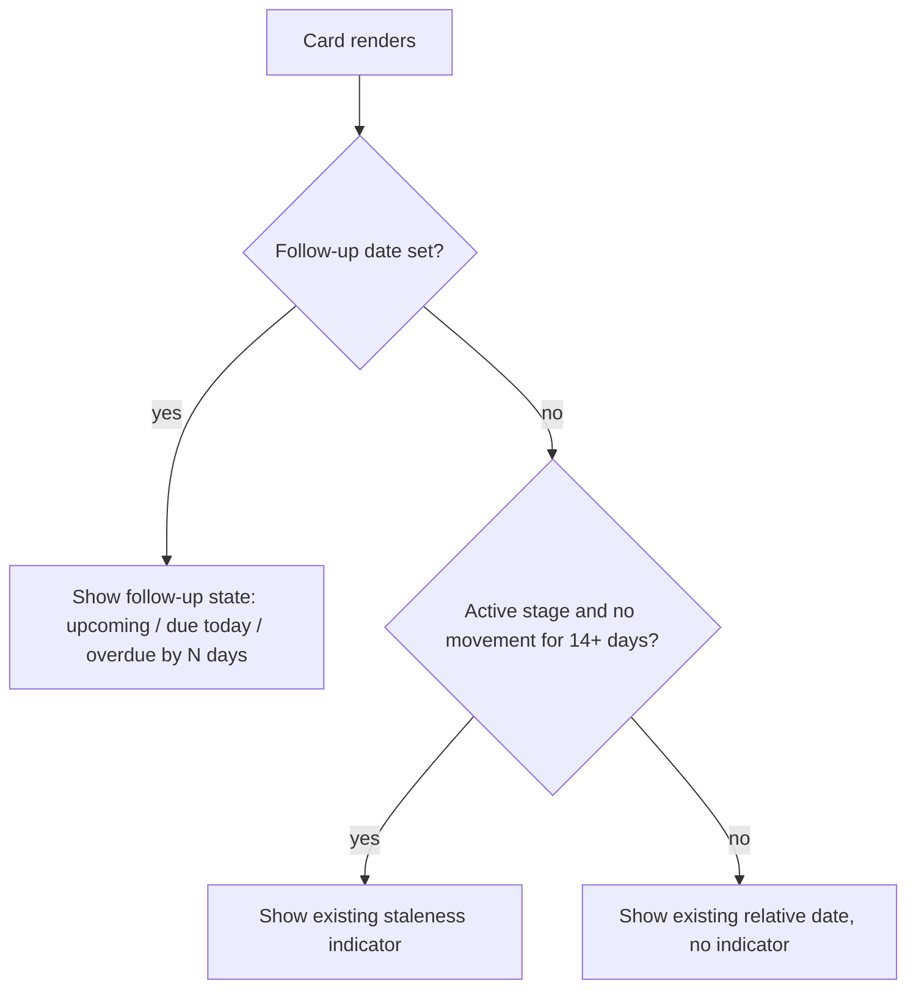
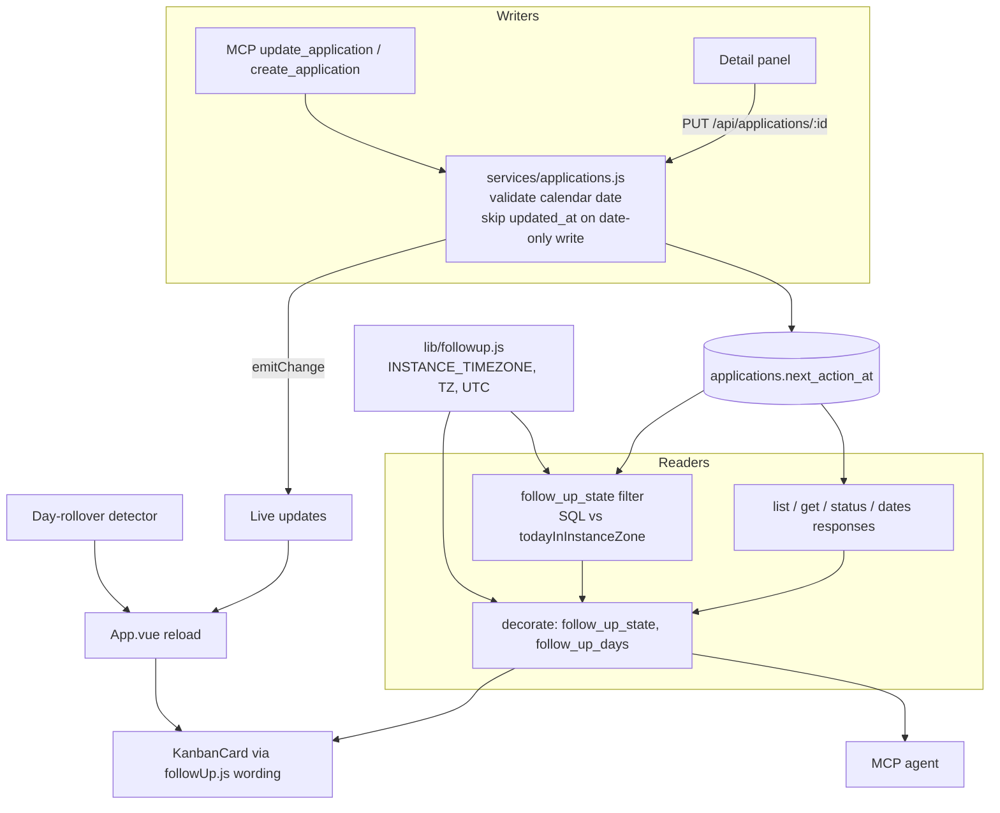

# Next Follow-Up Date - Plan

## Goal Capsule

- **Objective:** Give every application record an optional next follow-up date, primarily written and queried by MCP agents, secondarily set by hand and displayed on the board.
- **Means:** Extend the follow-up model contacts already use to applications: same column name, same shared classification, same client wording (KTD1, KTD2, KTD6).
- **Product authority:** This plan owns the follow-up date field, its due/overdue semantics, the MCP read/write/query surface, and the card and detail-panel display. The instance timezone and the classification core belong to `server/lib/followup.js`, which this plan consumes and does not change. It does not own reminders, notifications, or any new web-UI view.
- **Execution profile:** One branch and one PR covering server, MCP, and board together.
- **Stop conditions:** Stop and ask if the card slot cannot hand back to the staleness indicator without changing staleness for records that have no follow-up date (R12), or if keeping `updated_at` untouched on a follow-up-only write breaks an existing test that asserts every write bumps it.
- **Open blockers:** None.
- **Product Contract preservation:** Restructured, no scope change: R3 reworded because the instance timezone setting shipped with the contacts work (`INSTANCE_TIMEZONE`, then `TZ`, then UTC). Both Outstanding Questions resolved by KTD2 and KTD4 and removed. Sources updated for the status split.

---

## Product Contract

### Summary

Add an optional next follow-up date to every application record, at day granularity. MCP is the primary surface: agents read it, set it when they log activity, and query due and overdue records through a follow-up-state filter on `list_applications`. The shared instance timezone defines what "today" means, so the server, the agent, and the board agree on due and overdue. The board shows the date on the card in the slot the derived staleness indicator currently occupies, and the detail panel is where it is set by hand.

### Problem Frame

The board communicates neglect passively. A card in an active stage that has not moved in 14 days shifts to amber, and at 30 days to danger, derived from `updated_at` (`client/src/components/KanbanCard.vue`). That signal answers "has anything happened lately", which is not the same question as "what did I commit to doing, and when".

The concrete failure was a recruiter call that was never made. Nothing in the tracker held the commitment, so nothing could surface it. Passive staleness could not have caught it: the record had recent activity, so it was not stale, and the deadline was days away from any 14-day threshold.

The tracker is also increasingly driven through MCP rather than the browser. An agent that logs an application, adds a note after a call, or sweeps the pipeline each morning has no way to record what it should chase next, and no way to ask what is outstanding without pulling every record and reasoning over dates itself.

### Key Decisions

- KD1. **The date is an explicit commitment, not a derived signal.** (session-settled: user-directed — chosen over a stage-aware auto-clock or auto-suggested defaults: the value is recording intent, and a derived date is just staleness with extra steps.) Governs R1.
- KD2. **The date never auto-clears.** (session-settled: user-directed — chosen over clearing on stage change or on any activity: nothing should silently discard a commitment the user or agent recorded.) Governs R2.
- KD3. **The date lives on the record, not on a stage.** (session-settled: user-directed — chosen over restricting it to active pipeline statuses: a follow-up belongs to the role, and a rejected record can still warrant a ping in six months.) Governs R1.
- KD4. **Day granularity, no time of day.** (session-settled: user-directed — chosen over an optional time field: time-of-day commitments belong in a calendar, and every other date in the schema is day-level.) Governs R1.
- KD5. **One instance-level timezone rather than per-user.** (session-settled: user-directed — this is a self-hosted single-operator instance; per-user timezone is carrying cost for nobody.) Governs R3, R4.
- KD6. **Due and overdue are queried through filters on the existing list tool.** (session-settled: user-directed — chosen over a dedicated `follow_ups_due` tool: one tool for an agent to learn, composing with the filters already there.) Governs R8.
- KD7. **Manual entry is panel-only.** (session-settled: user-directed — chosen over card quick-set chips or a prompt on stage change: smallest surface, no click-versus-drag risk on a draggable board. The accepted cost is friction on the human path, which the MCP path absorbs.) Governs R10.
- KD8. **An explicit date supersedes the derived staleness signal on the card.** (session-settled: user-directed — chosen over showing both: a record you are actively managing should not also nag about inactivity, and the card has one strip for this.) Governs R12.

### Actors

- A1. **Job seeker** — the instance operator. Sets and clears dates by hand in the detail panel, reads due and overdue state off the board.
- A2. **MCP agent** — the primary writer. Reads the date, sets it when logging activity, and queries what is due or overdue.

### Requirements

**The field**

- R1. Every application record can carry an optional next follow-up date at day granularity, regardless of its status, including terminal statuses.
- R2. The follow-up date changes only through an explicit set or clear. No status change, note, attachment, or field edit modifies or removes it.

**Timezone and classification**

- R3. The instance's single configured timezone (an IANA zone name such as `Australia/Sydney`, read by `server/lib/followup.js`) anchors every follow-up classification for applications, and the deployed container receives that setting.
- R4. A record's follow-up state is derived by comparing its date to the current date in the configured timezone: `overdue` when the date is before today, `due` when it equals today, `upcoming` when it is after.
- R5. Every surface that reports or displays follow-up state derives it from R4, so the API, MCP, and board never disagree about whether a record is due.

**MCP surface**

- R6. Records returned by MCP tools include the follow-up date.
- R7. An agent can set, change, and clear the follow-up date on a record it may write to.
- R8. `list_applications` accepts filter parameters that select records by follow-up state, so an agent can retrieve what is due or overdue without pulling the full list.
- R9. Records returned by `list_applications` carry their follow-up state (R4) explicitly, so an agent does not recompute the classification from raw dates.

**Web UI**

- R10. The detail panel allows setting, changing, and clearing the follow-up date, alongside the existing stage date fields.
- R11. When a record has a follow-up date, its card shows it with wording that distinguishes upcoming, due today, and overdue, including how late an overdue record is.
- R12. When a record has a follow-up date, the card's follow-up display occupies the slot the staleness indicator uses, and the staleness indicator is not shown. A record with no follow-up date keeps today's staleness behaviour unchanged.

The card's single-slot rule:

### Key Flows

- F1. Agent morning sweep
  - **Trigger:** A2 is asked what needs chasing today.
  - **Steps:** A2 calls `list_applications` filtered to due and overdue; the response carries each record's follow-up state; A2 reports the list.
  - **Outcome:** A2 answers in one call, without pulling the full pipeline.
  - **Covered by:** R4, R8, R9
- F2. Agent logs activity and re-dates
  - **Trigger:** A2 records that a recruiter was emailed.
  - **Steps:** A2 adds the note, then sets the follow-up date to the day it should chase again.
  - **Outcome:** The record leaves the due list and reappears on the target day.
  - **Covered by:** R2, R7
- F3. Human sets a date by hand
  - **Trigger:** A1 opens a record and decides to chase it next Thursday.
  - **Steps:** A1 sets the follow-up date in the detail panel and saves.
  - **Outcome:** The card shows the follow-up state; the staleness indicator, if it was showing, gives up the slot.
  - **Covered by:** R10, R11, R12

### Acceptance Examples

- AE1. **Covers R4, R5.** Given the instance timezone is `Australia/Sydney` and a record's follow-up date is 12 August, when the time is 00:30 on 13 August in Sydney (14:30 on 12 August UTC), then the API, MCP, and card all report the record as overdue by one day.
- AE2. **Covers R2.** Given a record with a follow-up date of 20 August, when it is moved from `applied` to `interview` and a note is added, then the follow-up date is still 20 August.
- AE3. **Covers R1.** Given a record with status `rejected`, when a follow-up date six months out is set on it, then the date is accepted and stored.
- AE4. **Covers R12.** Given a record in `applied` with no movement for 25 days and no follow-up date, when a follow-up date three days out is set, then the card shows the follow-up state and no staleness indicator.
- AE5. **Covers R12.** Given that same record, when the follow-up date is cleared, then the staleness indicator returns.
- AE6. **Covers R8, R9.** Given three records due today, one overdue, and one due next week, when an agent lists records filtered to due and overdue, then it receives the four records, each carrying its follow-up state, and not the fifth.

### Scope Boundaries

Deferred for later:

- A due or overdue filter, view, or sort in the web UI. The board shows follow-up state per card; triage as a list is the agent's job for now.
- A "coming up" block in the Timeline view.
- Email, push, or any notification that reaches the user off the board.
- An overdue horizon that hands the card slot back to the staleness indicator once a follow-up date is old enough. Worth revisiting if forgotten dates start masking genuinely dead records.

Outside this feature's shape:

- Auto-derived or stage-suggested follow-up dates. KD1 rules these out; the date means something only because a human or agent chose it.
- Time-of-day follow-ups and calendar integration (KD4).
- Per-user timezone configuration (KD5).
- Card quick-set affordances and stage-change prompts (KD7).

#### Deferred to Follow-Up Work

- A short commitment wording beside the date (the `next_action` text contacts carry). Applications store the date only.
- Moving `PeopleView.vue`'s own day-rollover timer onto the shared detector U6 introduces.
- Ordering `list_applications` by follow-up date. Results keep the existing `updated_at` ordering; the filter answers F1.

### Dependencies and Assumptions

- The instance is operated by one person in one timezone, consistent with the self-hosted single-operator model in `AGENTS.md`.
- Agents are instructed to maintain the date as part of logging activity. Nothing in the tracker enforces it; R9 is the mitigation, giving an agent's next sweep an unambiguous view of what it left behind.
- Admin read-only access to other users' records follows the existing model unchanged: admins can see follow-up dates on records they may read, and cannot set them.
- Existing records have no follow-up date, and an absent date is a normal steady state, not a backfill gap.

### Sources

- `client/src/components/KanbanCard.vue` — the staleness thresholds (14 and 30 days over `updated_at`), the stages it watches, and the card slot the follow-up display takes over.
- `server/lib/followup.js` — the instance timezone (`INSTANCE_TIMEZONE`, then `TZ`, then UTC) and the `followUpState` / `daysUntil` / `toCalendarDate` core.
- `server/services/contacts.js` — the contact follow-up pattern this plan mirrors: `withFollowUp` decoration, calendar-date validation, and the inclusive date filter.
- `server/services/applications.js` — `listApplications` filter discipline (unknown values rejected, not ignored) and `updateApplication`, shared by REST and MCP.
- `server/db.js` — the `applications` table and the `PRAGMA table_info`-guarded column migrations.
- `docs/solutions/ui-bugs/timelineview-today-boundary-stale-overnight-2026-04-30.md` — a view left open past midnight keeps yesterday's "today" unless something detects the date change.
- `AGENTS.md` — MCP tool inventory, the "one follow-up model, shared" convention, and the self-hosted single-user deployment model.

---

## Planning Contract

### Key Technical Decisions

- KTD1. **Store the date in a nullable `next_action_at` column on `applications`.** It is the name contacts use and the name `server/lib/followup.js` already anticipates, so an agent learns one field for both entities. Values are bare `YYYY-MM-DD` strings normalised through `toCalendarDate`, with an index on `(user_email, next_action_at)` to match `idx_contacts_next_action`. Governs R1.
- KTD2. **One decorator adds `follow_up_state` and `follow_up_days` to every application the server returns.** It calls `followUpState` and `daysUntil` from `server/lib/followup.js` and is applied wherever an application row leaves the service or a route: list, get, create, update, status change, and the `/dates` route response. The client and agents only read these fields. Unconfigured timezone behaviour is the existing chain in `followup.js`, unchanged. Governs R4, R5, R6, R9.
- KTD3. **A write that only sets or clears the follow-up date leaves `updated_at` untouched.** (session-settled: user-directed — chosen over bumping `updated_at` as contact writes do: bumping would reset card staleness to zero on a clear and break AE5.) The write still emits the live-update change event so the board refreshes. A write that changes the follow-up date alongside any other field bumps `updated_at` as today. The cost is that `updated_since` polling does not see a date-only change, and the `list_applications` description says so and points agents at the follow-up-state filter instead. Governs R2, R12.
- KTD4. **`list_applications` filters on `follow_up_state`, accepting one or more of `overdue`, `due`, `upcoming`.** The comparison runs in SQL against a bound `todayInInstanceZone()` value, so pagination totals stay correct and the agent never works out today's date. Records with no date never match when the filter is present. An unknown value is rejected with a 400, matching the existing split-filter discipline. MCP takes an array; REST takes a comma-separated query value. Chosen over mirroring contacts' `next_action_before` bound, which would make the agent compute "today" itself. Governs R8, R9.
- KTD5. **Writes go through `updateApplication` and `createApplication` in the service, not the `/dates` route.** The `/dates` route stores ISO timestamps and has no MCP path, while this field is a calendar date that MCP must write. Validation mirrors contacts: a non-null value must normalise through `toCalendarDate` or the write fails with a 400, and `null` clears. Governs R7, R10.
- KTD6. **The card renders the server's state with the existing follow-up wording helpers.** `client/src/utils/followUp.js` supplies the text, title, and tone, so card and People view read identically. The card never computes a date. Governs R11, R12.
- KTD7. **The board refetches applications when the calendar date changes under an open session.** A small day-rollover detector, the same shape as the one in `PeopleView.vue`, triggers the guarded refetch path in `App.vue` (`requestReconnectRefetch`), which holds back during a drag and reconciles an open panel. The server-derived state then moves with the date. Governs R5, R11.
- KTD8. **`docker-compose.yml` passes `INSTANCE_TIMEZONE` through to the app container, defaulting to empty.** An empty value falls through to `TZ` then UTC in `followup.js`, so an unset host variable changes nothing. Without this the deployed instance classifies in UTC and AE1 fails in production, the same gap `SCHEMA_BACKFILL` had. Governs R3.

### High-Level Technical Design

Where the follow-up state comes from on each path:

### Sequencing

Server first (U1, U2), then the MCP surface (U3) and deployment config (U4), then the board (U5, U6). U5 and U6 both depend on U1's decorated fields and can land in either order.

---

## Implementation Units

### U1. Store, validate, and decorate the follow-up date

**Goal:** Applications carry `next_action_at`, writes validate and apply it under the `updated_at` rule, and every returned application carries its derived state.

**Requirements:** R1, R2, R4, R5, R6, R7, R9; KTD1, KTD2, KTD3, KTD5.

**Dependencies:** None.

**Files:**
- `server/db.js`
- `server/services/applications.js`
- `server/routes/applications.js`
- `server/test/application-followup.test.js` (new)
- `server/test/schema.test.js`

**Approach:**
1. Add the guarded `ALTER TABLE` for `next_action_at` and the `(user_email, next_action_at)` index beside the status-split migration.
2. Add a `withFollowUp`-style decorator in the applications service and apply it to every row `listApplications`, `getApplication`, `createApplication`, `updateApplication`, and `updateStatus` return, including the paginated `items`.
3. Accept `next_action_at` in `createApplication` and `updateApplication` with contact-style validation (KTD5).
4. In `updateApplication`, skip the `updated_at` push when `next_action_at` is the only field in the write (KTD3), and still call `emitChange`.
5. Decorate the row the `/dates` route returns.

**Patterns to follow:** `withFollowUp` and `validateDateFields` in `server/services/contacts.js`; the column-migration blocks in `server/db.js`; `server/test/contact-followup.test.js` for a test file that pins `INSTANCE_TIMEZONE=Australia/Sydney`.

**Test scenarios:**
- Covers AE1. With `INSTANCE_TIMEZONE=Australia/Sydney` and a record dated 12 August, a read at 2026-08-12T14:30:00Z reports `overdue` with `follow_up_days` of -1. Drive this through the decorator with an injected `now`, as the contact tests do.
- Covers AE3. A record closed as `rejected` accepts a date six months out and returns it with `follow_up_state` `upcoming`.
- Covers AE2. A record dated 20 August keeps that date after a stage change from `applied` to `interview` through `updateApplication`, after `PATCH /:id/status`, and after a stage note is added.
- Setting a date creates no change to `updated_at`, and clearing it with `null` creates none either.
- A write that sets the date and `job_location` together bumps `updated_at`.
- A date-only write still emits a change event.
- `createApplication` with `next_action_at` stores it, and without one returns `follow_up_state` null.
- A malformed value such as `2026-13-40` or `next week` is rejected with 400 and nothing is written.
- A full ISO timestamp is normalised to its calendar date.
- A record with no date returns `follow_up_state` and `follow_up_days` as null, not omitted.
- `GET /api/applications/:id`, `GET /api/applications`, and the `/dates` response each carry the decorated fields.
- An admin can read the decorated fields on another user's record and cannot write `next_action_at` to it.
- The migration adds the column to a pre-existing database without disturbing rows, and is idempotent across restarts.

**Verification:** Server tests pass with the new file included; a record written through REST reads back with the date and derived state on every read path.

### U2. Filter applications by follow-up state

**Goal:** Callers select records that are overdue, due, upcoming, or any combination, without pulling the full list.

**Requirements:** R8, R9; KTD4.

**Dependencies:** U1.

**Files:**
- `server/services/applications.js`
- `server/routes/applications.js`
- `server/test/application-followup.test.js`

**Approach:**
1. Add a `follow_up_state` option to `listApplications` that accepts a list, validates every member against `VALID_FOLLOWUP_STATES`, and builds the SQL condition from a single bound `todayInInstanceZone()` value.
2. Parse the REST `follow_up_state` query value as comma-separated and pass it through.
3. Keep the existing `updated_at DESC` ordering and pagination behaviour.

**Patterns to follow:** the `state` / `record_type` filter blocks in `listApplications`; `next_action_before` in `server/services/contacts.js` for the `date(...)` comparison.

**Test scenarios:**
- Covers AE6 / F1. Given three records due today, one overdue, one due next week, and one with no date, filtering to `overdue,due` returns exactly the four, each carrying its state.
- Filtering to `upcoming` returns only the future-dated record.
- Filtering with pagination reports a `total` that counts only matching records.
- The filter composes with `state=open`: a closed overdue record is excluded.
- An unknown member such as `due,soon` is rejected with 400 rather than ignored.
- An empty filter value behaves as no filter.
- Records with no follow-up date never appear under any filter value.
- The today boundary uses the instance timezone: a record dated the Sydney calendar day is `due` at 00:30 Sydney even though UTC is still the previous day.

**Verification:** `GET /api/applications?follow_up_state=overdue,due` returns only matching records with correct totals, and rejects bad values.

### U3. Expose the follow-up date on MCP tools

**Goal:** Agents read, set, clear, and query the date through the existing tools.

**Requirements:** R6, R7, R8, R9; KTD3, KTD4.

**Dependencies:** U1, U2.

**Files:**
- `server/mcp.js`
- `server/test/api.test.js`
- `AGENTS.md`

**Approach:**
1. Add `follow_up_state` (array of the three states) to `list_applications` and pass it to the service.
2. Update the `list_applications` description: records carry `follow_up_state` derived against the instance timezone, filter to `overdue` and `due` for "what needs chasing", and `updated_since` does not surface a date-only change.
3. Add `next_action_at` and `follow_up_state` to the suggested sparse-field preset in the `fields` description, and make sure the sparse projection runs after decoration.
4. Add a nullable `next_action_at` calendar-date parameter to `update_application` and `create_application`, describing `null` as clearing it.
5. Update the MCP section and API conventions in `AGENTS.md` to cover application follow-ups under "One follow-up model, shared".

**Patterns to follow:** the `list_contacts` tool definition and its description style; the MCP session harness around `startMcpServer` in `server/test/api.test.js`.

**Test scenarios:**
- Covers F2. Through an MCP session, `update_application` with `next_action_at` sets the date, and a following `list_applications` filtered to `upcoming` returns the record with its state.
- `update_application` with `next_action_at: null` clears it, and the record drops out of a `due` filter.
- `list_applications` with `fields: ["id", "follow_up_state"]` returns the derived field.
- `list_applications` with an invalid `follow_up_state` member returns a tool error, not an empty list.
- `get_application` returns `next_action_at`, `follow_up_state`, and `follow_up_days`.

**Verification:** An MCP client can complete the morning sweep and re-date flows in F1 and F2 using only these tools.

### U4. Pass the instance timezone to the deployed container

**Goal:** Production classifies follow-ups in the operator's timezone rather than UTC.

**Requirements:** R3; KTD8.

**Dependencies:** None.

**Files:**
- `docker-compose.yml`
- `.env.example`

**Approach:**
1. Add `INSTANCE_TIMEZONE=${INSTANCE_TIMEZONE:-}` to the `job-tracker` service environment with a one-line comment on the fallback.
2. Adjust the existing `.env.example` comment so it names both contacts and applications.

**Test expectation:** none -- deployment config only; the fallback chain is already covered by `server/test/contact-followup.test.js`.

**Verification:** `docker compose config` shows the variable on the app service, and an unset host value renders as empty.

### U5. Set and clear the date in the detail panel

**Goal:** The job seeker sets, changes, and clears the follow-up date by hand.

**Requirements:** R10; KD7; KTD5.

**Dependencies:** U1.

**Files:**
- `client/src/components/ApplicationPanel.vue`
- `client/e2e/follow-up-date.spec.js` (new)

**Approach:**
1. Add a "Follow up" entry to the panel's Dates grid, using the same click-to-edit date input and clear button the stage dates use.
2. Save through the existing `updateApplication` API helper with a payload of `next_action_at` alone (a bare `YYYY-MM-DD` value, or `null` to clear), never through the form's `save()`, which sends every field and would bump `updated_at` (KTD3). Emit `saved` as the stage dates do.
3. Show the stored date with the follow-up prose from `client/src/utils/followUp.js` so the panel states how late or soon it is.

**Patterns to follow:** `onDateChange` / `clearDate` and the `dates` grid in `ApplicationPanel.vue`; `followUpProse` usage in the same file.

**Test scenarios:**
- Covers F3. Opening a record, setting a follow-up date three days out, and saving shows "Due in 3 days" in the panel.
- Clearing the date removes it from the panel and the record reads back with no date.
- Setting and then clearing the date from the panel leaves the record's `updated_at` unchanged when read back through the API.
- A failed save shows the existing error toast and leaves the displayed date unchanged.

**Verification:** The panel round-trips a set and a clear against the running server.

### U6. Show follow-up state on the card and keep it current overnight

**Goal:** The card shows the follow-up state in the staleness slot, hands the slot back when the date is cleared, and stays correct across midnight.

**Requirements:** R5, R11, R12; KD8; KTD6, KTD7.

**Dependencies:** U1.

**Files:**
- `client/src/utils/cardSignal.js` (new)
- `client/src/utils/cardSignal.test.js` (new)
- `client/src/components/KanbanCard.vue`
- `client/src/composables/useDayRollover.js` (new)
- `client/src/composables/useDayRollover.test.js` (new)
- `client/src/App.vue`
- `client/e2e/follow-up-date.spec.js`

**Approach:**
1. Move the slot choice into a pure `cardSignal` helper that takes the application and the current time and returns either the follow-up signal (brief text, full prose, tone) or the existing staleness signal. With `follow_up_state` null it must return exactly what `KanbanCard.vue` computes today. Client unit tests run under `node --test` without mounting components, and the e2e server cannot seed an old `updated_at`, so this helper is where the staleness examples are proven.
2. Render the helper's result in `KanbanCard.vue`, using the full prose as the slot's title so hover text states how late the record is.
3. Add `useDayRollover`, a timer-injected composable that calls back once when the local calendar date changes.
4. Use it in `App.vue` to call `requestReconnectRefetch` on rollover, so the refetch waits out a drag, drops a response for a stale scope, and reconciles an open panel.

**Patterns to follow:** the day timer in `client/src/components/PeopleView.vue`; timer seams in `client/src/composables/useLiveUpdates.js`; pure-helper tests such as `client/src/utils/closedPartition.test.js`; `followUpBrief` / `followUpTone` usage in `ApplicationPanel.vue`.

**Test scenarios:**
- Covers AE4. `cardSignal` for a record in `applied` with `updated_at` 25 days before the injected time and no date returns the staleness signal; the same record with `follow_up_state` `upcoming` and `follow_up_days` 3 returns "in 3d" and no staleness.
- Covers AE5. Removing the follow-up fields from that record returns the staleness signal with its original 25-day age.
- Covers AE1 (card). A record whose server state is `overdue` with `follow_up_days` -1 returns "1d overdue" in the danger tone.
- A record due today returns "due today" in the accent tone.
- A closed record with a follow-up date returns the follow-up signal.
- A record with no date matches the current card output at 0, 14, and 30 days of inactivity in an active stage and in a closed stage.
- On the board, setting a follow-up date from the panel makes the card show the follow-up text, and clearing it removes that text.
- The rollover composable fires once when the injected clock crosses midnight, does not fire within the same day, and stops after unmount.

**Verification:** On the board, the card slot follows the single-slot rule in R12 for set, due, overdue, and cleared dates, and a session left open past midnight refetches once.

---

## Verification Contract

| Gate | Command | Proves |
|---|---|---|
| Server tests | `cd server && npm test` | U1, U2, U3: storage, validation, `updated_at` rule, filter, MCP surface, timezone boundary |
| Client unit tests | `cd client && npm run test:unit` | U6: card slot rule (AE1 card, AE4, AE5) and day-rollover composable |
| Client build | `npm run build:client` | U5, U6 compile |
| E2E | `cd client && npm run test:e2e` | U5, U6: panel round-trip, `updated_at` untouched, card shows and clears follow-up text |
| Compose config | `docker compose config` | U4: variable reaches the app service |

The existing staleness, People view, and kanban e2e specs must keep passing unchanged.

---

## Definition of Done

- Every acceptance example AE1 to AE6 has a passing test that names it.
- All gates in the Verification Contract pass.
- A record with no follow-up date renders on the board exactly as before this change.
- `AGENTS.md` documents application follow-ups and the `updated_since` caveat.
- No dead-end or experimental code from abandoned approaches remains in the diff.
