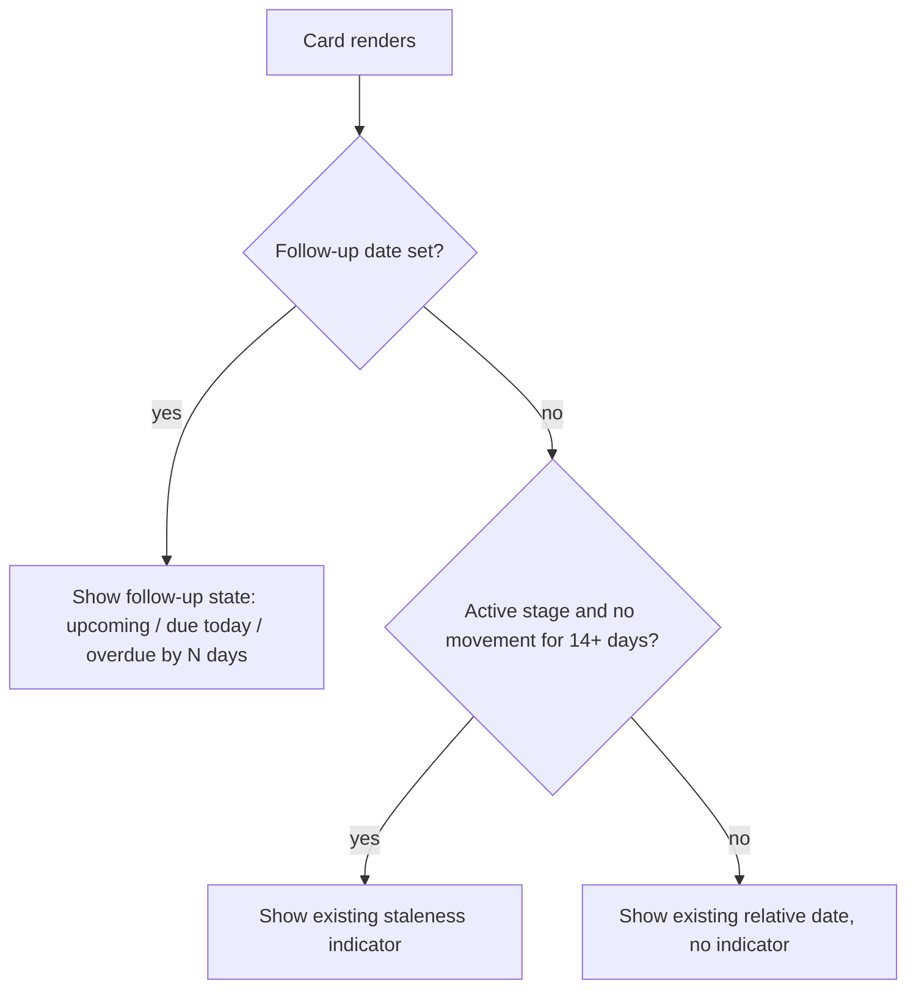

# Next Follow-Up Date - Plan

## Goal Capsule

- **Objective:** Give every application record an optional next follow-up date, primarily written and queried by MCP agents, secondarily set by hand and displayed on the board.
- **Product authority:** This plan owns the follow-up date field, its due/overdue semantics, the instance timezone that anchors them, the MCP read/write/query surface, and the card and detail-panel display. It does not own reminders, notifications, or any new web-UI view.
- **Open blockers:** None. Two items are deferred to planning; see Outstanding Questions.

---

## Product Contract

### Summary

Add an optional next follow-up date to every application record, at day granularity. MCP is the primary surface: agents read it, set it when they log activity, and query due and overdue records through filters on `list_applications`. A single configured instance timezone defines what "today" means, so the server, the agent, and the board agree on due and overdue. The board shows the date on the card in the slot the derived staleness indicator currently occupies; the detail panel is where it is set by hand.

### Problem Frame

The board communicates neglect passively. A card in an active stage that has not moved in 14 days shifts to amber, and at 30 days to danger, derived from `updated_at` (`client/src/components/KanbanCard.vue`). That signal answers "has anything happened lately", which is not the same question as "what did I commit to doing, and when".

The concrete failure was a recruiter call that was never made. Nothing in the tracker held the commitment, so nothing could surface it. Passive staleness could not have caught it: the record had recent activity, so it was not stale, and the deadline was days away from any 14-day threshold.

The tracker is also increasingly driven through MCP rather than the browser. An agent that logs an application, adds a note after a call, or sweeps the pipeline each morning has no way to record what it should chase next, and no way to ask what is outstanding without pulling every record and reasoning over dates itself.

### Key Decisions

- KD1. **The date is an explicit commitment, not a derived signal.** (session-settled: user-directed — chosen over a stage-aware auto-clock or auto-suggested defaults: the value is recording intent, and a derived date is just staleness with extra steps.) Governs R1.
- KD2. **The date never auto-clears.** (session-settled: user-directed — chosen over clearing on stage change or on any activity: nothing should silently discard a commitment the user or agent recorded.) Governs R2.
- KD3. **The date lives on the record, not on a stage.** (session-settled: user-directed — chosen over restricting it to active pipeline statuses: a follow-up belongs to the role, and a rejected record can still warrant a ping in six months.) Governs R1.
- KD4. **Day granularity, no time of day.** (session-settled: user-directed — chosen over an optional time field: time-of-day commitments belong in a calendar, and every other date in the schema is day-level.) Governs R1.
- KD5. **One instance-level timezone rather than per-user.** (session-settled: user-directed — this is a self-hosted single-operator instance; per-user timezone is carrying cost for nobody.) Governs R3, R4.
- KD6. **Due and overdue are queried through filters on the existing list tool.** (session-settled: user-directed — chosen over a dedicated `follow_ups_due` tool: one tool for an agent to learn, composing with the filters already there.) Governs R8.
- KD7. **Manual entry is panel-only.** (session-settled: user-directed — chosen over card quick-set chips or a prompt on stage change: smallest surface, no click-versus-drag risk on a draggable board. The accepted cost is friction on the human path, which the MCP path absorbs.) Governs R10.
- KD8. **An explicit date supersedes the derived staleness signal on the card.** (session-settled: user-directed — chosen over showing both: a record you are actively managing should not also nag about inactivity, and the card has one strip for this.) Governs R12.

### Actors

- A1. **Job seeker** — the instance operator. Sets and clears dates by hand in the detail panel, reads due and overdue state off the board.
- A2. **MCP agent** — the primary writer. Reads the date, sets it when logging activity, and queries what is due or overdue.

### Requirements

**The field**

- R1. Every application record can carry an optional next follow-up date at day granularity, regardless of its status, including terminal statuses.
- R2. The follow-up date changes only through an explicit set or clear. No status change, note, attachment, or field edit modifies or removes it.

**Timezone and classification**

- R3. The instance carries a single configured timezone as an IANA zone name (for example `Australia/Sydney`). No timezone configuration exists in the codebase today, so this introduces the setting.
- R4. A record's follow-up state is derived by comparing its date to the current date in the configured timezone: `overdue` when the date is before today, `due` when it equals today, `upcoming` when it is after.
- R5. Every surface that reports or displays follow-up state derives it from R4, so the API, MCP, and board never disagree about whether a record is due.

**MCP surface**

- R6. Records returned by MCP tools include the follow-up date.
- R7. An agent can set, change, and clear the follow-up date on a record it may write to.
- R8. `list_applications` accepts filter parameters that select records by follow-up state, so an agent can retrieve what is due or overdue without pulling the full list.
- R9. Records returned by `list_applications` carry their follow-up state (R4) explicitly, so an agent does not recompute the classification from raw dates.

**Web UI**

- R10. The detail panel allows setting, changing, and clearing the follow-up date, alongside the existing stage date fields.
- R11. When a record has a follow-up date, its card shows it with wording that distinguishes upcoming, due today, and overdue, including how late an overdue record is.
- R12. When a record has a follow-up date, the card's follow-up display occupies the slot the staleness indicator uses, and the staleness indicator is not shown. A record with no follow-up date keeps today's staleness behaviour unchanged.

The card's single-slot rule:

### Key Flows

- F1. Agent morning sweep
  - **Trigger:** A2 is asked what needs chasing today.
  - **Steps:** A2 calls `list_applications` filtered to due and overdue; the response carries each record's follow-up state; A2 reports the list.
  - **Outcome:** A2 answers in one call, without pulling the full pipeline.
  - **Covered by:** R4, R8, R9
- F2. Agent logs activity and re-dates
  - **Trigger:** A2 records that a recruiter was emailed.
  - **Steps:** A2 adds the note, then sets the follow-up date to the day it should chase again.
  - **Outcome:** The record leaves the due list and reappears on the target day.
  - **Covered by:** R2, R7
- F3. Human sets a date by hand
  - **Trigger:** A1 opens a record and decides to chase it next Thursday.
  - **Steps:** A1 sets the follow-up date in the detail panel and saves.
  - **Outcome:** The card shows the follow-up state; the staleness indicator, if it was showing, gives up the slot.
  - **Covered by:** R10, R11, R12

### Acceptance Examples

- AE1. **Covers R4, R5.** Given the instance timezone is `Australia/Sydney` and a record's follow-up date is 12 August, when the time is 00:30 on 13 August in Sydney (14:30 on 12 August UTC), then the API, MCP, and card all report the record as overdue by one day.
- AE2. **Covers R2.** Given a record with a follow-up date of 20 August, when it is moved from `applied` to `interview` and a note is added, then the follow-up date is still 20 August.
- AE3. **Covers R1.** Given a record with status `rejected`, when a follow-up date six months out is set on it, then the date is accepted and stored.
- AE4. **Covers R12.** Given a record in `applied` with no movement for 25 days and no follow-up date, when a follow-up date three days out is set, then the card shows the follow-up state and no staleness indicator.
- AE5. **Covers R12.** Given that same record, when the follow-up date is cleared, then the staleness indicator returns.
- AE6. **Covers R8, R9.** Given three records due today, one overdue, and one due next week, when an agent lists records filtered to due and overdue, then it receives the four records, each carrying its follow-up state, and not the fifth.

### Scope Boundaries

Deferred for later:

- A due or overdue filter, view, or sort in the web UI. The board shows follow-up state per card; triage as a list is the agent's job for now.
- A "coming up" block in the Timeline view.
- Email, push, or any notification that reaches the user off the board.
- An overdue horizon that hands the card slot back to the staleness indicator once a follow-up date is old enough. Worth revisiting if forgotten dates start masking genuinely dead records.

Outside this feature's shape:

- Auto-derived or stage-suggested follow-up dates. KD1 rules these out; the date means something only because a human or agent chose it.
- Time-of-day follow-ups and calendar integration (KD4).
- Per-user timezone configuration (KD5).
- Card quick-set affordances and stage-change prompts (KD7).

### Dependencies and Assumptions

- The instance is operated by one person in one timezone, consistent with the self-hosted single-operator model in `AGENTS.md`.
- Agents are instructed to maintain the date as part of logging activity. Nothing in the tracker enforces it; R9 is the mitigation, giving an agent's next sweep an unambiguous view of what it left behind.
- Admin read-only access to other users' records follows the existing model unchanged: admins can see follow-up dates on records they may read, and cannot set them.
- Existing records have no follow-up date, and an absent date is a normal steady state, not a backfill gap.

### Outstanding Questions

Deferred to planning:

- The default timezone when the setting is unconfigured, and whether it inherits the container's `TZ` rather than falling back to UTC.
- The exact shape of the `list_applications` filter parameters (R8) and of the follow-up state field on returned records (R9).

### Sources

- `client/src/components/KanbanCard.vue` — the staleness thresholds (14 and 30 days over `updated_at`), the stages it watches, and the card slot the follow-up display takes over.
- `server/db.js` — the `applications` table and the `ALTER TABLE` guarded column-migration pattern used for new columns.
- `server/services/applications.js` — `VALID_STATUSES` and the shared business logic behind both the REST API and MCP.
- `AGENTS.md` — MCP tool inventory and the self-hosted single-user deployment model.
