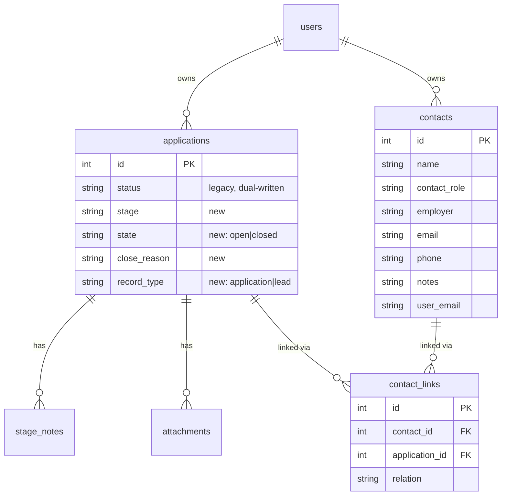
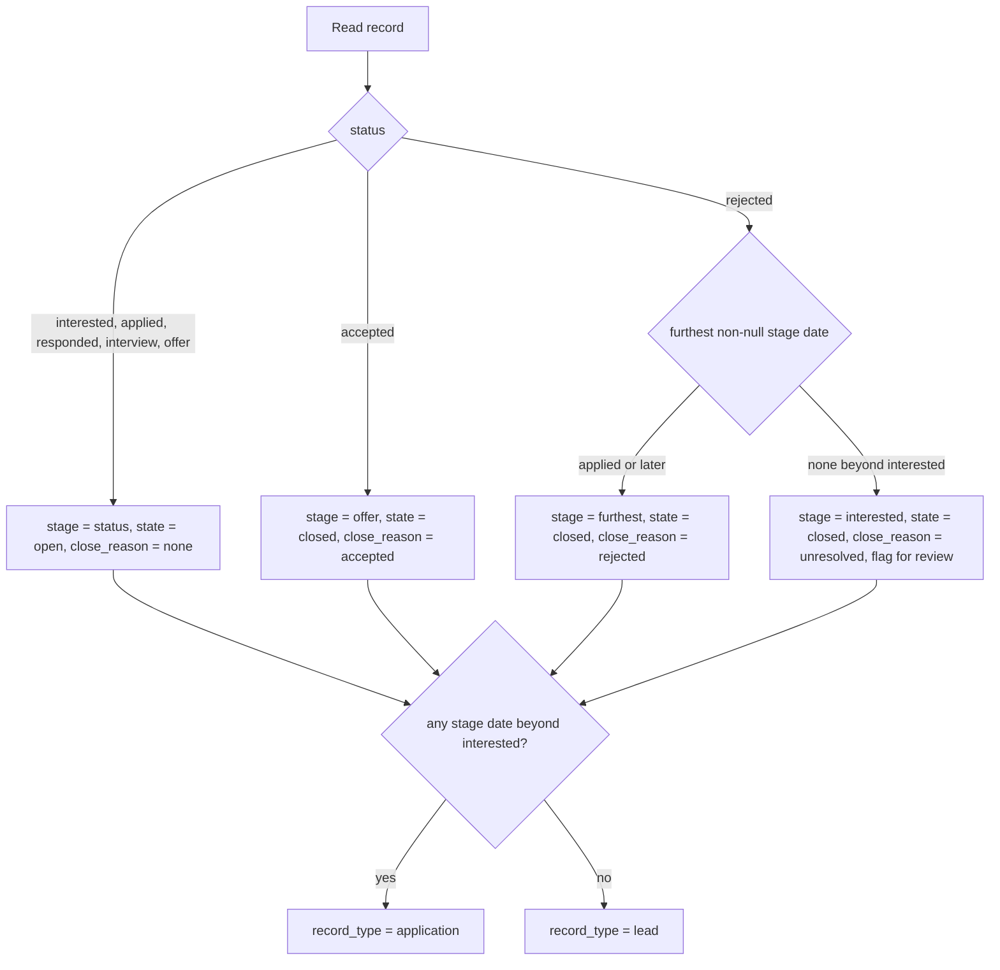
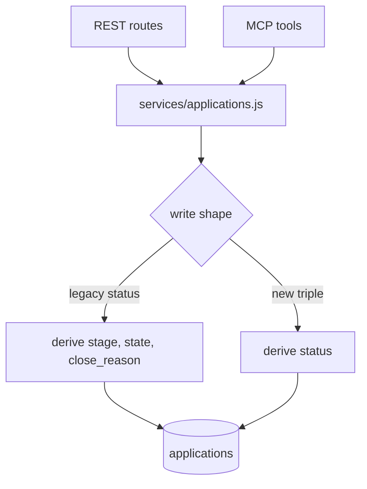

# Pipeline Schema Split and Contacts Entity - Plan

## Goal Capsule

- **Objective:** Split the overloaded `status` column into `stage`, `state`, and `close_reason`; separate applications from leads with `record_type`; and give contacts their own entity. Backfill the existing records without guessing.
- **Authority:** This plan owns the `applications` status model, the `record_type` distinction, the `contacts` and `contact_links` tables, the migration and its inference rules, and the read/write surfaces that expose the new fields. It does not own promoted fields, pipeline statistics, the notes model, or ingest hygiene.
- **Execution profile:** Migration correctness is the binding constraint. The backfill reports before it writes, and never converts a pipeline row into a contact on inference alone.
- **Stop conditions:** Stop and surface if the dry-run report shows an inference rule classifying a materially different share of records than this plan predicts, or if the production database schema differs from `server/db.js`.
- **Tail:** Standalone run. Owns commit and PR.

---

## Product Contract

### Summary

Split the single pipeline status into three independent facts, introduce a contacts entity, and separate applications from leads. A one-shot migration derives the new fields from existing statuses and dates, reports what it will do before doing it, and flags what it cannot classify rather than defaulting it.

### Problem Frame

`status` on `applications` carries three unrelated facts at once: how far a record progressed, whether it is still open, and why it ended. The status set (`interested`, `applied`, `responded`, `interview`, `offer`, `accepted`, `rejected`) has exactly one close state that means failure, so every record that ends for any reason other than acceptance becomes `rejected`.

An audit of the 174 live records found 129 reading `rejected`, of which 82 were never applied to. Those are leads that went nowhere, roles that closed, and postings that turned out to be wrong — recorded as rejections because nothing else was available. A note on record #175 states this directly: the record was closed out as rejected because that is the only close state available. Every conversion rate computed off this column is wrong by roughly a factor of three.

Two mechanisms manufacture the bad data. The tracker has no way to say "this ended without an application", and the board's Closed column assigns `rejected` on drag (`docs/plans/completed/2026-04-24-001-feat-rejected-archive-and-quiet-plan.md`) — a one-gesture path from any stage to a false rejection.

The same table also holds rows that are not applications. Record #148 is Mike Carter, a recruiter, filed as a job application with his mobile number in `prep_work`. People have no home in the schema, so they are entered as pipeline rows, where they inflate every count and leave the referral network unrepresentable. Asking who has been spoken to at a given class of employer is not answerable today.

### Actors

- A1. **Job seeker** — the instance operator. Reads the board, closes records, and needs counts that mean something.
- A2. **MCP agent** — logs records, sets outcomes, and queries the pipeline. The primary writer.
- A3. **Migration operator** — the job seeker running the backfill, reviewing its report, and resolving flagged records.

### Requirements

**The status split**

- R1. Every application record carries a `stage` recording the furthest point it reached, independent of whether it is still open.
- R2. Every application record carries a `state` of `open` or `closed`.
- R3. A closed record carries a `close_reason` naming why it ended. An open record carries none.
- R4. The close reasons are exactly `accepted`, `rejected`, `withdrawn`, `role_closed`, `lapsed`, `not_pursued`, and `unresolved`. They mean, in order: the offer was taken, the candidate was turned down, the candidate pulled out, the role was filled or cancelled, the record went unanswered and was given up on, the role was identified but never applied to, and the reason is not known.
- R5. Closing a record does not change its stage. A record closed at `applied` still reads as having reached `applied`.

**Record type**

- R6. Every record carries a `record_type` of `application` or `lead`. A lead is a role identified but never applied to.
- R7. Pipeline counts, conversion rates, and any list defaulting to "the pipeline" can be scoped to applications alone.

**Contacts**

- R8. A contact is a first-class record with its own identity, holding at minimum a name, and optionally a role, employer, email, phone, and free-text notes.
- R9. A contact can be linked to any number of application or lead records, and each link carries the contact's relation to that record.
- R10. A contact can exist with no links, so a person met before any specific role can be recorded.
- R11. Contacts are scoped to their owning user under the existing ownership model, and admin read-only access follows the existing rules unchanged.

**Migration and backfill**

- R12. The migration derives `stage`, `state`, and `close_reason` for every existing record from its current status and its stage date fields.
- R13. The migration reports without writing by default, and writes only when the operator explicitly opts in. A deploy alone cannot apply it.
- R14. A record whose close reason cannot be determined confidently is written with `unresolved` and flagged for review, never assigned a plausible-looking default.
- R15. The migration derives `record_type` from the stage dates: a record with no application date and no later stage date is a `lead`, and every other record is an `application`. It does not infer `record_type` from record content.
- R16. The migration does not create contacts. It reports pipeline rows that look like people and leaves them in place until an operator converts them.
- R17. Converting a pipeline row into a contact is an explicit operator action that preserves the original row's full content, so the conversion can be undone.

**Compatibility and surfaces**

- R18. The existing `status` column keeps working for every reader that has not migrated, and stays consistent with the new fields after any write through either shape.
- R19. The REST API and the MCP tools both expose the new fields and both accept writes to them, through the shared service layer.
- R20. Records can be filtered by `state`, `close_reason`, and `record_type` without pulling the full list.
- R21. The board's existing columns, drag behaviour, and Closed-column treatment are unchanged by this plan, except that dragging to Closed no longer records a rejection.

### Key Flows

- F1. Operator runs the backfill
  - **Trigger:** A3 deploys the release containing the migration.
  - **Steps:** Startup runs the derivation in report mode and writes the report without touching data; A3 reads it and compares it against the expected shape; A3 restarts with the apply opt-in set; flagged records surface for review.
  - **Outcome:** Every record has stage, state, close_reason, and record_type; the unresolved ones are visibly unresolved.
  - **Covered by:** R12, R13, R14, R15
- F2. Agent closes a record that was never applied to
  - **Trigger:** A2 learns a lead went nowhere.
  - **Steps:** A2 sets state to closed with a close reason of `not_pursued`; stage stays where it was.
  - **Outcome:** The record leaves the open pipeline without becoming a rejection.
  - **Covered by:** R2, R3, R4, R5
- F3. Operator converts a person-row into a contact
  - **Trigger:** A3 reviews the migration report and finds record #148 is a recruiter.
  - **Steps:** A3 converts the row; a contact is created from its content; the original row content is preserved; the pipeline row is removed.
  - **Outcome:** The person leaves the pipeline count and becomes linkable to real records.
  - **Covered by:** R8, R16, R17
- F4. Agent records who it spoke to
  - **Trigger:** A2 logs a call with a recruiter about a specific role.
  - **Steps:** A2 finds or creates the contact, then links it to the record with a relation.
  - **Outcome:** The person is attached to the role rather than buried in a note body.
  - **Covered by:** R8, R9, R19

### Acceptance Examples

- AE1. **Covers R5.** Given a record at stage `interview` that is then closed as rejected, when it is read back, then its stage is still `interview`, its state is `closed`, and its close reason is `rejected`.
- AE2. **Covers R12, R14, R15.** Given an existing record with status `rejected` and every stage date null beyond `interested_at`, when the migration runs, then its stage is `interested`, its state is `closed`, its close reason is `unresolved`, its record type is `lead`, and it appears in the review list.
- AE3. **Covers R12.** Given an existing record with status `rejected` and a non-null `interview_at`, when the migration runs, then its stage is `interview`, its state is `closed`, and its close reason is `rejected`.
- AE4. **Covers R12.** Given an existing record with status `accepted`, when the migration runs, then its stage is `offer`, its state is `closed`, and its close reason is `accepted`.
- AE5. **Covers R13.** Given the release is deployed without the apply opt-in set, when the server starts, then a report of intended derivations is written and every row is unchanged.
- AE11. **Covers R15.** Given an existing record with status `rejected` and a non-null `applied_at`, when the migration runs, then its record type is `application`, not `lead`.
- AE6. **Covers R18.** Given a record whose state is set to closed with a close reason of withdrawn through the new shape, when the record is read through a caller that only knows `status`, then `status` reads `rejected` and the record is still recognised as terminal.
- AE7. **Covers R18.** Given a caller sets `status` to `interview` through the legacy endpoint, when the record is read through the new shape, then its stage is `interview` and its state is `open`.
- AE8. **Covers R17.** Given record #148 is converted into a contact, when the conversion is inspected afterwards, then the contact holds the row's content and the original row is recoverable from the backup.
- AE9. **Covers R10.** Given a contact created with no links, when contacts are listed, then it appears.
- AE10. **Covers R21.** Given a card is dragged to the Closed column, when the record is read back, then it is closed with `unresolved` rather than a rejection.

### Scope Boundaries

Deferred for later:

- Promoted fields: `fit_score`, `source_channel`, `salary_basis`, `employment_type`, `onsite_days`.
- A `get_pipeline_stats` endpoint and a default sparse field set on `list_applications`. Independent of this plan and shippable alongside it.
- The notes upgrade: `occurred_at`, `interaction_type`, `supersedes_note_id`.
- Ingest hygiene: boilerplate stripping on job descriptions, create-time dedup on `job_posting_url`.
- Rich contact querying, such as retrieving everyone spoken to at a class of employer. This plan gives contacts a minimal create, link, list, and get surface; the querying follows once the entity holds real data.
- Backfilling contacts out of existing note bodies. Only pipeline rows that are people are addressed here.
- The follow-up date and instance timezone work in `docs/plans/2026-08-12-001-feat-follow-up-date-plan.md`. It touches the same table and lands after this plan.

Outside this plan's identity:

- AI features, scraping, auto-apply, and email reminders.
- Any change to the board's column layout or drag mechanics beyond the close-reason value that a drag records.

### Dependencies and Assumptions

- The production database is a single-operator self-hosted instance whose schema matches `server/db.js`. The local `data/job-tracker.db` holds 13 sample records, not the 174 live ones, so the inference rules cannot be validated locally. R13's report mode is the mitigation: it is run against production before anything is written.
- The audit's counts (174 records, 129 rejected, 82 of those never applied to) come from reading the live instance and are treated as the expected shape of the report, not as verified inputs. A materially different report is a stop condition.
- `screening_at` exists on the table with no corresponding status, left behind by the `screening_to_responded` migration. It is treated as a weak stage signal during backfill and otherwise left alone.
- Note content is not parsed to determine close reasons. The evidence sits in prose across 174 records and inferring from it would violate R14.

---

## Planning Contract

### Key Technical Decisions

- KTD1. **Contacts are a full entity in this step, not a `record_type` value.** (session-settled: user-directed — chosen over deferring the entity behind a `relationship` record type: too much of the search runs through people to model them as a flag on a pipeline row.) A `contacts` table holds identity; a `contact_links` join table carries the relation to each record. Governs R8, R9, R10.
- KTD2. **`record_type` is narrowed to `application` and `lead`.** Because people leave the pipeline table entirely under KTD1, the third value has nothing to hold. Governs R6.
- KTD3. **`status` stays a live column, dual-written by the service layer.** The repo's migration pattern is `ALTER TABLE ADD COLUMN` guarded by `PRAGMA table_info` (`server/db.js`), which cannot drop or rename a column, and three surfaces read `status` today. The service layer derives `status` from the new fields on every write and derives the new fields from `status` on every legacy write. Governs R18.
- KTD4. **The status-to-triple mapping is asymmetric and lossy in one direction.** Every new triple maps to exactly one legacy status, but `rejected` maps back to several possible close reasons. The compatibility direction that loses information is legacy-read, which is acceptable; the direction that must not lose information is new-read, which is why the migration flags rather than guesses. Governs R14, R18.
- KTD5. **The migration runs in two modes over one code path, and report mode is the default.** Report mode computes every derivation and writes a report file without touching the database. Apply mode runs the same computation inside a transaction and records itself in `_migrations`, mirroring the existing `screening_to_responded` migration. One code path means the report cannot drift from the apply. The mode is selected by an environment variable read at startup, so the migration stays inside the repo's startup-migration convention while a deploy alone cannot apply it. Governs R12, R13.
- KTD6. **Row conversion into a contact backs up the original row before deleting it.** A `_row_backups` table stores the original row as JSON keyed by the operation that removed it. `audit_log` cannot serve this purpose: it cascades on `applications` delete, so it would vanish with the row it documents. Governs R17.
- KTD7. **Person-row detection produces a report, never a write.** The heuristics available — an empty or person-shaped `role_title`, a phone number in `prep_work`, no `job_posting_url` — are weak enough that a false positive silently deletes a real application. Conversion stays an operator action. Governs R16.
- KTD8. **Stage is derived from the date columns, not from the status.** The stage dates record what actually happened; the status records where the record ended up, which for closed records has been overwritten by the close. Governs R12.
- KTD9. **`close_reason` carries `unresolved` rather than null on a closed record.** Null would be indistinguishable from "not yet backfilled" and would make the review list unqueryable. Governs R14.
- KTD10. **`record_type` is derived from the stage dates, not left for manual reclassification.** R6 defines a lead as a role never applied to, and the absence of an application date with no later stage date states exactly that — this is a read of recorded fact, not an inference about content, so it does not fall under KTD7. Deriving it classifies the roughly 82 never-applied records at migration time instead of leaving R7's pipeline scoping inert behind a hand-editing backlog. Governs R6, R15.

### High-Level Technical Design

The data model after this plan. `applications` keeps its identity and gains four columns; `contacts` and `contact_links` are new.

The backfill's derivation, applied per record. Every branch that cannot reach a confident close reason lands on `unresolved` and the review list. Record type is derived alongside it from the same stage dates.

Compatibility runs through the service layer, so both surfaces get it without either knowing about the other.

### Assumptions

None carried. The scope was confirmed before research, and the open fork on contacts was settled by the user (KTD1).

### Sequencing

U1 through U4 are the migration spine and land in order. U5 and U6 add the contacts surface and depend only on U1. U7 and U8 expose the new shape and depend on U4. U9 is the board's close-reason fix and depends on U4.

The follow-up date plan (`docs/plans/2026-08-12-001-feat-follow-up-date-plan.md`) lands after this one. It adds a column to the same table and reads the same MCP list surface; sequencing it second avoids two concurrent migrations over `applications`.

---

## Implementation Units

### U1. New columns and contact tables

- **Goal:** Add every new column and table additively, with no behaviour change and no backfill.
- **Requirements:** R1, R2, R3, R6, R8, R9, R10, R11
- **Dependencies:** none
- **Files:** `server/db.js`
- **Approach:**
  1. Add `stage`, `state`, `close_reason`, and `record_type` to `applications` via the existing `PRAGMA table_info` guarded `ALTER TABLE` pattern. All nullable, no defaults — a null distinguishes not-yet-backfilled from backfilled, which U3 relies on.
  2. Create `contacts` with the fields in R8, a `user_email` column, and `created_at` / `updated_at`, mirroring the `applications` ownership shape.
  3. Create `contact_links` joining `contacts` and `applications` with a `relation` column, cascade-deleting on both sides, and a uniqueness constraint on the contact/application pair.
  4. Create `_row_backups` holding an operation name, an original table name, the row JSON, and a timestamp.
  5. Index `contacts(user_email)` and `contact_links(application_id)`, matching the existing index conventions.
- **Patterns to follow:** the guarded column migrations and `CREATE TABLE IF NOT EXISTS` blocks already in `server/db.js`; `attachments` for the cascade-delete relationship shape.
- **Test scenarios:**
  - Starting from an empty database, every new column and table exists after startup.
  - Starting from a database at the pre-plan schema, startup adds the columns without error and leaves existing row values untouched.
  - Running startup twice does not error or duplicate any column.
  - Deleting an application removes its `contact_links` rows and leaves the linked contact intact.
  - Deleting a contact removes its `contact_links` rows and leaves the linked application intact.
  - Inserting the same contact/application pair twice is rejected.
- **Verification:** `cd server && npm test` passes, and a database created before this change starts cleanly against it.

### U2. Backfill derivation and report mode

- **Goal:** Compute the derivation for every record and write a report, without touching the database.
- **Requirements:** R12, R13, R14, R15, R16
- **Dependencies:** U1
- **Files:** `server/services/migration-backfill.js`, `server/test/migration-backfill.test.js`
- **Approach:**
  1. Implement the derivation in the shape of the backfill flowchart in the Planning Contract, per KTD8, KTD9, and KTD10. One record in, one derived `stage` / `state` / `close_reason` / `record_type` out.
  2. Treat `screening_at` as a stage-date signal equivalent to `responded_at` when determining the furthest stage.
  3. Return a per-record result carrying the derived values, the rule that produced them, and a review flag.
  4. Produce a summary counting records per derived close reason, per record type, per rule, and the flagged total, so the report can be checked against the audit's expected shape.
  5. Include the person-row candidate list from the KTD7 heuristics, marked as advisory. It is a report only and never feeds a write.
  6. Expose report mode as a callable that writes the report and returns the summary, performing no writes.
- **Execution note:** Build this unit test-first. The inference rules are the plan's highest-risk content and cannot be validated against production data from the development environment.
- **Patterns to follow:** the pure-function-plus-caller split in `server/services/applications.js`; `STATUS_DATE_MAP` for the status-to-date-column relationship.
- **Test scenarios:**
  - Covers AE3. A `rejected` record with a non-null `interview_at` derives stage `interview`, state `closed`, close reason `rejected`.
  - Covers AE2. A `rejected` record with all stage dates null beyond `interested_at` derives stage `interested`, close reason `unresolved`, record type `lead`, and is flagged.
  - Covers AE4. An `accepted` record derives stage `offer`, state `closed`, close reason `accepted`.
  - Covers AE11. A `rejected` record with a non-null `applied_at` derives record type `application`.
  - An open record with a null `applied_at` and no later stage date derives record type `lead`, so the classification does not depend on the record being closed.
  - Each open status derives its own stage, state `open`, and no close reason.
  - A `rejected` record with a null `applied_at` but a non-null `interview_at` derives stage `interview` and close reason `rejected`, because a later date outranks the missing earlier one.
  - A `rejected` record with only `screening_at` set derives stage `responded`.
  - A record with a status outside the known set is flagged rather than derived.
  - A record with every stage date null and status `interested` derives stage `interested` and is not flagged.
  - Covers AE5. Report mode over a fixture database leaves every row byte-identical.
  - The summary's counts sum to the total record count.
  - A row with an empty `role_title` and a phone-shaped string in `prep_work` appears in the person-row candidate list.
  - A normal application row with a `job_posting_url` does not appear in the person-row candidate list.
- **Verification:** `cd server && npm test` passes, and report mode over a copy of the production database produces a summary matching the audit's expected shape.

### U3. Apply the backfill

- **Goal:** Write the derived values in a one-shot migration, gated so a deploy alone cannot apply it, and recorded so it runs once.
- **Requirements:** R12, R13, R14, R15
- **Dependencies:** U2
- **Files:** `server/db.js`, `.env.example`, `server/test/migration-backfill.test.js`
- **Approach:**
  1. Read the mode from an environment variable at startup, per KTD5. Absent or any value other than the apply opt-in means report mode.
  2. In report mode, run the U2 report callable, log where the report was written, and return without touching data.
  3. In apply mode, guard on a `_migrations` row named for this backfill, mirroring `screening_to_responded`.
  4. Run the U2 derivation over every record inside a single transaction and write `stage`, `state`, `close_reason`, and `record_type`.
  5. Leave `status` untouched. U4 makes it derived going forward; existing values are already consistent with what U2 derived from them.
  6. Skip records that already have a non-null `stage`, so a partially applied run is resumable.
  7. Document the variable in `.env.example` alongside the existing entries.
- **Patterns to follow:** the `screening_to_responded` transaction block in `server/db.js`; the existing environment-variable reads in `server/app.js`.
- **Test scenarios:**
  - Covers AE5. Starting with the variable unset writes a report and leaves every row byte-identical.
  - Starting with the variable set to an unrecognised value behaves as report mode, not apply mode.
  - Over a fixture spanning every status, apply mode leaves every record with a non-null stage, state, and record type.
  - Running startup twice in apply mode applies the backfill once; the second run changes nothing.
  - A record whose stage was already set by a prior partial run is left untouched.
  - A derivation failure mid-run rolls back the whole transaction and leaves every row at its original values.
  - Flagged records are written with `unresolved` and are retrievable by querying for it.
  - Covers AE2, AE3, AE4, AE11. The end-state values match what report mode predicted for the same fixture.
- **Verification:** `cd server && npm test` passes; a fixture database at the pre-plan schema is unchanged after a startup without the opt-in, and fully backfilled after one startup with it.

### U4. Dual-write in the service layer

- **Goal:** Keep `status` and the new triple consistent regardless of which shape a caller writes.
- **Requirements:** R1, R2, R3, R4, R5, R18, R19
- **Dependencies:** U3
- **Files:** `server/services/applications.js`, `server/test/api.test.js`
- **Approach:**
  1. Declare the R4 close reasons as a constant beside `VALID_STATUSES`, and define the mapping between the triple and the legacy status, per KTD4.
  2. On a legacy `status` write, derive and persist the triple. A write to `accepted` or `rejected` sets state closed with the corresponding close reason; `rejected` maps to the rejected reason, preserving today's meaning for existing callers.
  3. On a new-shape write, derive and persist `status`: any closed state maps to `accepted` when the close reason is acceptance and `rejected` otherwise; an open state maps to the stage.
  4. Keep the existing stage-date auto-set behaviour keyed on stage rather than status, so R5 holds — closing a record must not stamp a stage date it never reached.
  5. Validate the new fields with the existing `ServiceError` pattern and reject a close reason on an open record.
- **Patterns to follow:** `VALID_STATUSES`, `STATUS_DATE_MAP`, and the `ServiceError` validation style in `server/services/applications.js`.
- **Test scenarios:**
  - Covers AE7. Setting `status` to `interview` yields stage `interview` and state `open`.
  - Covers AE6. Setting state closed with close reason withdrawn yields `status` of `rejected`.
  - Setting state closed with close reason acceptance yields `status` of `accepted`.
  - Covers AE1. Closing a record at stage `interview` leaves its stage at `interview`.
  - Closing a record does not stamp `closed_at` onto a stage date the record never reached.
  - Setting a close reason on an open record is rejected with a validation error.
  - Setting an unknown close reason is rejected with a validation error.
  - Setting an unknown `record_type` is rejected with a validation error.
  - Reopening a closed record clears its close reason.
  - A legacy status write followed by a new-shape read, and the reverse, both round-trip consistently.
- **Verification:** `cd server && npm test` passes with the existing status tests unmodified.

### U5. Contacts service and REST surface

- **Goal:** Create, link, list, and retrieve contacts over HTTP.
- **Requirements:** R8, R9, R10, R11, R19
- **Dependencies:** U1
- **Files:** `server/services/contacts.js`, `server/routes/contacts.js`, `server/app.js`, `client/src/api.js`, `server/test/contacts.test.js`
- **Approach:**
  1. Implement create, update, delete, list, and get in a contacts service scoped by `user_email`, mirroring the ownership checks in `server/services/applications.js`.
  2. Implement link and unlink against `contact_links`, validating that both the contact and the application belong to the caller.
  3. Include a contact's links when it is retrieved, and a record's contacts when the record is retrieved.
  4. Mount the routes under the existing auth middleware and admin read-only rules.
  5. Cap the contact text fields with the existing `LIMITS` and `validateInputLengths` mechanism, so the free-text notes and identity fields cannot be used to store unbounded content.
  6. Add the client API functions as named exports in `client/src/api.js`, matching the existing export style. No component consumes them until U8.
- **Patterns to follow:** `getOwnApp` for the ownership check; `server/routes/applications.js` for router shape and error handling; `attachNotes` for the batched-children read; `LIMITS` and `validateInputLengths` in `server/services/applications.js` for field caps.
- **Test scenarios:**
  - Covers AE9. A contact created with no links is returned by the list endpoint.
  - A contact linked to a record appears when that record is retrieved.
  - Linking a contact to another user's record is rejected.
  - Retrieving another user's contact is rejected.
  - An admin can read another user's contacts and cannot write them.
  - Creating a contact without a name is rejected.
  - Creating a contact whose notes exceed the field cap is rejected with a validation error.
  - Unlinking removes the link and leaves both the contact and the record intact.
  - Linking the same contact to the same record twice is rejected.
  - A contact linked to several records lists all of them.
- **Verification:** `cd server && npm test` passes.

### U6. Convert a pipeline row into a contact

- **Goal:** Let the operator turn a person-row into a contact, reversibly.
- **Requirements:** R16, R17
- **Dependencies:** U1, U5
- **Files:** `server/services/contacts.js`, `server/routes/contacts.js`, `server/test/contacts.test.js`
- **Approach:**
  1. Accept an application id and the contact fields the operator wants set, since the source row's field names do not map cleanly onto a person.
  2. In one transaction: write the full original row as JSON into `_row_backups`, create the contact, then delete the application row.
  3. Carry the original row's notes into the contact's notes field so nothing is silently lost with the cascade.
  4. Record the conversion in `audit_log` before the delete, so the action is visible even though the row-scoped entries cascade away.
- **Execution note:** This is the only destructive path in the plan. Prove the backup is written and the row is recoverable before proving the delete works.
- **Patterns to follow:** the transaction blocks in `server/db.js`; the audit-logging call in `server/routes/applications.js`.
- **Test scenarios:**
  - Covers AE8. After converting a row, the contact holds the supplied fields and `_row_backups` holds the original row's JSON.
  - The original row's note content is present on the resulting contact.
  - The application row is gone from list results after conversion.
  - A failure during contact creation rolls back and leaves the application row in place.
  - Converting another user's record is rejected.
  - Converting a record that has attachments still writes the backup before the cascade removes them.
  - The backup JSON round-trips into an object carrying every original column.
- **Verification:** `cd server && npm test` passes, and a converted row is reconstructable from `_row_backups` by hand.

### U7. Expose the new shape over REST and MCP

- **Goal:** Return and accept the new fields on both surfaces, and filter by them.
- **Requirements:** R7, R19, R20
- **Dependencies:** U4, U5
- **Files:** `server/services/applications.js`, `server/routes/applications.js`, `server/mcp.js`, `server/test/api.test.js`
- **Approach:**
  1. Add `state`, `close_reason`, and `record_type` filters to `listApplications`, alongside the existing `status` filter.
  2. Extend the MCP `list_applications` schema with the same filters and extend `update_application` to accept the new fields.
  3. Add MCP tools for the contacts surface from U5: create, link, list, and get.
  4. Update the MCP tool descriptions so an agent knows the triple is the current model and `status` is legacy.
  5. Leave the existing `status` filter and `update_status` behaviour in place, per R18.
- **Patterns to follow:** the zod schemas and `toolError` handling in `server/mcp.js`; the filter-building block in `listApplications`.
- **Test scenarios:**
  - Filtering by state `open` excludes every closed record.
  - Filtering by close reason returns only records carrying it.
  - Covers R7. Filtering by record type `application` excludes leads.
  - Combining a state filter with a company-name filter applies both.
  - An unknown filter value returns a validation error rather than silently returning everything.
  - The MCP list tool returns the new fields on each record.
  - The MCP update tool sets state and close reason, and the record reads back consistently over REST.
  - The MCP contacts tools create, link, and retrieve a contact under the calling key's user.
  - An MCP key cannot read another user's contacts.
- **Verification:** `cd server && npm test` passes; the MCP tools respond correctly against a running server.

### U8. Surface the new fields in the client

- **Goal:** Show close reason and record type, and let the operator set them and manage contacts on a record.
- **Requirements:** R7, R21
- **Dependencies:** U7
- **Files:** `client/src/components/ApplicationPanel.vue`, `client/src/App.vue`, `client/src/utils/timeline.js`, `client/e2e/`
- **Approach:**
  1. Add close-reason selection to the detail panel alongside the existing stage date fields, enabled only when the record is closed.
  2. Show `record_type` on the panel and allow switching a record between application and lead.
  3. Show linked contacts on the panel with add and remove actions, against the U5 endpoints.
  4. Derive the existing terminal checks in `client/src/utils/timeline.js` from `state` where the new field is present, falling back to `status` so nothing breaks mid-migration.
  5. Exclude leads from the counts feeding the pipeline views, per R7. Column layout and drag mechanics are unchanged.
- **Patterns to follow:** the props-down / events-up flow described in `AGENTS.md`; the existing date-field editing in `ApplicationPanel.vue`; `TERMINAL_STAGES` consumers in `client/src/App.vue`.
- **Test scenarios:**
  - The close-reason control is disabled on an open record and enabled once it is closed.
  - Setting a close reason persists and survives a reload.
  - A record switched to lead leaves the pipeline count.
  - Linked contacts render on the panel, and adding one persists.
  - The Closed column renders records closed for any reason, not only rejections.
  - A record with a null `state`, as during a partial migration, still renders using its `status`.
  - The board renders every view without errors after the change.
- **Verification:** `npm run build:client && cd client && npm run test:e2e` passes.

### U9. Stop the drag gesture manufacturing rejections

- **Goal:** Make dragging to Closed record an unresolved close, not a rejection.
- **Requirements:** R21
- **Dependencies:** U4, U8
- **Files:** `client/src/components/KanbanBoard.vue`, `client/e2e/`
- **Approach:**
  1. Change the Closed-column drop handler to set state closed with `unresolved`, rather than assigning `rejected`.
  2. Leave the drag mechanics, the ghost-header behaviour, and the drag guard in `docs/solutions/ui-bugs/showclosed-toggle-drag-guard-and-panel-close-sync-2026-04-30.md` unchanged.
  3. Leave the card's quieting treatment keyed on the close reason being a rejection, so a record closed for another reason is not styled as a failure.
- **Patterns to follow:** the drop handler and quieting decision recorded in `docs/plans/completed/2026-04-24-001-feat-rejected-archive-and-quiet-plan.md`.
- **Test scenarios:**
  - Covers AE10. Dragging a card from `offer` to Closed sets `unresolved`, not a rejection.
  - The dragged card's stage is unchanged by the drop.
  - A record closed with the unresolved reason is not rendered with the rejected quieting treatment.
  - The existing drag guard still prevents the panel-close race the prior solution documented.
- **Verification:** `npm run build:client && cd client && npm run test:e2e` passes.

---

## Verification Contract

| Gate | Command | Applies to |
|---|---|---|
| Backend tests | `cd server && npm test` | U1-U7 |
| Client build | `npm run build:client` | U8, U9 |
| Frontend E2E | `cd client && npm run test:e2e` | U8, U9 |
| Migration dry run | Start the server against production with the apply opt-in unset; read the written report | U2, U3 |
| Migration shape check | Report summary compared against the audit's expected counts | U3 |

The migration shape check is a stop condition, not a soft signal. The audit expects roughly 129 records deriving from `rejected`, of which roughly 82 land on `unresolved` and are classified `lead`. A materially different split means an inference rule is wrong and the apply must not run.

---

## Definition of Done

Global:

- Every requirement R1 through R21 is implemented or explicitly deferred in Scope Boundaries.
- Every gate in the Verification Contract passes.
- A database at the pre-plan schema starts cleanly, backfills once, and serves both the legacy and new shapes.
- The existing status tests in `server/test/api.test.js` pass unmodified, proving R18.
- No abandoned or experimental code remains in the diff.
- `AGENTS.md` records the new tables, the new MCP tools, and the status compatibility rule.

Per unit:

- U1: columns and tables exist and are idempotent across restarts.
- U2: derivation rules are covered by tests, and report mode writes nothing.
- U3: report mode is the default, and apply mode runs once inside a transaction and is resumable.
- U4: both write shapes round-trip consistently.
- U5: contacts are creatable, linkable, and correctly scoped by owner.
- U6: conversion is reversible from `_row_backups`.
- U7: both surfaces expose and filter the new fields.
- U8: the panel edits close reason, record type, and contacts.
- U9: the drag gesture no longer records a rejection.

---

## Risks and Dependencies

- **The inference rules cannot be validated against real data before they run.** The development database holds 13 sample records; production holds 174. Mitigated by KTD5's report mode and the Verification Contract's shape check, both of which run against production before any write.
- **The person-row heuristics have no reliable ground truth.** A false positive would delete a real application. Mitigated by KTD7 keeping conversion an operator action and KTD6 backing up the row.
- **`status` cannot be dropped later without recreating the table.** This plan makes that acceptable by making `status` derived rather than authoritative; removing it is a separate exercise requiring a table rebuild.
- **The migration and the follow-up date plan both alter `applications`.** Sequencing them, rather than running both, is the mitigation.
- **Close reasons are being assigned to historical records that no longer have recoverable context.** R14 makes this visible rather than silent: `unresolved` is a queryable admission, not a guess.
- **The `record_type` derivation trusts that stage dates were kept accurately.** A record applied to but never date-stamped would be misclassified as a lead. The report is the check: the lead count is compared against the audit's expectation before the apply runs, and a record type is one panel click to correct afterwards.

---

## Sources and Research

- `server/db.js:27-49` — the `applications` table; `server/db.js:232-248` — the `screening_to_responded` one-shot migration, the pattern U3 mirrors.
- `server/services/applications.js:18-36` — `VALID_STATUSES` and `STATUS_DATE_MAP`, where both terminal statuses collapse onto `closed_at`.
- `server/mcp.js:103-190` — `list_applications`, which already has default pagination and a sparse `fields` parameter.
- `docs/plans/completed/2026-04-24-001-feat-rejected-archive-and-quiet-plan.md` — the single Closed column, and the drop handler that assigns `rejected` on drag. The most likely origin of the 82 false rejections.
- `docs/solutions/ui-bugs/showclosed-toggle-drag-guard-and-panel-close-sync-2026-04-30.md` — the drag guard U9 must not disturb.
- `client/src/utils/timeline.js:8` — `TERMINAL_STAGES`, the client's single definition of terminal.
- Local `data/job-tracker.db` — 13 records, confirming the development database is not representative of production.
