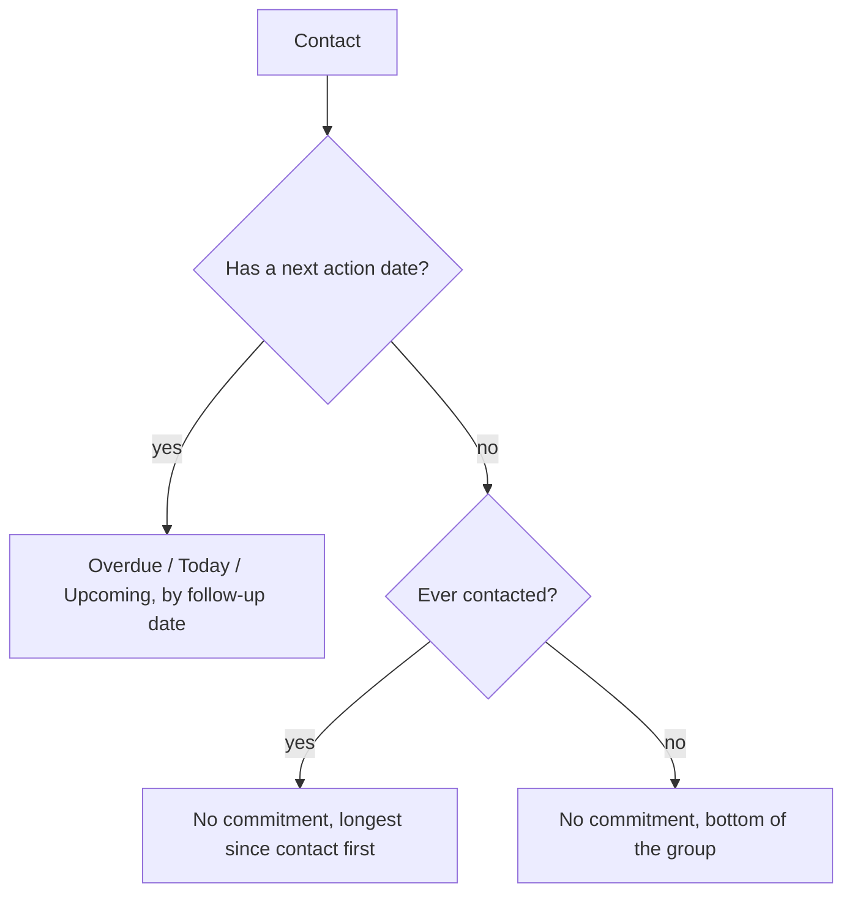
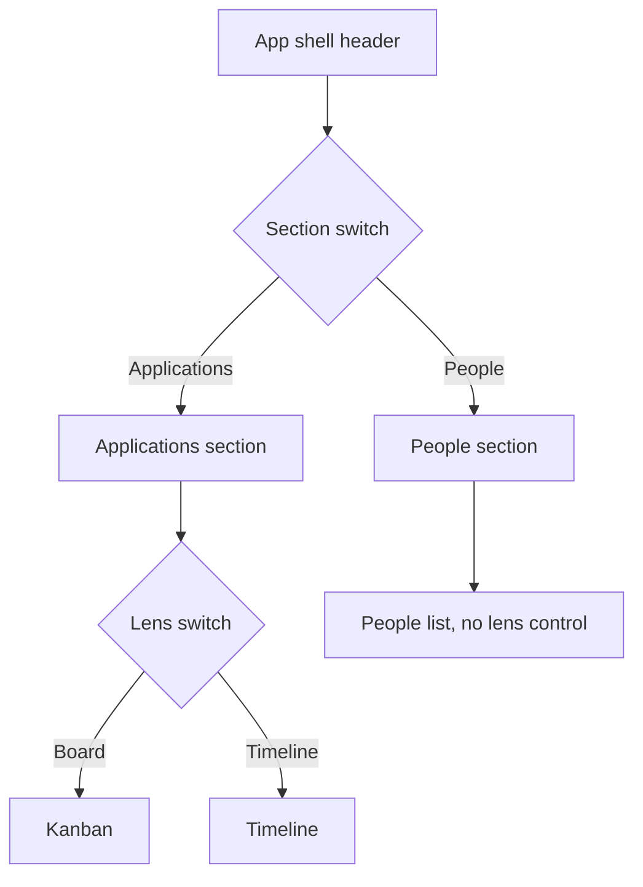
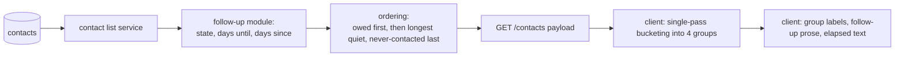

# Contacts Follow-Up View - Plan

## Goal Capsule

- **Objective:** A job seeker can see who they owe a reply and who is going cold in one place, and act on both without opening application records.
- **Means:** A People section listing contacts in follow-up groups, with staleness ordering derived server-side (KTD1) and reached through a two-tier navigation (see Key Decisions, "Navigation splits into section and lens").
- **Product authority:** This plan owns the People section, the contact rows in it, and the navigation change that makes it reachable. Follow-up dates for applications stay with `docs/plans/2026-08-12-001-feat-follow-up-date-plan.md` and are not active scope.
- **Stop conditions:** Stop and ask if implementation requires a schema change to `contacts`, or if preserving the follow-up prose wording proves impossible without breaking the existing end-to-end assertion.
- **Open blockers:** None.

---

## Product Contract

**Product Contract preservation:** changed — R1 (navigation mechanism restructured to two tiers after design review; product intent that People is a peer top-level destination is unchanged) and R2 (clarified that "no filter" means no user-operated control, so empty-group omission in R25 does not contradict it). Requirements R20-R26 added from flow analysis. The ten original Key Decisions carry unchanged; the eleventh, splitting navigation into section and lens, was settled during planning after design review.

### Summary

A People view as a third top-level destination beside Kanban and Timeline. Commitments the user has made surface as dated groups; everyone else sorts by how long it has been since contact, so people going cold rise on their own. The view never flags, counts, or nudges.

### Problem Frame

Contacts, their interaction history, and their next-touch dates all exist, and all of them are reachable only by opening an application that happens to link to the person. Two things follow. The user cannot answer "who do I owe a touch this week" at all, and there is nowhere to put a person who is not attached to a role.

The user's goal is wider than the owed-touch queue: they want to run a campaign of regular contact to keep a professional network warm. That makes the people with no commitment against them the working set, not the leftovers. Those are exactly the people the current data has no way to rank.

The cost is not a missing feature but a decaying asset. Relationships go quiet without any moment where that becomes visible, and the documented failure mode for this product is abandonment once upkeep becomes a chore, so anything that answers this has to earn every interaction it asks for.

### Key Decisions

- **People as a top-level destination.** (session-settled: user-directed — chosen over surfacing people on the existing pipeline board: a queue the user works needs its own surface.) Governs R1.
- **Navigation splits into section and lens.** (session-settled: user-directed — chosen over a flat three-way toggle: Board and Timeline are two lenses on applications while People is a different entity, and a Table lens is already anticipated in `client/src/assets/main.css`.) Governs R1, R20.
- **People only; not a mixed queue.** (session-settled: user-directed — chosen over combining application and contact follow-ups: application follow-ups have their own plan.)
- **Grouped sections in one scroll.** (session-settled: user-directed — chosen over filters: nobody is hidden behind a control the user has to remember to press.) Governs R2.
- **Cadence surfaces through ordering, never through a schedule.** (session-settled: user-directed — chosen over a per-person cadence field and over a commitments-only queue: no per-contact upkeep, and nothing that chases the user.) Governs R5, R7.
- **Never-contacted people sort last.** (session-settled: user-directed — chosen over a separate sub-block and over sorting them first: keeps the top of the list about re-warming existing relationships.) Governs R6.
- **The row identifies people by employer, not role.** (session-settled: user-directed — chosen over adding role and over name alone: employer is the strongest cue for whether a touch is worth making, and the slowest field to go stale.) Governs R8.
- **Snooze is the only inline action.** (session-settled: user-directed — chosen over an inline mark-contacted action: interaction history stays substantive rather than accumulating one-tap stubs.) Governs R12, R14.
- **Pipeline links stay in the drawer.** (session-settled: user-directed — chosen over a row marker and over navigating to the linked application.) Governs R11.
- **Removal is out of scope.** (session-settled: user-directed — chosen over delete-from-drawer and over an archive state.)
- **Creating a contact offers a next action.** (session-settled: user-directed — chosen over accepting that new contacts sort to the bottom, and over a scroll-and-highlight affordance.) Governs R16.

### Requirements

**View and navigation**

- R1. People is a top-level section, reachable from a section switch in the application shell header.
- R2. Contacts render in one scroll under four groups, in order: Overdue, Today, Upcoming, No commitment. No group is hidden behind a user-operated filter.
- R20. Board and Timeline become a lens switch inside the Applications section. People renders no lens control.
- R26. The section and lens controls meet the application's 44px minimum touch target, mark the active destination for assistive technology, and announce a section change through the existing live region.

**Grouping and ordering**

- R3. Group membership derives from the server-provided follow-up state. The client does not recompute it.
- R4. Within Overdue, Today, and Upcoming, contacts order by follow-up date, soonest owed first.
- R5. Within No commitment, contacts order by time since last contact, longest first.
- R6. Contacts who have never been contacted sort after every contact that has a last-contacted date, at the bottom of No commitment.
- R7. No commitment carries no staleness threshold, flag, count, or nudge. Elapsed time and position are the only signals.
- R22. Elapsed time never reads as negative. A contact whose last-contacted date is in the future reads as contacted today and sorts accordingly.

**Row content**

- R8. A row identifies the person by name and employer.
- R9. A row states the follow-up commitment in prose, carrying both how overdue it is and what was committed.
- R10. A row states how long it has been since the last contact, or that the person has never been contacted.
- R11. A row shows nothing about the person's linked applications.

**Row actions**

- R12. Snooze is the only action available from the row: it reschedules the next action to a relative offset or a picked date.
- R13. A snooze writes the next action date only. It does not advance last-contacted and does not create an interaction record.
- R14. Opening a row opens the existing contact drawer, which remains the only path for logging interactions and editing anything substantive.
- R21. In all-users mode the section is read-only. Snooze is hidden rather than failing on write.
- R24. A snooze that fails leaves the row where it is and surfaces the error. A snooze already in flight cannot be resubmitted.

**Creating contacts**

- R15. A contact can be created from this view with no application link.
- R16. The create form offers an optional next action date and description.

**States and freshness**

- R17. With no contacts at all, the view shows an orienting message and a create action.
- R18. With no commitments due, the view presents no empty or congratulatory state. The No commitment group is the working list.
- R19. On narrow screens the groups stack, and snooze stays reachable from the row without opening the drawer.
- R23. The section refetches its contacts on entry, on tab focus, and when live updates reconnect.
- R25. A dated group with no contacts is omitted. The No commitment group always renders.

### Key Flows

- F1. Work the campaign
  - **Trigger:** The user opens People with nothing owed today.
  - **Steps:** Overdue, Today, and Upcoming are absent or short. The user scans the top of No commitment, where the longest-quiet people sit. They pick someone and contact them outside the app.
  - **Outcome:** The user has a next person to contact without deciding who deserves attention.
  - **Covered by:** R2, R5, R7, R18, R25

- F2. Snooze from the row
  - **Trigger:** A commitment is due but the user cannot act on it now.
  - **Steps:** The user reschedules from the row. The list refetches and the contact appears in the group its new date implies.
  - **Outcome:** The commitment is preserved at a later date, with no interaction recorded.
  - **Covered by:** R12, R13, R24

- F3. Log a touch
  - **Trigger:** The user has contacted someone and needs it recorded.
  - **Steps:** The user opens the row, which opens the drawer, and logs the interaction there.
  - **Outcome:** Last-contacted advances, and the person's position in No commitment drops accordingly.
  - **Covered by:** R14, R5

- F4. Add someone unattached to a role
  - **Trigger:** The user meets someone worth keeping in the network.
  - **Steps:** The user creates the contact from this view, optionally naming a next action.
  - **Outcome:** With a next action, the person appears in a dated group. Without one, they sort to the bottom of No commitment.
  - **Covered by:** R15, R16, R6

### Acceptance Examples

- AE1. **Covers R5, R6.** Given three contacts with no commitment — one last contacted 8 months ago, one 3 weeks ago, one never — when the view renders, then they appear in that order: 8 months, 3 weeks, never.
- AE2. **Covers R13.** Given a contact last contacted 40 days ago with an overdue commitment, when the user snoozes from the row, then the commitment moves to the new date, the contact still reads as last contacted 40 days ago, and no interaction is added.
- AE3. **Covers R10.** Given a contact created with no interactions logged, when the view renders, then the row reads that the person has never been contacted rather than showing an elapsed duration.
- AE4. **Covers R3, R7.** Given a contact with no commitment last contacted a year ago, when the view renders, then the row shows the elapsed time and its position in the group, and carries no warning, badge, or count.
- AE5. **Covers R22.** Given a contact whose last-contacted date is tomorrow, when the view renders, then the row reads as contacted today and sorts above a contact last contacted a week ago.
- AE6. **Covers R25.** Given contacts exist but none are overdue, when the view renders, then no Overdue heading appears and the No commitment heading is present.
- AE7. **Covers R21.** Given an admin viewing another user's data in all-users mode, when the view renders, then no snooze control appears on any row.

### Success Criteria

- The user can name who to contact next from the view alone, without opening a record.
- The view is still in use after several weeks rather than abandoned, which is the product's documented failure mode for anything requiring upkeep.

### Scope Boundaries

- Follow-up dates for applications. They belong to `docs/plans/2026-08-12-001-feat-follow-up-date-plan.md`, and this view does not become a mixed queue.
- Deleting or archiving contacts. No removal affordance ships with this view; cleanup remains possible through the agent tool surface.
- A per-person contact cadence or frequency setting.
- Search overlays, segmentation, and enrichment, which are anti-patterns at this record count. See `docs/ideation/2026-08-16-contact-records-display-ideation.html`.
- Any count, stat tile, or hero metric summarising what is owed. This includes group headings, which carry no counts.

#### Deferred to Follow-Up Work

- Extending the change event stream to contacts, so the section live-updates. Blocked on a payload discriminator: the current remote-change handler assumes an event id is an application id and would refresh the wrong record.
- Persisting the chosen section across reloads. No view preference is stored today, so this is net-new work rather than an extension.

### Dependencies / Assumptions

- Ordering by time since last contact does not exist today. The contact list orders by follow-up date and then alphabetically, so R5 and R6 are new work.
- Last-contacted advances only when an interaction is logged. Combined with the decision to keep logging in the drawer, a touch the user makes without writing it up leaves the contact ranked as though it never happened. This is an accepted cost of keeping history substantive.
- Without removal, contacts the user has stopped caring about accumulate at the top of No commitment, since longest-quiet sorts first. Accepted, with the agent tool surface as the cleanup path.
- Follow-up state and elapsed days are derived server-side against the instance timezone as calendar dates, not timestamps.
- The agent-facing tool surface already covers every behaviour here. No new tools are required for parity, though the contact list tool inherits the new ordering.
- The global freshness indicator reports on the applications event stream only. While People is open it can read as live when the contact list is stale. R23's refetch triggers bound the staleness; removing the mismatch is deferred follow-up work.
- `AGENTS.md` states the default view is persisted in `localStorage`. It is not — no view preference is stored, and the mount-time assignment is a dead ternary. The claim is wrong independently of this work.

### Outstanding Questions

**Deferred to Planning** — all resolved; see Key Technical Decisions for where each landed.

### Sources / Research

- `docs/ideation/2026-09-08-contacts-follow-up-view-requirements.md` — the settled decisions and constraints this plan was built from.
- `server/services/contacts.js` — the contact list query, its ordering, and the derived follow-up fields.
- `server/lib/followup.js` — the single owner of follow-up state derivation, shared with the pending application follow-up work.
- `client/src/components/ContactPanel.vue` — the existing detail drawer, opened today only from the application panel.
- `docs/solutions/ui-bugs/timelineview-today-boundary-stale-overnight-2026-04-30.md` — a day-boundary defect in a view left open overnight.
- `docs/solutions/performance-issues/closedcount-double-array-scan-2026-04-30.md` — repeated scans of one array across sibling computeds.
- `docs/solutions/ui-bugs/showclosed-toggle-drag-guard-and-panel-close-sync-2026-04-30.md` — drawer state that must stay synchronous with the data behind it.

---

## Planning Contract

### Key Technical Decisions

- KTD1. **Derive elapsed days and the staleness ordering on the server.** `server/lib/followup.js` is already the single owner of date derivation, and deriving in the browser would be the first client-side date classification in the repo. Governs R5, R6, R10, R22.
- KTD2. **Map the three server states to four client group labels; add no server state.** The server returns `overdue`, `due`, `upcoming`, or null; `due` renders as Today and null as No commitment. Governs R2, R3.
- KTD3. **Snooze writes through the contact update endpoint with only the next action date.** The notes endpoint advances last-contacted, which R13 forbids. Governs R12, R13.
- KTD4. **Refetch the contact list after a snooze rather than splicing the row.** Ordering is server-owned, so a spliced row cannot reposition itself correctly. This diverges from the per-record refresh used for applications, and the reason is the ordering ownership. Governs R4, R5, R12.
- KTD5. **Extract the follow-up prose formatter into a shared client utility.** The wording exists twice already; R9 would be a third copy. An end-to-end test asserts the exact string, so the extraction must preserve wording. Governs R9.
- KTD6. **Bucket contacts into the four groups in a single pass.** Sibling computeds that each rescan the same array are a documented past defect in this repo. Governs R2, R25.
- KTD7. **Keep classification server-derived across the day boundary; refetch rather than recompute.** A reactive clock drives only the rendered elapsed text. `docs/solutions/ui-bugs/timelineview-today-boundary-stale-overnight-2026-04-30.md` prescribes a client-side reactive today, which cannot be applied literally here because R3 forbids client classification. Governs R3, R10, R23.
- KTD8. **Do not extend the change event stream to contacts in this work.** The remote-change handler assumes an event id is an application id. Refetch on entry, focus, and reconnect instead. Governs R23.
- KTD9. **Synchronise drawer state with a watcher, not a deferred tick.** A snoozed contact can leave its group while its drawer is open; deferred cleanup is a documented past defect. Governs R14.

### High-Level Technical Design

Navigation topology after the change. The section switch is application-shell chrome; the lens switch belongs to the Applications section only.

Where each value is derived. The server owns classification, elapsed days, and order; the client owns labels, prose, and display only.

### Assumptions

- The contact list tool's output ordering changes with KTD1. Records that carry a next action keep their current relative order; only the tail without commitments re-orders from alphabetical to staleness. Treated as an improvement, not a break.
- No schema change is required. Every field this work needs already exists on `contacts`.

### Sequencing

U1 and U2 are independent and can land in either order. U3 depends on nothing but unblocks U5 through U7. U4 is independent of the data work. U5 depends on U1, U2, and U3. U6 and U7 depend on U5. U8 depends on everything.

---

## Implementation Units

### U1. Server-side elapsed days and staleness ordering

- **Goal:** The contact list returns days since last contact and orders the no-commitment tail by staleness, never-contacted last.
- **Requirements:** R5, R6, R10, R22; KTD1
- **Dependencies:** none
- **Files:** `server/lib/followup.js`, `server/services/contacts.js`, `server/test/contact-followup.test.js`
- **Approach:**
  1. Add a days-since derivation beside the existing days-until helper in the follow-up module, clamping negatives to zero so a future date reads as zero days (R22).
  2. Attach the derived value in the same place the list service already attaches follow-up state and days.
  3. Extend the list `ORDER BY` so the existing owed-first keys are unchanged, then null-last on last-contacted, then last-contacted ascending, then name as the final tiebreak.
- **Patterns to follow:** the existing derivation attachment in the list service; the instance-timezone calendar-date handling already in the follow-up module.
- **Test scenarios:**
  - Covers AE1. Three contacts with no next action, last contacted 8 months, 3 weeks, and never, return in that order.
  - A contact with a next action always sorts before every contact without one, unchanged from today.
  - Two contacts with equal last-contacted dates fall back to name order.
  - Covers AE5. A contact whose last-contacted date is in the future returns zero days since contact and sorts above one contacted a week ago.
  - A contact never contacted returns a null days-since rather than a large number.
  - The existing ordering assertion in the follow-up suite still passes for records that carry a next action.
- **Verification:** The contacts follow-up suite passes, including the ordering case, and the list response carries the new field for every contact.

### U2. Extract the follow-up prose formatter

- **Goal:** One shared formatter produces the follow-up wording, replacing two near-duplicate copies.
- **Requirements:** R9; KTD5
- **Dependencies:** none
- **Files:** `client/src/utils/followUp.js`, `client/src/utils/followUp.test.js`, `client/src/components/ContactPanel.vue`, `client/src/components/ApplicationPanel.vue`
- **Approach:**
  1. Move the wording logic into a utility that takes follow-up state, days, and the action text.
  2. Replace both existing call sites, preserving output byte-for-byte.
- **Execution note:** An end-to-end test asserts the exact rendered string. Pin the current wording in the new unit test first, then refactor against it.
- **Patterns to follow:** the colocated `client/src/utils/*.test.js` convention run under the client unit test runner.
- **Test scenarios:**
  - Overdue by three days with an action renders the current overdue wording.
  - Due today renders the current due wording.
  - Upcoming in N days renders the current upcoming wording, matching the string the contact panel end-to-end test asserts.
  - A contact with no next action returns no follow-up prose.
  - An action date with no action text renders the date portion without a trailing separator.
- **Verification:** Both panels render identical wording to before, and the contact panel end-to-end assertion still passes.

### U3. Contacts state and drawer reuse in the app shell

- **Goal:** The shell holds a contacts list, refreshes it on the right triggers, and the contact drawer behaves correctly when opened outside the application panel.
- **Requirements:** R14, R23; KTD7, KTD9
- **Dependencies:** none
- **Files:** `client/src/App.vue`
- **Approach:**
  1. Add a contacts ref and a loader calling the existing contacts fetch binding, honouring the all-users flag.
  2. Refetch on section entry, on tab focus, and on live-update reconnect (R23).
  3. Add a contact-saved handler; the current saved handler refreshes an application and would refresh nothing when the drawer is opened from People.
  4. Extend the body-scroll lock so it accounts for an open contact drawer, not only an open application panel, without two watchers fighting over the same style property.
  5. Review the panel-close path, which clears the contact id as a side effect and now has a second entry point.
- **Patterns to follow:** the existing child-emits-event, shell-handles-it, shell-refetches convention; the existing all-users flag threading.
- **Test scenarios:**
  - Saving a contact from the People section refreshes the contact list rather than an application.
  - Opening the contact drawer from People locks body scroll; closing it restores scroll.
  - Opening the contact drawer from an application panel and closing it restores scroll, unchanged from today.
  - Returning to the section after switching away refetches the contact list.
  - Reconnecting live updates refetches the contact list.
- **Verification:** The drawer opens and closes correctly from both entry points, and no scroll-lock state survives a close.

### U4. Two-tier navigation

- **Goal:** A section switch reaches Applications and People; a lens switch inside Applications reaches Board and Timeline.
- **Requirements:** R1, R20, R26; the "Navigation splits into section and lens" Key Decision
- **Dependencies:** none
- **Files:** `client/src/components/SectionNav.vue`, `client/src/components/ViewLensToggle.vue`, `client/src/App.vue`, `client/src/components/KanbanBoard.vue`, `client/src/components/TimelineView.vue`
- **Approach:**
  1. Add a section switch to the shell header, left cluster, as an underline tab set using existing ink and accent tokens.
  2. Replace the one-way chevron links in both application views with a shared two-item lens control; drop the chevron icons.
  3. Change the timeline branch in the shell from a bare else to an explicit condition, and give the People branch its own key so the crossfade works.
  4. Route a section-change announcement through the existing polite live region.
- **Approach constraints:** No filled-pill segmented control, which reads as the generic dashboard look the design brief rejects. Both controls take the 44px minimum touch target; the current links are 20px, below the standard used everywhere else in the shell. Use plain buttons with an active-destination marker, not a tab widget, since the outgoing view unmounts and there is no stable panel to reference.
- **Patterns to follow:** the condensed uppercase heading treatment; the existing focus-ring convention; the existing live region in the shell.
- **Test scenarios:**
  - Switching to People renders the People section and marks People active.
  - Switching from People back to Applications restores the lens the user last had.
  - The lens control switches Board and Timeline without leaving the Applications section.
  - The People section renders no lens control.
  - Both controls are reachable by keyboard in document order and show a visible focus ring.
  - Switching sections writes an announcement into the live region.
- **Verification:** All three destinations are reachable from any other, keyboard and pointer alike, with no control smaller than 44px.

### U5. People section: grouping, ordering, and rows

- **Goal:** The People section renders contacts in four groups with the required row content and empty states.
- **Requirements:** R2, R3, R7, R8, R9, R10, R11, R17, R18, R19, R25; KTD2, KTD6, KTD7
- **Dependencies:** U1, U2, U3
- **Files:** `client/src/components/PeopleView.vue`, `client/src/utils/contactGroups.js`, `client/src/utils/contactGroups.test.js`
- **Approach:**
  1. Put grouping in a pure utility that takes the contact list and returns the four ordered groups in a single pass (KTD6).
  2. Map server states to group labels per KTD2; treat server order as authoritative within each group.
  3. Render group headings without counts, per the Scope Boundaries entry on counts.
  4. Render rows as buttons with a composed accessible label, following the existing row convention.
  5. Drive elapsed text from a reactive clock so a session left open overnight does not show stale text; classification stays server-derived (KTD7).
  6. Stack groups in a single column on narrow screens. Do not copy the horizontal snap-scroller the board uses on mobile.
- **Patterns to follow:** the timeline empty-state markup for R17; the board's static group-descriptor array shape; the timeline's single-column container.
- **Test scenarios:**
  - Covers AE1. The grouping utility orders a no-commitment group by staleness with never-contacted last.
  - Covers AE6. A group with no contacts is omitted; the no-commitment group renders even when empty.
  - Covers AE4. A no-commitment row renders elapsed text and no badge, warning, or count.
  - Covers AE3. A never-contacted row renders the never-contacted wording, not a duration.
  - The grouping utility walks the contact array once for a list containing all four states.
  - With zero contacts the section renders the orienting message and a create action.
  - With contacts but no commitments due, no congratulatory state renders and the no-commitment group is present.
  - A row exposes an accessible name carrying the person's name and employer.
- **Verification:** The section renders correctly at desktop and narrow widths, and the grouping utility has unit coverage independent of the component.

### U6. Inline snooze

- **Goal:** A row can reschedule its next action without opening the drawer.
- **Requirements:** R12, R13, R21, R24; KTD3, KTD4
- **Dependencies:** U5
- **Files:** `client/src/components/PeopleView.vue`, `client/src/App.vue`
- **Approach:**
  1. Offer relative offsets and a picked date, reusing the native date input the drawer already uses.
  2. Write through the contact update binding with only the next action date (KTD3).
  3. Hold a per-row pending flag, guard against resubmission, and make no optimistic move (R24).
  4. Refetch the list on success (KTD4).
  5. Hide the control entirely in all-users mode (R21), rather than letting the write fail.
- **Patterns to follow:** the drawer's existing in-flight guard and error-toast handling; the drawer's native date input.
- **Test scenarios:**
  - Covers AE2. Snoozing an overdue contact moves the commitment, leaves last-contacted untouched, and adds no interaction.
  - After a successful snooze the contact appears in the group its new date implies.
  - A failed snooze leaves the row in place and surfaces an error.
  - A second snooze on a row with one in flight is ignored.
  - Covers AE7. In all-users mode no row exposes a snooze control.
  - The snooze control meets the 44px touch target at narrow width.
- **Verification:** A snooze changes only the next action date, confirmed against the record, and the list reflects the new grouping.

### U7. Create a contact from the section

- **Goal:** A contact can be created from People with no application link and an optional next action.
- **Requirements:** R15, R16; the "Creating a contact offers a next action" Key Decision
- **Dependencies:** U5
- **Files:** `client/src/components/PeopleView.vue`, `client/src/App.vue`
- **Approach:**
  1. Offer create from a persistent affordance in the section header and from the zero-contacts empty state.
  2. Collect name, employer, and an optional next action date and description.
  3. Refetch on success. Do not scroll to or highlight the new row; the next action is what places it.
- **Patterns to follow:** the existing create-contact binding, which requires only a non-empty name.
- **Test scenarios:**
  - Creating a contact with a next action places it in the group that date implies.
  - Creating a contact without a next action places it at the bottom of the no-commitment group.
  - Creating a contact with a blank name is rejected before the request.
  - The created contact carries no application link.
- **Verification:** A contact created from the section appears in the list without a page reload, in the correct group.

### U8. End-to-end coverage

- **Goal:** The section and the navigation change are covered by browser tests.
- **Requirements:** R1, R2, R12, R20
- **Dependencies:** U1, U2, U3, U4, U5, U6, U7
- **Files:** `client/e2e/people-view.spec.js`, `client/e2e/views.spec.js`
- **Approach:**
  1. Seed contacts over the API, following the seeding style the contact panel spec already uses.
  2. Add the People case to the existing view-switching spec.
  3. Cover grouping order, an inline snooze, and opening the drawer from a row.
- **Execution note:** The suite shares one in-memory database across the run and does not isolate specs, so use contact names distinct from those the contact panel spec seeds.
- **Patterns to follow:** the existing API seeding helper; the short wait after a view switch that lets the crossfade settle.
- **Test scenarios:**
  - Switching to People from Board and from Timeline renders the section.
  - Groups render in the required order with a seeded contact in each.
  - An inline snooze moves a contact to a later group after the list refreshes.
  - Clicking a row opens the contact drawer.
  - The existing closed-preference-across-view-switches assertion still passes.
- **Verification:** The full browser suite passes against a fresh client build.

---

## Verification Contract

| Gate | Command | Applies to |
|---|---|---|
| Backend tests | `cd server && npm test` | U1 |
| Client unit tests | `cd client && npm run test:unit` | U2, U5 |
| Browser tests | `npm run build:client && cd client && npm run test:e2e` | U4, U8 |

The client must be rebuilt before the browser suite runs; the suite serves the built output rather than the dev server.

Quality gates beyond the suites:

- No hardcoded colour values. Every colour comes from an existing token.
- No control below the 44px minimum touch target in the two navigation controls or the snooze affordance.
- The follow-up wording is byte-identical to its current output at both existing call sites.

## Definition of Done

Global:

- Every requirement R1-R26 is either implemented or explicitly deferred in Scope Boundaries.
- All three verification gates pass.
- The contact list ordering change is reflected in the backend suite, including the pre-existing ordering assertion.
- Both themes render correctly for the new section and both navigation controls.
- No dead-end or experimental code from abandoned approaches remains in the diff.
- No new state is persisted to browser storage; the section is not remembered across reloads, which is deferred work.

Per unit:

- U1: the list response carries days since contact, and the no-commitment tail orders by staleness with never-contacted last.
- U2: one formatter, two call sites converted, wording unchanged.
- U3: the drawer opens, saves, and closes correctly from both entry points with no scroll-lock leak.
- U4: all three destinations reachable from any other, keyboard included, with an announced section change.
- U5: four groups render with correct membership and order, empty dated groups omitted.
- U6: snooze writes only the next action date and never advances last-contacted.
- U7: a contact created from the section lands in the group its next action implies.
- U8: the browser suite covers section switching, grouping order, and an inline snooze.
