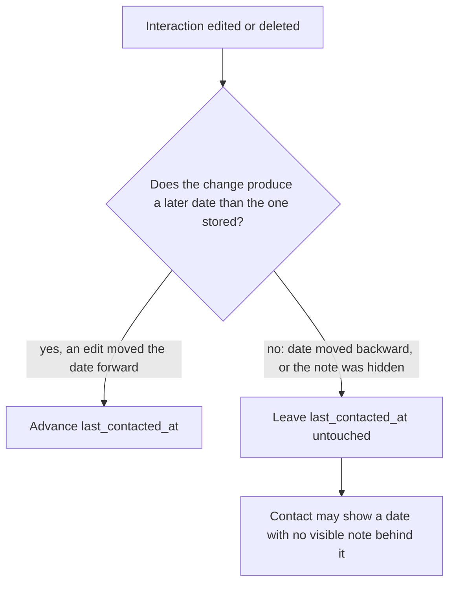
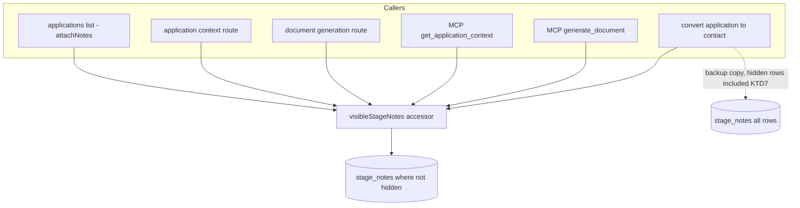

# Note Editing and Deletion - Plan

## Goal Capsule

- **Objective:** A note written into the tracker can be corrected or withdrawn afterwards, from whichever client the user is holding, without destroying what was recorded and without making a relationship look staler than it was.
- **Means:** Hide notes instead of destroying them, and route every note read through one accessor that skips hidden rows (KTD1, KTD2).
- **Product authority:** The Key Decisions below were settled in the originating dialogue. Where they are marked `session-settled`, they are the user's choice and are not re-opened during implementation.
- **Execution profile:** Backend-only change across the database, service, REST, and MCP layers. No client work.
- **Stop conditions:** Stop and ask if implementation finds a note read path not reachable through the accessor in U2, or if hiding a note turns out to require changing what the web UI sends.
- **Who finishes:** `ce-work` or a human implementer, landing each unit as its own commit.

---

## Product Contract

### Summary

Editing and deleting a single note becomes possible for both kinds the tracker holds: the interactions logged against a person, and the stage notes on an application. Both are reachable from MCP as well as the REST API. A delete hides the note instead of destroying it, identically for both kinds, and no edit or delete can move a contact's last-contacted date backwards.

### Problem Frame

Notes are the only part of the tracker that is written in a hurry. An interaction is logged in the minutes after a call ends, often on a phone, often with the wrong date attached because the call happened on Thursday and the write-up happened on Monday. A stage note is typed while reading a rejection email.

Today an interaction can only ever be appended. There is no way to fix the date on one, no way to correct a name, and no way to remove one logged against the wrong person. The only recourse is to log a second note contradicting the first, which leaves the contradiction in the permanent record of the relationship — and leaves the contact's last-contacted date derived from a note the user knows is wrong.

Stage notes are half-solved: the web UI can edit and delete them, but an agent working through MCP cannot. That asymmetry has a sharper edge than it first appears. An agent that logs a note through MCP has no way to withdraw one, so a note written from a misread email stays until a human opens the browser.

The cost lands on the one field the tracker derives rather than stores. `last_contacted_at` is computed from the interaction log, so a note carrying the wrong date does not just look wrong — it reorders the contacts list, which is sorted by who has gone quiet longest.

### Key Decisions

- KD1. **One delete behaviour across both note types.** (session-settled: user-directed — chosen over adding MCP tools only and leaving stage notes on their existing hard delete: two kinds of note deleting two different ways is a distinction no user of the product would predict.) Governs R6, R7.
- KD2. **A delete hides the note; it never destroys the row.** (session-settled: user-directed — chosen over destroying the row after writing it to `_row_backups`: recovery should not require reading a JSON blob out of a backup table.) Governs R6.
- KD3. **Nothing in the product brings a hidden note back.** (session-settled: user-approved — chosen over an undelete flag on the edit path and over a dedicated restore tool: the row surviving is the recovery story, and a restore surface can be added later if it is ever wanted.) Governs R9.
- KD4. **A contact's last-contacted date only ever advances.** (session-settled: user-directed — chosen over recomputing it from the surviving log on every write, which was raised as the more honest derivation: the invariant that no write can make a relationship look staler was judged worth more than the field always matching the visible log.) Governs R10, R11.
- KD5. **Both note types get the same reach: edit and delete from MCP and from REST.** (session-settled: user-approved — chosen over an MCP-only change: a capability that exists on one transport and not the other is the gap this work exists to close.) Governs R12, R13.

The freshness rule in KD4 is the one a future reader is most likely to mistake for a bug, because it is the one place the product deliberately lets a derived field disagree with what it is derived from:

### Requirements

**Editing**

- R1. An individual interaction can be edited after it is logged, changing both what it says and the date it happened.
- R2. An individual stage note can be edited after it is written, changing both what it says and the stage it is filed under.
- R3. An edited note carries the fact that it was edited, distinguishable from when it was first written.
- R4. Editing a note never changes the commitment about what happens next with that contact; the next-action date and its description move only when a write names them directly.
- R5. Editing is refused for content longer than the limit the create path already enforces, and for a date that is not a calendar date.

**Deletion and visibility**

- R6. Deleting a note hides it. It stops appearing anywhere a user or agent can read, and the record of what it said survives.
- R7. Both note types behave the same way on delete. Covers KD1.
- R8. A hidden note is absent from every surface that reads notes, including the prose carried across when an application is converted into a contact, and including the context assembled for document generation.
- R9. No tool, endpoint, or flag makes a hidden note visible again.

**Contact freshness**

- R10. A contact's last-contacted date never moves backwards, whatever happens to the interactions behind it.
- R11. Editing an interaction's date to something later than the contact's last-contacted date advances that date. Any other edit, and any delete, leaves it where it is.

**Surface parity**

- R12. Editing and deleting either note type is reachable from MCP.
- R13. Editing and deleting either note type is reachable from the REST API. The application-note endpoints keep the paths they have today; only what their delete does changes.
- R14. A caller can only edit or delete notes on records they own, and the existing read-only posture for administrators viewing another user's data is unchanged.

### Key Flows

- F1. Correcting a misdated interaction
  - **Trigger:** The user logged Thursday's call on Monday, so it carries Monday's date.
  - **Steps:** The user edits the interaction's date to Thursday. The date moves backwards, so the contact's last-contacted date stays at Monday.
  - **Outcome:** The log reads correctly. The contact's freshness is unchanged, because nothing that happened made the relationship staler.
  - **Covers:** R1, R10, R11.

- F2. Withdrawing a note logged against the wrong record
  - **Trigger:** An agent logged an interaction against the wrong person.
  - **Steps:** The note is deleted and disappears from the contact. The contact's last-contacted date stays as it was.
  - **Outcome:** The interaction is gone from every view. If it was the most recent one, the contact still shows a last-contacted date that no visible note accounts for.
  - **Covers:** R6, R8, R10.

### Acceptance Examples

- AE1. **Covers R11.** Given a contact last contacted on the 10th whose only interaction is dated the 10th, when that interaction is re-dated to the 14th, then the contact's last-contacted date becomes the 14th.
- AE2. **Covers R10, R11.** Given that same contact and its single interaction dated the 10th, when the interaction is re-dated to the 3rd instead, then the contact's last-contacted date stays the 10th while its only visible interaction reads the 3rd.
- AE3. **Covers R6, R10.** Given a contact last contacted on the 10th with exactly one interaction, dated the 10th, when that interaction is deleted, then the contact has no visible interactions and still reports having been contacted on the 10th.
- AE4. **Covers R8.** Given an application with three stage notes, one of them hidden, when the application is converted into a contact, then the new contact's description carries the two visible notes and not the hidden one.
- AE5. **Covers R9.** Given a hidden note, when any read of that record is performed by any surface, then the note does not appear and no parameter causes it to appear.
- AE6. **Covers R14.** Given a note belonging to another user, when a caller attempts to edit or delete it, then the attempt fails as not found rather than revealing that the note exists.

### Scope Boundaries

- Controls in the web UI for editing or deleting an interaction. The interaction list stays read-only in the browser; this work is about the API and MCP surfaces. Stage notes keep the UI controls they already have.
- Any restore path. Per KD3, a hidden note comes back by hand through the database or not at all.
- Bulk editing or deleting.
- Giving stage notes a concept of when the note's subject happened. An interaction has an occurred-on date; a stage note does not, and this work does not introduce one.

#### Deferred to Follow-Up Work

- Purging hidden notes after some retention period. Nothing removes them today, so the tables grow slowly and indefinitely.

### Dependencies / Assumptions

- Hiding a note requires a new column on both note tables. The application notes table already tracks when a row was last changed; the interaction table does not, so R3 needs one there.
- The contacts list is sorted by the last-contacted date, so R10 and R11 govern ordering, not just a displayed value.
- The web client receives notes only in server-composed payloads, so server-side filtering satisfies R8 without a client change.

### Sources / Research

- `server/services/contacts.js` — the interaction log: `addContactNote` (the only writer), `notesForContact` (the only reader), and `convertApplicationToContact`, which carries note prose into a new contact and is the non-obvious read site behind R8.
- `server/services/notes.js` — `updateNote` and `deleteNote` for stage notes already exist; `deleteNote` is the hard delete that KD1 changes.
- `server/routes/contacts.js`, `server/routes/applications.js` — the REST surface referenced by R13; application note routes already exist, contact note routes do not.
- `server/mcp.js` — the tool surface referenced by R12; `add_contact_note` is the closest existing shape for the new tools.
- `server/db.js` — the existing guarded `ALTER TABLE` migration pattern, including the one that added a last-changed column to stage notes.
- `AGENTS.md` — the documented contract for the last-contacted date being derived and forward-only, which KD4 extends rather than revises.

---

## Planning Contract

**Product Contract preservation:** changed — R8 extended to name document-generation context alongside the conversion path, after research found both read stage notes; the two Outstanding Questions carried as `Deferred to Planning` are resolved by KTD1 and KTD3 and removed. No scope was added or dropped.

### Key Technical Decisions

- KTD1. **One accessor owns every stage-note read.** (session-settled: user-approved — chosen over teaching each read site to filter independently: seven separate copies of the filter is seven chances to forget one, and all seven already issue near-identical queries.) Covers R8.
- KTD2. **Hidden state is a nullable timestamp column on each note table**, added with the guarded `PRAGMA table_info` + `ALTER TABLE` pattern already in `server/db.js`. A timestamp rather than a boolean records when the note was withdrawn at no extra cost. Covers R6.
- KTD3. **Hiding a note counts as a change to its parent record**, so polling clients see the note disappear. For a stage note that means bumping the application's `updated_at` and emitting the same change event `addNote` and `updateNote` already emit. For an interaction it means bumping the contact's `updated_at` only: contacts have no change-event stream, and this work does not add one. Covers R6.
- KTD4. **Contact freshness advances by comparison, never by recomputation.** The write compares the candidate date against the stored one and takes the later; no code path derives the field from `MAX(occurred_at)`. (session-settled: user-directed — chosen over recomputing from the surviving log: the invariant that no write makes a relationship look staler was judged worth more than the field always matching the visible log.) Covers R10, R11.
- KTD5. **A hidden note is not found for writes either.** Edit and delete resolve notes through the same accessor as reads, so operating on a hidden note fails the same way as operating on someone else's. Covers R9, R14.
- KTD6. **The service layer stays the single implementation; MCP tools and REST routes are both thin callers.** This is the existing arrangement for every other capability in the repo and is what makes the MCP tools testable without an MCP harness. Covers R12, R13.
- KTD7. **The conversion backup keeps hidden notes; the carried description drops them.** The backup exists to make the conversion recoverable, so it captures the rows as they were; the prose carried into the new contact is a read and obeys R8.

### High-Level Technical Design

Stage notes are read from seven places today, each issuing its own near-identical query. The work funnels them through one accessor so the hidden-note rule has a single owner (KTD1):

The interaction log needs no equivalent fan-in: `notesForContact` is already its only reader.

### Assumptions

- The existing `_row_backups` mechanism is untouched by this work; KTD7 only decides what the conversion puts into it.
- Rate limits, auth middleware, and the admin read-only posture need no change — the new endpoints sit inside the same routers as existing ones.
- Stage-note editing already satisfies R2, R3, and the edit half of R13: `updateNote` and the `PUT` route exist and stamp a last-changed value. The only gap for those requirements is MCP reach, which U6 closes. No unit re-implements them.

### Sequencing

U1 first, since both note types need their columns before anything can hide a row. U2 follows so the read rule exists before any writer can produce a hidden note. U3 and U4 are then independent of each other. U5 and U6 are thin callers and can land in either order once U4 exists. U7 last, once the surfaces are final.

---

## Implementation Units

### U1. Add hidden and edited columns to both note tables

- **Goal:** Both note tables can record that a row is hidden, and interactions can record that they were edited.
- **Requirements:** R3, R6.
- **Dependencies:** none.
- **Files:** `server/db.js`, `server/test/schema.test.js`.
- **Approach:**
  1. Add a nullable hidden-timestamp column to `stage_notes` and to `contact_notes`, using the guarded `PRAGMA table_info` check already used for the `stage_notes` last-changed column (KTD2).
  2. Add a nullable last-changed column to `contact_notes` only; `stage_notes` already has one.
  3. Leave the existing `contact_notes` index alone; add a hidden-aware index only if U2's accessor shows a need.
- **Patterns to follow:** the `contactCols` / `stageNotesCols` migration blocks in `server/db.js`.
- **Test scenarios:**
  - Both note tables report the hidden column after startup on a fresh in-memory database.
  - The interaction table reports the last-changed column after startup.
  - Running the migration twice against the same database leaves the columns intact and raises nothing.
  - Rows that existed before migration read back with a null hidden value.
- **Verification:** `cd server && npm test` passes, and the schema test asserts the new columns.

### U2. Route every stage-note read through one accessor

- **Goal:** One function answers "which stage notes are visible for this application", and every existing reader uses it.
- **Requirements:** R8.
- **Dependencies:** U1.
- **Files:** `server/services/notes.js`, `server/services/applications.js`, `server/services/contacts.js`, `server/routes/applications.js`, `server/mcp.js`, `server/test/services/notes.test.js`.
- **Approach:**
  1. Add an exported accessor for visible stage notes, supporting both the single-application and the many-application (`IN` clause) shapes that `attachNotes` needs (KTD1).
  2. Replace all seven existing queries with calls to it: the applications list, the application context route, the document-generation route, both MCP context builders, and the conversion path's prose source.
  3. Leave the conversion path's backup query reading every row, hidden included (KTD7).
- **Execution note:** Write a test per read path that a hidden note is absent, before changing the delete behaviour in U3 — with no writer producing hidden rows yet, seed them directly so each path is proved independently.
- **Patterns to follow:** the existing `attachNotes` helper in `server/services/applications.js`.
- **Test scenarios:**
  - Covers AE5. A hidden stage note is absent from the applications list payload.
  - A hidden stage note is absent from the assembled application context.
  - A hidden stage note is absent from the context used for document generation, so it cannot reach the model.
  - Covers AE4. Converting an application to a contact carries visible note prose only.
  - The conversion backup still contains the hidden note's row.
  - Visible notes keep their existing order.
- **Verification:** every stage-note read path has a test proving a seeded hidden note does not appear.

### U3. Make stage-note deletion hide the note

- **Goal:** Deleting a stage note hides it instead of destroying the row, and a hidden one cannot be edited or deleted again.
- **Requirements:** R6, R7, R9.
- **Dependencies:** U1, U2.
- **Files:** `server/services/notes.js`, `server/test/services/notes.test.js`.
- **Approach:**
  1. Change `deleteNote` to stamp the hidden column rather than issue a `DELETE` (KD2, via R6).
  2. Resolve the target note through the visible-notes accessor in both `updateNote` and `deleteNote`, so a hidden note is not found (KTD5).
  3. Keep the existing parent `updated_at` bump and change event on both paths (KTD3).
- **Patterns to follow:** the current `updateNote` ownership check in `server/services/notes.js`.
- **Test scenarios:**
  - Deleting a stage note leaves the row present in the table with the hidden column set.
  - A deleted stage note is absent from the application's notes.
  - Deleting an already-deleted stage note fails as not found.
  - Editing a deleted stage note fails as not found.
  - Covers AE6. Deleting a stage note on another user's application fails as not found.
  - Deleting a stage note bumps the parent application's `updated_at`.
- **Verification:** `cd server && npm test` passes with the delete tests asserting the row survives.

### U4. Add interaction edit and delete with the freshness rule

- **Goal:** An individual interaction can be edited or hidden, and the contact's last-contacted date only ever advances.
- **Requirements:** R1, R3, R4, R5, R6, R7, R9, R10, R11, R14.
- **Dependencies:** U1.
- **Files:** `server/services/contacts.js`, `server/test/contacts.test.js`.
- **Approach:**
  1. Add an update function taking the interaction's text and its occurred-on date, validating both with the limits and date parser `addContactNote` already uses (R5).
  2. Add a delete function that stamps the hidden column.
  3. Filter hidden rows out of `notesForContact`, and resolve the target through the same filter on both writes (KTD5).
  4. After an edit, advance the contact's last-contacted date only when the new date is later than the stored one; do nothing on a delete (KTD4).
  5. Leave the next-action pair untouched on both paths (R4).
- **Execution note:** Implement the freshness comparison test-first — it is the rule most likely to be "corrected" into a recomputation by a later reader.
- **Patterns to follow:** the transaction and forward-only comparison already in `addContactNote`.
- **Test scenarios:**
  - Covers AE1. Re-dating the only interaction forward advances the contact's last-contacted date.
  - Covers AE2. Re-dating it backward leaves the last-contacted date unchanged.
  - Covers AE3. Deleting the only interaction leaves the last-contacted date unchanged and the contact with no visible interactions.
  - Editing an interaction's text alone leaves both the last-contacted date and the next-action pair untouched.
  - Editing sets the interaction's last-changed value.
  - Content over the limit is refused, and a malformed date is refused.
  - A hidden interaction cannot be edited or deleted again.
  - Covers AE6. Editing an interaction on another user's contact fails as not found.
  - Deleting an interaction that is not the most recent leaves the last-contacted date alone.
- **Verification:** the freshness scenarios pass, and no code path recomputes the date from the log.

### U5. Expose interaction edit and delete over REST

- **Goal:** The two new interaction operations are reachable on the contacts router.
- **Requirements:** R13, R14.
- **Dependencies:** U4.
- **Files:** `server/routes/contacts.js`, `server/test/contacts.test.js`.
- **Approach:**
  1. Add update and delete routes for a single note under a contact, mirroring the path shape the application-note routes already use (KTD6).
  2. Use the existing `handleError` helper so service errors map to their status codes.
- **Patterns to follow:** the existing note and link routes in `server/routes/contacts.js`.
- **Test scenarios:**
  - Editing an interaction returns the updated contact.
  - Deleting an interaction returns success and the interaction is gone from a subsequent read.
  - Both routes return 404 for another user's contact.
  - A malformed date returns 400.
- **Verification:** request-level tests cover both routes for success, not-found, and validation failure.

### U6. Add the four MCP note tools

- **Goal:** An agent can edit and delete both kinds of note.
- **Requirements:** R2, R12.
- **Dependencies:** U3, U4.
- **Files:** `server/mcp.js`, `server/test/mcp.test.js`.
- **Approach:**
  1. Register update and delete tools for interactions and for stage notes, each calling the corresponding service function (KTD6).
  2. Mirror `add_contact_note`'s shape: the same auth preamble, the same `toolError` handling, the same JSON result.
  3. Write tool descriptions that say a delete hides the note and cannot be undone, so an agent treats it as final.
  4. Export the server factory alongside the existing exports. It is currently module-private, so nothing can inspect the registered tool list; exporting it is what makes the registration scenarios below possible without standing up the HTTP transport.
- **Patterns to follow:** `add_contact_note` in `server/mcp.js`.
- **Test scenarios:**
  - The four new tools are present in a constructed server's registered tool list.
  - Each new tool declares the parameters its service function requires, so a malformed call is rejected before reaching the service.
  - The stage-note tools and the interaction tools resolve to distinct handlers rather than one shadowing another.
- **Verification:** the registration test passes, and a manual call against a dev server edits and hides a note of each kind.

### U7. Update the repository's agent documentation

- **Goal:** `AGENTS.md` describes the new tools and the freshness rule that now survives edits and deletes.
- **Requirements:** R12.
- **Dependencies:** U5, U6.
- **Files:** `AGENTS.md`.
- **Approach:**
  1. Add the four tools to the MCP tool list.
  2. Extend the last-contacted-date convention to say edits and deletes never rewind it, and that a contact may therefore show a date no visible interaction accounts for (KTD4).
  3. Note in the tables section that both note tables carry a hidden column and that deletes are hides.
- **Patterns to follow:** the existing API Conventions bullets, which state a rule and the reason it exists.
- **Test scenarios:** Test expectation: none -- documentation only.
- **Verification:** a reader of `AGENTS.md` can tell why a contact's date may disagree with its visible log.

---

## Verification Contract

| Gate | Command | Applies to |
|---|---|---|
| Backend tests | `cd server && npm test` | U1-U6; the primary gate for this work |
| Client build | `npm run build:client` | Regression only; no client source changes |
| Client E2E | `cd client && npm run test:e2e` | Regression only; confirms the notes UI still renders |
| Client lint | `cd client && npm run lint` | Regression only |

The backend runner picks up new files matching `test/*.test.js` and `test/*/*.test.js`, so the interaction tests belong in `server/test/contacts.test.js` and the stage-note tests in `server/test/services/notes.test.js`.

This repo has no MCP transport harness, so the tools are proved in two parts: U6 adds a registration test that constructs the server in-process and inspects its tool list, and the behaviour behind each tool is covered by the service tests in U3 and U4. The end-to-end path over the transport is confirmed by the manual call described in U6.

---

## Definition of Done

- Every requirement R1-R14 is either implemented or explicitly traced to the unit that implements it.
- `cd server && npm test` passes, including a test per stage-note read path proving a hidden note is absent.
- The three freshness acceptance examples pass, and no code path recomputes the contact's last-contacted date from the interaction log.
- Deleting a note of either kind leaves its row in the database.
- The client build, lint, and E2E suites still pass with no client source changes.
- `AGENTS.md` describes the four new tools and the freshness rule.
- No abandoned or experimental code from approaches that did not pan out remains in the diff.
