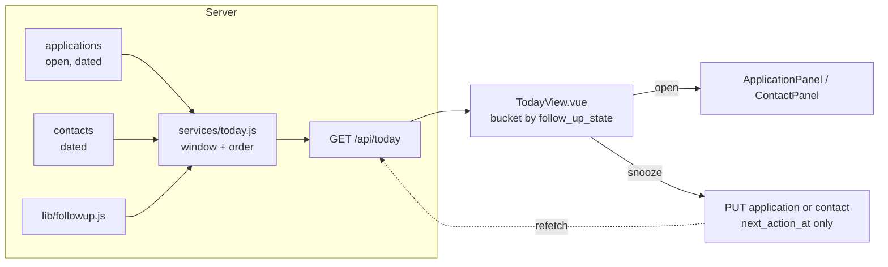

# Today Queue - Plan

## Goal Capsule

- **Objective:** When the operator opens the tracker, they can see in one read everything they owe this week across roles and people, and what each item asks them to do.
- **Means:** A server-ordered Today list as the home screen, plus a free-text next step on applications so application rows say what, not just when.
- **Product authority:** This Product Contract. Surrounding ideas from `docs/ideation/2026-09-28-ui-backend-simplification-ideation.html` (whose move, "Done asks what next", leads off the board, status split) are not active scope.
- **Open blockers:** None.
- **Stop conditions:** stop and report if evidence shows a session-settled Key Decision cannot work, or if any Verification Contract gate cannot be made to pass without changing product scope.
- **Execution:** autonomous via lfg. Implement U1-U8 in sequence, then review and open a PR; merging stays with the operator.

---

## Product Contract

### Summary

The app opens on a Today screen. It lists every open application, lead and person with a follow-up due in the next seven days, grouped Overdue / Today / This week. Each row names the record and states the next step in prose. Applications gain a free-text next step to match the one people already have. Pipeline (the board and Timeline) and People move to secondary navigation.

### Problem Frame

The operator's morning routine has four inputs: email, LinkedIn, the tracker, and an agent that reads the tracker over MCP and suggests a focus. The tracker is the slow step. Working out what is owed means scanning board cards (one signal slot each, often a staleness guess from last update), switching to the People section for contacts, and sometimes checking Timeline.

The server already holds the answer in one place. `server/lib/followup.js` is the single follow-up model for both applications and contacts, and it classifies each date as overdue, due or upcoming. The UI splits that answer across three views. Applications also cannot say what is owed: contacts carry both a next-action date and text (`server/db.js:275`), but applications carry only the date (`server/db.js:195`). So even a dated application reads as "follow up" with no detail.

### Key Decisions

- **Roles and people share one queue.** Governs R1, R3. (session-settled: user-approved — chosen over keeping the People view people-only, as settled in D2 of `docs/ideation/2026-09-08-contacts-follow-up-view-requirements.md`: the server already treats both as one follow-up model, and splitting them is what makes the morning scan slow.)
- **Today is home; Pipeline and People are secondary.** Governs R12. (session-settled: user-directed — chosen over a third peer section, a rail beside the board, and a strip above the board, compared as rough sketches: the daily view is for working through what's owed, the board is for review.)
- **Rows offer open and snooze only.** Governs R9, R10. (session-settled: user-approved — chosen over adding a silent "done" or an inline log-and-reschedule: the record and contact panels stay the single path for writing history.)
- **Closing an application clears its next step.** Governs R14. (session-settled: user-directed — chosen over hiding closed records while keeping the step stored, after the conflict was raised that the board's Undo toast and a later reopen will not restore the step, and that this differs from the rule that a status change never discards a contact's commitment.)
- **The server builds and orders the list; the client only renders it.** Governs R4. (session-settled: user-approved — chosen over the client merging two reads and over making the next step its own record: it keeps classification and ordering in one place, so the screen matches what the API and the agent see across midnight.)
- **MCP gets parity, not a Today tool.** Governs R16. (session-settled: user-approved — chosen over a merged Today read for agents: keeps AGENTS.md's "no separate follow-ups tool" rule; the agent's existing sweep of applications and contacts gains the new text.)

### Requirements

**The Today list**

- R1. Today lists every open application and lead, and every person, whose next-step date falls on or before seven days from today in the instance timezone.
- R2. Items are grouped Overdue, Today, This week, in that order. An empty group is omitted, and headings carry no counts.
- R3. Applications, leads and people are interleaved within each group. They are not sub-grouped by kind.
- R4. The server decides membership, grouping and order. The client renders the order it receives and never reclassifies a date or re-sorts.
- R5. When nothing is due in the window, Today shows a short orienting message in prose, with no metric or count.

**Rows**

- R6. An application or lead row names the company and role. A person row names the person and, when known, their employer.
- R7. Every row states the next step as prose with its timing, for example "Chase panel date: 3 days overdue". A row with a date but no step text falls back to a generic follow-up wording.
- R8. A row visibly distinguishes a person from an application or lead without relying on colour alone.
- R9. Opening a row opens the existing application panel or contact panel for that record.
- R10. A row can be snoozed inline using the same choices the People view offers today. Snoozing changes only the date. It is not logged as an interaction.
- R11. In the admin all-users view, Today is read-only: rows open, but snooze is unavailable.

**Navigation**

- R12. The app opens on Today. Pipeline (board and Timeline, with the existing lens toggle) and People stay reachable as secondary navigation.

**The application next step**

- R13. An application or lead can carry free-text next-step wording alongside its next-step date. It is set, edited and cleared in the application panel, and the two halves change independently, as they do for people.
- R14. Closing an application, by any path (board, panel, API or MCP), clears both its next-step date and its text. Reopening does not restore them.
- R15. Today stays correct across midnight while the app is open, and reflects changes made elsewhere, including agent writes, at least when the user returns to the tab or the live connection recovers.

**Agents**

- R16. MCP application tools read and write the next-step text wherever they already read and write the next-step date, including logging a note.

### Acceptance Examples

- AE1. **Covers R1, R2.** Given today is Monday 5 Oct, an application due 2 Oct, a person due 5 Oct, and a lead due 12 Oct: Today shows the application under Overdue, the person under Today, and the lead under This week. An item due 13 Oct is not shown.
- AE2. **Covers R7.** Given an application with a date and no step text, its row reads as a generic follow-up with the timing. After text "Send portfolio" is added, the row reads "Send portfolio" with the timing.
- AE3. **Covers R14.** Given an overdue application with a next step, when it is dragged to Closed, it leaves Today. When it is reopened (dragged back to an active stage), it has no next step and does not reappear in Today.
- AE4. **Covers R10.** Given an overdue person, when they are snoozed one week from Today, their row moves to This week (or out of the window) after the list refreshes, and their last-contacted date is unchanged.
- AE5. **Covers R14, R16.** Given an agent closes an application through MCP, its next-step date and text are both cleared.

### Scope Boundaries

**Deferred for later**

- "Whose move" (their-move steps hidden until a chase date).
- Completing a step with a prompt for the next one ("Done asks what next").
- Replacing the board card's staleness hint with a "no next step" signal. The board keeps its current hint.
- Surfacing open records that have no dated step anywhere as "needs a step".
- Moving leads off the board, retiring Timeline, and finishing the status split.
- A merged Today read over MCP.

**Outside this work**

- Changes to how interactions are logged, or to the contact panel's write paths.
- Any count, badge or metric for owed items (AGENTS.md bans hero metrics).

### Dependencies / Assumptions

- "This week" means the next seven days, not the calendar week. Items further out are visible only in Pipeline or People.
- The follow-up classification in `server/lib/followup.js` does not currently consider whether an application is closed, so today a closed record with a date classifies as overdue. R14 removes the case for new closes. Existing closed records that already carry a date need a one-time cleanup or a filter.

### Outstanding Questions

The four questions deferred to planning are resolved in the Planning Contract: existing closed records (KTD3), header actions (KTD6), tie-break (KTD2), contact refresh (KTD7). None remain open.

### Sources / Research

- `server/lib/followup.js`: the shared follow-up model and instance-timezone rules.
- `server/db.js:195`, `server/db.js:275`: application next-action date only, contact date plus text.
- `client/src/components/PeopleView.vue`, `client/src/utils/contactGroups.js`: existing grouped list, snooze choices and "server orders, client renders" discipline to reuse.
- `client/src/utils/cardSignal.js`: the board's current single signal slot (unchanged by this work).
- `docs/ideation/2026-09-08-contacts-follow-up-view-requirements.md`: the People view decisions this work partly reverses (D2).
- `docs/ideation/2026-09-28-ui-backend-simplification-ideation.html`: the ideation this plan came from, with CRM prior art (Close/HubSpot work queues, Pipedrive next-activity rule).

Product Contract preservation: unchanged except Outstanding Questions, whose four deferred items are now answered by KTD2, KTD3, KTD6 and KTD7.

---

## Planning Contract

### Key Technical Decisions

- KTD1. **One read endpoint, `GET /api/today`, backed by a new `server/services/today.js`.** It returns a flat, ordered array of items. Each item has `kind` (`application` or `contact`), `id`, `title` (company name or person name), `subtitle` (role title or employer), `record_type` (applications only), `next_action`, `next_action_at`, `follow_up_state` and `follow_up_days`. The client buckets by `follow_up_state` the way `contactGroups.js` does and never reorders. Admins may pass `?all=true` for a read-only view, as on the other list endpoints; items then also carry `user_email`, which rows render in that mode as `KanbanCard.vue`'s `showUser` does. Governs R1, R4, R11. (session-settled: user-approved, inherited from the Product Contract Key Decision on server-built ordering.)
- KTD2. **Order: `next_action_at` ascending, then `title` ascending (case-insensitive), then `kind`, then `id`.** The oldest overdue item comes first. The window is `date(next_action_at) <= today + 7` in the instance timezone, computed with `todayInInstanceZone` from `server/lib/followup.js`. No lower bound applies, so everything overdue shows. Governs R1, R2, R3.
- KTD3. **Existing closed records are excluded by the query, not cleaned up.** Today selects only open applications, using the same `COALESCE(state, ...)` fallback `listApplications` uses for rows the backfill has not reached. No one-shot data migration runs. A closed record carrying a date from before this change stays inert and off Today. Governs R1, R14.
- KTD4. **Close clears in the service layer, on both write paths.** `updateApplication` clears `next_action_at` and `next_action` whenever the write's resulting state is `closed` and it touched the split fields. `updateStatus` clears them when the new status is terminal (`accepted` or `rejected`). The REST routes, MCP tools and board drag all go through one of these two functions, so R14 holds for every caller without per-caller code. Governs R14. (session-settled: user-directed, inherited from the Product Contract Key Decision on clear-on-close.)
- KTD5. **`next_action` on applications mirrors contacts.** It is a nullable `TEXT` column added by the `PRAGMA table_info` guard in `server/db.js`, with a 500-character limit, `''` or `null` clearing it, and changes independent of the date. A write that changes only `next_action`, only `next_action_at`, or both does not bump `updated_at`, which extends the existing date-only rule so that re-wording a commitment is not treated as activity. `addNote` accepts `next_action` alongside `next_action_at`. Governs R13, R16.
- KTD6. **Navigation: `section` gains `today` as the default. The nav renders Today as the primary item, with Pipeline and People as smaller secondary links.** "Applications" is relabelled "Pipeline", and the board/Timeline lens toggle is unchanged inside it. "+ Add Application" stays in the header on every section. The show-closed toggle renders only on Pipeline, because it only affects the board and Timeline. Governs R12. (session-settled: user-directed, inherited from the Product Contract Key Decision on navigation.)
- KTD7. **Today refreshes by refetching the whole list, never by patching.** It refetches when you arrive at the section, on tab focus, on live-stream reconnect, on day rollover, and after a snooze or a panel/contact save. It also refetches on any application change event while Today is showing, because application changes are on the stream. Contact changes made elsewhere (including by agents) show on focus or reconnect, since contacts are still not on the stream. This meets R15's floor and does not widen the stream. It uses the same sequence-token and scope guard as `loadContacts` in `client/src/App.vue`. Governs R15.
- KTD8. **The snooze control is extracted from `PeopleView.vue` into a shared `SnoozeControl.vue`.** Both Today and People use it. For an application row, snooze calls `updateApplication(id, { next_action_at })`. For a person row, it calls `updateContact`, the same write People uses today (KTD3 of the 09-08 plan: rescheduling is not contact). Governs R10.
- KTD9. **Row wording reuses `followUpProse(state, days, action)`.** An empty `next_action` falls back to the action "Follow up". The kind marker is a short text label ("Role", "Lead", "Person") rather than colour alone. Governs R7, R8.

### Assumptions

- The lfg run skipped the scoping confirmation, so the plan-time bets are recorded here. The Today endpoint returns items only, with no server-side group objects. The label "Pipeline" replaces "Applications" in the nav. Snooze offsets are whatever `PeopleView.vue` offers today.
- Closing a record that is already closed (a close-reason edit) re-clears the step. That is harmless because Today excludes it either way.

### High-Level Technical Design

### Sequencing

U1 (schema and application next step) comes first, because U2 reads `next_action` and U5 edits it. U2 (endpoint) and U3 (close clearing) are independent after U1. U4 (MCP parity) follows U1. U5 to U7 are client work: U5 panel, U6 shared snooze plus Today view, U7 navigation and App wiring. U8 updates the e2e suite last, once navigation has changed.

---

## Implementation Units

### U1. Application next-step text

**Goal:** Applications and leads carry free-text `next_action` alongside `next_action_at`.

**Requirements:** R13, R16 (storage side)

**Dependencies:** none

**Files:**
- `server/db.js`
- `server/services/applications.js`
- `server/services/notes.js`
- `server/test/application-followup.test.js`

**Approach:**
1. Add the `next_action TEXT` column with the existing `PRAGMA table_info(applications)` guard beside `next_action_at`.
2. Add `next_action: 500` to `LIMITS`. Accept `next_action` in `createApplication` and `updateApplication` (`''`/`null` clears, non-string rejected with 400).
3. Extend the "date-only" rule to "follow-up-only": a write whose only updates are `next_action_at` and/or `next_action` leaves `updated_at` alone.
4. `addNote` accepts `next_action` with the same omit/leave, null/clear semantics, and validates it before the transaction opens.

**Patterns to follow:** `next_action` handling in `server/services/contacts.js` (`addContactNote`, around lines 507-518); `normaliseFollowUpDate` and the `followUpOnly` detection in `updateApplication`.

**Test scenarios:**
- Setting `next_action` on update returns it and leaves `next_action_at` untouched.
- Clearing with `null` and with `''` both store null.
- A 501-character `next_action` returns 400 with a message naming the field.
- A write containing only `next_action` does not change `updated_at`.
- A write with `next_action` plus `company_name` does bump `updated_at`.
- `createApplication` with `next_action` persists it.
- `addNote` with `next_action` sets it in the same transaction; omitting it leaves an existing value alone; `null` clears it.
- `addNote` with an over-length `next_action` rejects and writes no note.

**Verification:** server tests pass; `GET /api/applications/:id` returns `next_action`.

### U2. Today endpoint

**Goal:** One server-ordered list of what is owed in the next seven days across open applications, leads and contacts.

**Requirements:** R1, R2, R3, R4, R11; AE1

**Dependencies:** U1

**Files:**
- `server/services/today.js` (new)
- `server/routes/today.js` (new)
- `server/app.js`
- `server/test/today.test.js` (new)

**Approach:**
1. The service selects dated, open applications (KTD3 open-state fallback) and dated contacts for the user, or for all users when an admin passes `all=true`. Both use `date(next_action_at) <= ?`, bound to today + 7 in the instance zone.
2. Map both to the KTD1 item shape, decorate with `followUpState`/`daysUntil`, merge, and sort per KTD2 in the service. The client never sorts.
3. The route is GET-only, mounted at `/api/today` after auth, and uses the contacts route's error-handling shape.

**Patterns to follow:** `listContacts` in `server/services/contacts.js` (scope handling, `toCalendarDate`); the open-state `COALESCE` in `listApplications`; `server/routes/contacts.js`.

**Test scenarios:**
- Covers AE1. Items due -3, 0 and +7 days are returned as overdue, due and upcoming; +8 is excluded.
- Closed applications with a date are excluded, including a legacy row with null `state` and status `rejected`.
- Undated applications and contacts are excluded.
- Leads are included, with `record_type: lead`.
- An application and a contact due the same day are interleaved by title, not grouped by kind.
- The same date and same title break the tie by kind, then id, deterministically.
- Items carry `next_action` for both kinds (null when unset).
- Another user's records never appear.
- An admin with `all=true` sees every user's items, each carrying `user_email`; a non-admin with `all=true` sees only their own.
- An empty result returns `[]`.

**Verification:** `curl /api/today` in dev returns the ordered array.

### U3. Closing clears the next step

**Goal:** Any close, by any path, clears both halves of an application's next step.

**Requirements:** R14; AE3, AE5

**Dependencies:** U1

**Files:**
- `server/services/applications.js`
- `server/test/application-followup.test.js`
- `server/test/mcp.test.js`

**Approach:** apply KTD4 inside `updateApplication` (where `nextState === 'closed'` in the `touchesSplit` branch) and `updateStatus` (a terminal status). In `updateApplication`, force the normalised `next_action_at` and `next_action` values to null before the single late push, so each column is assigned exactly once. A second `= NULL` assignment would be overridden by the caller's later value, and the follow-up-only count check must still treat the close as a full write. In `updateStatus`, add the two `= NULL` assignments. Reopening writes nothing to these fields.

**Patterns to follow:** the `closed_at` handling next to these branches.

**Test scenarios:**
- Covers AE3. PUT `state: closed, close_reason: rejected` on a dated application clears both fields.
- PATCH status `rejected` clears both fields.
- PATCH status `accepted` clears both fields.
- Covers AE3. Reopening (PUT `state: open`, or PATCH status back to `applied`) leaves both fields null.
- A write that closes and also sends `next_action_at` ends with the fields cleared.
- Covers AE5. MCP `update_application` with `state: closed` clears both fields.
- MCP `update_status` to `rejected` clears both fields.
- Editing the close reason on an already-closed record keeps the fields null.

**Verification:** server tests pass.

### U4. MCP parity for the application next step

**Goal:** Agents read and write `next_action` wherever they already handle `next_action_at` on applications.

**Requirements:** R16

**Dependencies:** U1

**Files:**
- `server/mcp.js`
- `server/test/mcp.test.js`
- `AGENTS.md`

**Approach:**
1. Add an optional, nullable `next_action` string (max 500) to `create_application`, `update_application` and `add_note`, and pass it through to the service.
2. Mention `next_action` in the `list_applications` description and its suggested summary field preset.
3. Update the AGENTS.md follow-ups paragraph: applications now carry `next_action`, closing clears both halves, and there is still no separate follow-ups tool. Add `/api/today` to the API conventions.

**Patterns to follow:** the `next_action` schemas on `create_contact`, `update_contact` and `add_contact_note` in `server/mcp.js`.

**Test scenarios:**
- `update_application` with `next_action` returns it.
- `add_note` with `next_action` sets it.
- `add_note` without `next_action` leaves it unchanged.
- An over-length `next_action` returns an `isError` result, not a thrown JSON-RPC error.

**Verification:** MCP tests pass; the tool list shows the new parameter.

### U5. Next-step text in the application panel

**Goal:** The operator sets, edits and clears the application's next-step wording in the panel.

**Requirements:** R13

**Dependencies:** U1

**Files:**
- `client/src/components/ApplicationPanel.vue`
- `client/e2e/follow-up-date.spec.js`

**Approach:**
1. Beside the existing "Follow up" date block, add a "Next step" text field that saves on blur/Enter through `updateApplication(id, { next_action })`, with Escape to cancel and a clear control.
2. Show the prose line as `followUpProse(state, days, panelApp.next_action)`.
3. Hide the editor on closed records, since a close clears the step and Today excludes closed records.

**Patterns to follow:** the `editingDateKey === 'next_action_at'` block and `saveFollowUp` in the same component; the next-action field in `ContactPanel.vue`.

**Test scenarios:**
- Covers AE2. An e2e test types a next step, reloads, and sees the wording persisted and shown in the prose line.
- Clearing the text leaves the date intact.

**Verification:** manual check in dev, and the e2e spec passes.

### U6. Shared snooze control and the Today view

**Goal:** A Today view that renders the server list in Overdue / Today / This week groups, with open and snooze on each row.

**Requirements:** R2, R3, R5, R6, R7, R8, R9, R10, R11; AE4

**Dependencies:** U2

**Files:**
- `client/src/components/SnoozeControl.vue` (new)
- `client/src/components/PeopleView.vue`
- `client/src/components/TodayView.vue` (new)
- `client/src/utils/todayGroups.js` (new)
- `client/src/utils/todayGroups.test.js` (new)
- `client/src/api.js`

**Approach:**
1. Move `SNOOZE_OFFSETS`, `shiftDate` and the date-picker glyph out of `PeopleView.vue` into `SnoozeControl.vue`. It takes `label` (for aria), `disabled` and `pending`, and emits `snooze(date)`. PeopleView keeps identical behaviour and aria labels.
2. `todayGroups.js` buckets by `follow_up_state` into `overdue` / `due` / `upcoming`, labelled Overdue / Today / This week. It omits empty groups, preserves input order, and puts no counts in the headings.
3. `TodayView.vue` renders the groups in a single column. It shows the R5 empty-state prose only after a successful load that returned zero items. A failed refetch keeps the last list, a failed first load shows neither list nor empty-state prose, and the error is reported through the existing toast. Each row shows title and subtitle, the kind label (KTD9), and prose from `followUpProse(state, days, next_action || 'Follow up')`. It emits `open(item)` and `snooze(item, date)`, hides snooze when `readOnly`, and shows a prose empty state (R5).
4. `fetchToday(all)` in `api.js`.

**Patterns to follow:** `PeopleView.vue` row markup and a11y (44px targets, `aria-label`s); `contactGroups.js` and its test for the pure bucketing module; the day-rollover emit PeopleView uses.

**Test scenarios:**
- Unit: mixed-state input produces groups in order Overdue, Today, This week, with input order kept within each group.
- Unit: an empty group is omitted.
- Unit: an empty input produces no groups.
- Unit: an unknown or null state is dropped. The server never sends one, but the view must not crash.
- Covered in U8 e2e: with nothing due, empty-state prose shows only after the load succeeds.
- Covered in U8 e2e: snoozing a person row moves it without changing `last_contacted_at` or logging an interaction.
- Covered in U8 e2e: the People view snooze still works after the extraction.

**Verification:** `npm run test:unit` and `npm run lint` pass.

### U7. Today as home: navigation and App wiring

**Goal:** The app opens on Today, with Pipeline and People as secondary navigation, and Today stays fresh.

**Requirements:** R12, R15, R9, R10, R11

**Dependencies:** U6

**Files:**
- `client/src/components/SectionNav.vue`
- `client/src/App.vue`

**Approach:**
1. Add a `today` section and make it the default. In SectionNav, Today is the primary item and Pipeline/People are secondary links. It stays a plain button set with `aria-current`. Rename the "Applications" label to "Pipeline" (KTD6).
2. In `App.vue`, add a `today` ref and a `loadToday` that copies `loadContacts`' sequence and scope guard. It also tracks whether a load has ever succeeded and whether the last load failed. Call `loadToday()` in `onMounted` beside `loadApplications()`, because the default section never passes through `setSection`. Extend the section checks in `refreshOnFocus` and `requestReconnectRefetch` to cover `today`. Refresh triggers follow KTD7: `setSection('today')`, `refreshOnFocus`, `requestReconnectRefetch`, the day-rollover callback, `handleRemoteChange` while on Today, and after snooze and panel/contact saves.
3. Snooze handling reuses the single-in-flight guard pattern of `handleSnooze`, dispatching by `kind`. Opening routes to `openPanel({ id })` or `openContact(id)`.
4. Render the show-closed toggle only when the section is Pipeline. "+ Add Application" stays global.
5. Pass `readOnly` from `showAllUsers`, and refetch Today in `setShowAll`.

**Patterns to follow:** existing `loadContacts`/`refreshContacts`/`handleSnooze` in `App.vue`.

**Test scenarios:** covered by U8's e2e specs. `Test expectation: none` at unit level, because `App.vue` wiring has no unit harness in this repo.

**Verification:** manual smoke in dev. The app opens on Today, and Pipeline/People switch correctly.

### U8. End-to-end coverage for the new home

**Goal:** The e2e suite exercises Today and still reaches the board now that it is no longer home.

**Requirements:** R1, R2, R5, R9, R10, R12, R14; AE1, AE3, AE4

**Dependencies:** U5, U7

**Files:**
- `client/e2e/helpers.js` (new)
- `client/e2e/today.spec.js` (new)
- `client/e2e/kanban.spec.js`
- `client/e2e/kanban-drag.spec.js`
- `client/e2e/follow-up-date.spec.js`
- `client/e2e/contact-panel.spec.js`
- `client/e2e/people-view.spec.js`
- `client/e2e/views.spec.js`

**Approach:**
1. Add an `openPipeline(page)` helper (goto `/`, click "Pipeline", settle).
2. Switch every spec that assumed the board is home to use the helper, and rename "Applications" to "Pipeline" in selectors.
3. `today.spec.js` seeds through the API with distinct names, because the suite shares one in-memory database.

**Test scenarios:**
- The app lands on Today, with Today marked `aria-current`.
- Covers AE1. A seeded overdue application, a person due today and a lead due in 5 days appear under the right headings, interleaved. An item 9 days out is absent.
- Covers AE4. Snoozing a person +1w moves the row; the API shows `last_contacted_at` unchanged and no interaction logged.
- Snoozing an application moves it and leaves `updated_at` unchanged.
- Clicking an application row opens the application panel; clicking a person row opens the contact panel.
- Covers AE3. Dragging a dated application to Closed removes it from Today; dragging it back to an active stage leaves it off Today with no next step.
- With nothing due, the empty-state prose shows and no count is rendered.
- The existing People and board specs pass through the new navigation.

**Verification:** `npm run build:client && cd client && npm run test:e2e` passes.

---

## Verification Contract

| Gate | Command | Proves |
|---|---|---|
| Server tests | `cd server && npm test` | U1-U4 |
| Client lint | `cd client && npm run lint` | no-undef gate CI enforces |
| Client unit | `cd client && npm run test:unit` | U6 bucketing |
| Build + e2e | `npm run build:client && cd client && npm run test:e2e` | U5-U8 |

All four run in CI (`.github/workflows/build.yml`) and must pass before merge.

## Definition of Done

- R1-R16 hold, and AE1-AE5 are each exercised by a named test.
- All four Verification Contract gates pass locally.
- AGENTS.md describes the application `next_action`, clear-on-close, and `/api/today` (U4).
- No dead code remains from abandoned approaches. PeopleView carries no leftover snooze helpers after the extraction.
- The board card signal, Timeline and the status split are untouched (Scope Boundaries).
